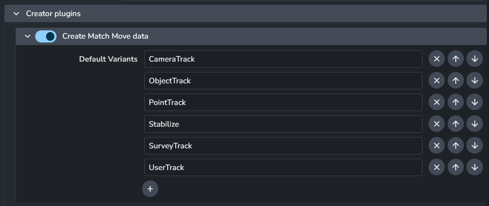

import ReactMarkdown from "react-markdown";
import versions from '@site/docs/assets/json/Ayon_addons_version.json'

<ReactMarkdown>
{versions.Equalizer_Badge}
</ReactMarkdown>

## Overview

To get the 3DEqualizer (3DE) addon running, we need to install Qt Python bindings. We use a pre-launch hook that automatically installs `PySide2/6` into 3DE Python. You can set the location using the `TDE4_ROOT` environment variable, or it will be deduced from the 3DE executable path in AYON applications settings.

:::caution Python Bindings and Protected Locations
This automatic **PySide2/6** installation might fail if 3DE is used from a protected location (either a network drive or a user write-restricted location). If this happens, you need to install PySide there manually.
:::

:::info PYTHON_CUSTOM_SCRIPTS_3DE4
AYON uses the `PYTHON_CUSTOM_SCRIPTS_3DE4` environment variable to install itself into the 3DE menu. It appends to this variable, but if you overwrite it using a startup script or rez, the AYON menu won’t be shown in 3DE.
:::

## Addon Settings
### Heartbeat Interval
> Setting Location: `ayon+settings://equalizer/heartbeat_interval`

This setting controls how often Qt processes yield control back to 3DE. Adjusting this value can affect the stability and responsiveness of 3DE. The default value is 500.

:::info
AYON uses this value to set the `AYON_TDE4_HEARTBEAT_INTERVAL` environment variable when the application starts. The integration addon will then rely on this environment variable throughout the session.
:::

### Create Match Move data
> Setting Location: `ayon+settings://equalizer/create/CreateMatchMove`

This setting includes `Match Move` creator settings.

- **Default variants:** List of default variants for the `Match Move` product.