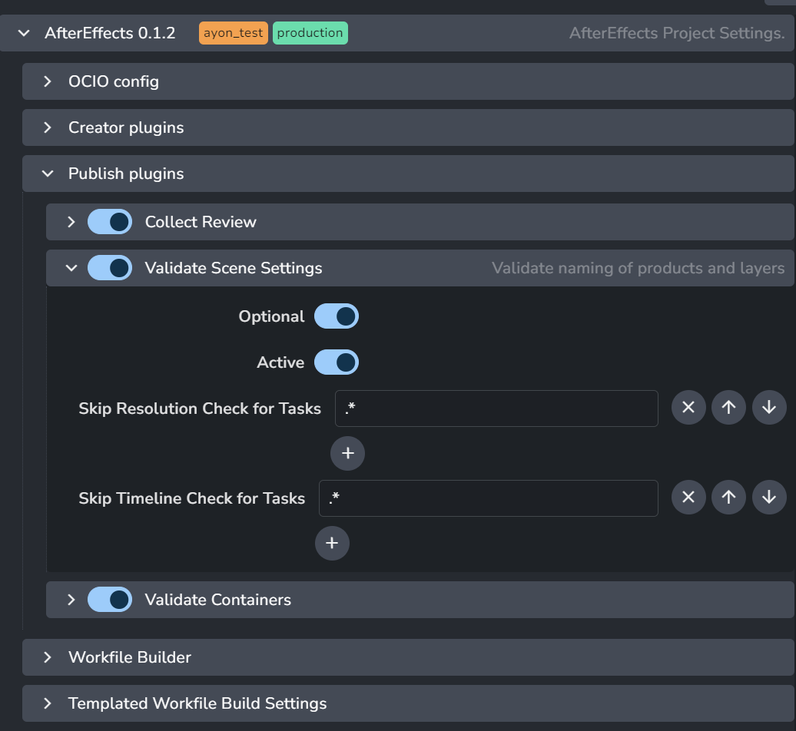

import Tabs from '@theme/Tabs';
import TabItem from '@theme/TabItem';

## AfterEffects settings

There is a couple of settings that could configure publishing process for **AfterEffects**.
All of them are Project based, eg. each project could have different configuration.

Location: `ayon+settings://aftereffects/publish`

## Publish plugins

### Collect Review
Enable/disable collecting reviews. If disabled, no review will be created at all. 

### Validate Scene Settings

#### Skip Resolution Check for Tasks

Set regex pattern(s) to look for in a Task name to skip resolution check against values from DB.

#### Skip Timeline Check for Tasks

Set regex pattern(s) to look for in a Task name to skip `frameStart`, `frameEnd` check against values from DB.

### Validate Containers
Enable/disable check for non latest loaded items in the scene.

### AfterEffects Submit to Deadline

* `Use Published scene` - Set to True (green) when Deadline should take published scene as a source instead of uploaded local one.
* `Priority` - priority of job on farm
* `Primary Pool` - here is list of pool fetched from server you can select from.
* `Secondary Pool`
* `Frames Per Task` - number of sequence division between individual tasks (chunks)
making one job on farm.