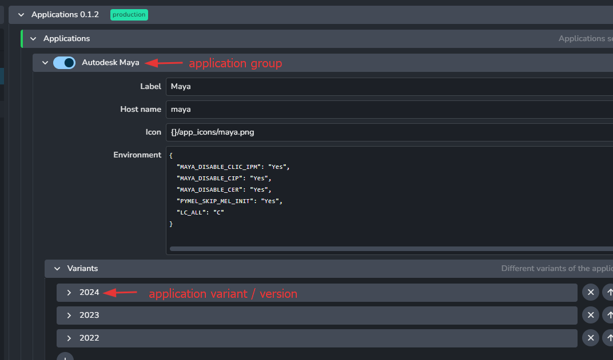
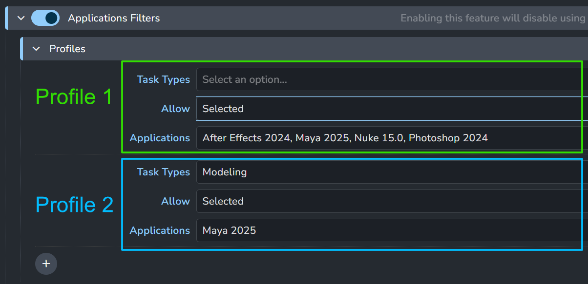

import Tabs from '@theme/Tabs';
import TabItem from '@theme/TabItem';

# Applications addon

The Applications addon is responsible for setting up applications, their executable paths and their startup environments. It also allows custom launch handling for other addons.

The Addon has two layers of settings: **definitions** and **filters**:

1. **Definitions:** available only in studio settings, allows to define all possible applications and tools that can be used across all projects.
2. **Filters**: defines when certain applications and tools are used on project level. This filters whether a certain application or tool should be enabled in a certain launch context, like a specific task type or project-wide.


## Applications definitions

In this section you can manage what Applications are available to your studio, locations of their executables, and their additional environments. In AYON context, each application that is integrated is also called a `Host` and these two terms will be used interchangeably in the documentation.

Each Application is made of two levels.
1. **Application group** - This is the main name of the application and you can define extra environments that are applicable to all versions of the given application. For example any extra Maya scripts that are not
version dependent, can be added to `Maya` environment here.
2. **Application versions** - Here you can define executables (per platform) for each supported version of
the DCC and any default arguments (`--nukex` for instance). You can also further extend its environment.



### Environments

Please keep in mind that the environments are not additive by default, so if you are extending variables like
`PYTHONPATH`, or `PATH` make sure that you add themselves to the end of the list.

For instance:

```json
{
    "PYTHONPATH": [
        "my/path/to/python/scripts",
        "{PYTHONPATH}"
    ]
}
```

### Adding versions

It is possible to add new version for any supported application. There are two ways of doing it.

1. **Add new executable** to an existing application version. This is a good way if you have multiple fully compatible versions of your DCC across the studio. Nuke is a typical example where multiple artists might have different `v#` releases of the same minor Nuke release. For example `12.2v3` and `12.3v6`. When you add both to `12.2` Nuke executables they will be treated the same in AYON and the system will automatically pick the first that it finds on an artist machine when launching. Their order is also the order of their priority when choosing which version to run if multiple are present.


2. **Add version** in case you want this version to be selectable individually. This is typically used for bigger releases that might not be fully compatible with previous versions. Keep in mind that if you add the latest version of an Application that is not yet part of the official AYON release, you might run into problems with integration. We test all the new software versions for compatibility and most often, smaller or bigger updates to AYON code are necessary to keep everything running.


## Tools definitions

A tool in AYON is anything that needs to be selectively added to your DCC applications. Most often these are plugins, modules, extensions or similar depending on what your package happens to call it.

AYON comes with some major CG renderers pre-configured as an example, but these and any others will need to be changed to match your particular environment.

Their environment settings are split to two levels just like applications to allow more flexibility when setting them up.

In the image before you can see that we set most of the environment variables in the general MTOA level, and only specify the version variable in the individual versions below. Because all environments within pype setting will resolve any cross references, this is enough to get a fully dynamic plugin loading as far as your folder structure where you store the plugins is nicely organized.


In this example MTOA will automatically set the `MAYA_VERSION`(which is set by Maya Application environment) and `MTOA_VERSION` into the `MTOA` variable. We then use the `MTOA` to set all the other variables needed for it to function within Maya.


All the tools defined in here can then be assigned to projects. You can also change the tools versions on any project level all the way down to individual asset or shot overrides. So it is possible to upgrade you render plugin for a single shot, while not risking the incompatibilities on the rest of the project.

## Applications filters
These filters define the applications that will be shown in the launcher tool. It is profile based filtering that allows to filter applications for specific task types.

Using default settings will show all applications for all tasks. That can be easily changed.

Simple example:


In this case all tasks with `Modeling` type will show only `Maya 2025`. Any other task type will show `After Effects 2024`, `Maya 2025`, `Nuke 15.0` and `Photoshop 2024`.

:::note Default studio profile
It is recommended to have one profile without task types filter, which then acts as the standard set of applications used in the studio.
:::

## Tools filters
Tools that will be used on application launch. It is profile based filtering that allows to filter tools for a context. Tools can have more specific filtering than applications.

## Legacy: Applications and Tools attributes

Settings based filtering was introduced in applications addon release 1.0.0 . Before that applications were set with `applications` attribute on project (located under project anatomy) and tools were set using `tools` attribute on Project, Folder and Task entities.

For backwards compatibility the settings do allow to switch between new settings and attributes and the legacy behavior, so we don't break existing productions without option to change it back.

:::note Legacy behavior
The legacy behavior is enabled by **disabling** the filters in settings:
