import Tabs from '@theme/Tabs';
import TabItem from '@theme/TabItem';
import ReactMarkdown from "react-markdown";
import versions from '@site/docs/assets/json/Ayon_addons_version.json'

<ReactMarkdown>
{versions.Applications_Badge}
</ReactMarkdown>

## Introduction

The Applications addon is designed to configure applications, set their executable paths, and set up their startup environments.

<!-- :::info
The addon introduces a debug launcher action for users. For more details, please refer to [Application addon artist docs] (addon_applications_artist.md)
Also, The addon's client code features hook definitions that developers can leverage to implement launch hooks that tailor launch processes for other addons. For more details, please see [Application addon Dev docs] (addon_applications_dev.md).
::: -->

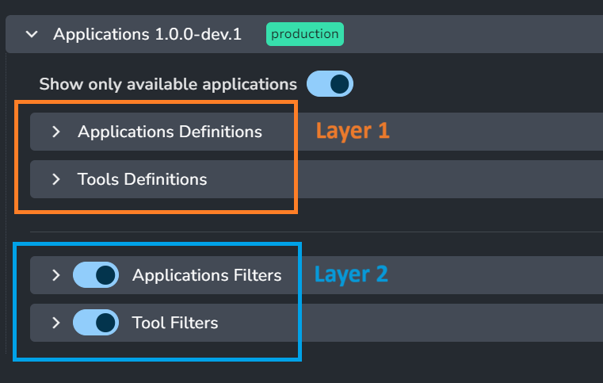

The Addon features two primary settings categories: Definitions and Filters:

1. **Definitions:** available only in studio settings, allows to define all possible applications and tools that can be used across all projects.
2. **Filters:** defines when certain applications and tools are used on project level. This filters whether a certain application or tool should be enabled in a certain launch context, like a specific task type or project-wide.

## Applications Addon Settings
### Show only available applications
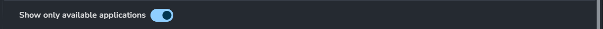

When enabled, AYON Launcher will display only those applications for which executable paths exist on the current machine.
This acts as an extra filter to the Applications filters, ensuring that inaccessible applications are excluded from view.

### Applications Definitions

In this section you can manage what Applications are available to your studio, locations of their executables, and their additional environments. 
In AYON context, each application that is integrated is also called a `Host` and these two terms will be used interchangeably in the documentation.

#### Built-in Applications
Each application definition has an application group e.g. Maya, Houdini, Nuke and etc.

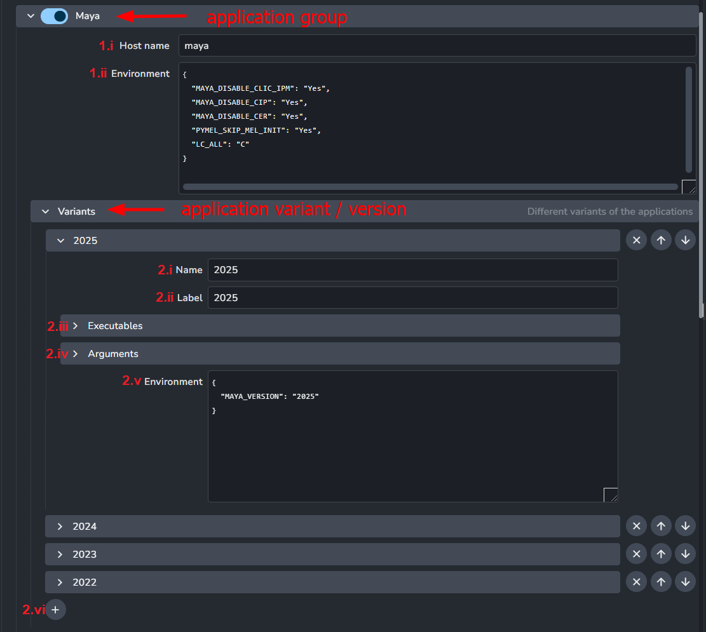

Each Application is made of two levels.
1. **Application group:**
   1. **Host name:** Pipeline integration name supplied by an AYON addon.
   2. **Environment:** Define extra environments that are applicable to all versions of the given application version dependent.
2. **Application variant:** For each application variant we have
   1. **Name:** application variant name
   2. **Label:** application variant label
   3. **Executables:** Define executables (per platform).
   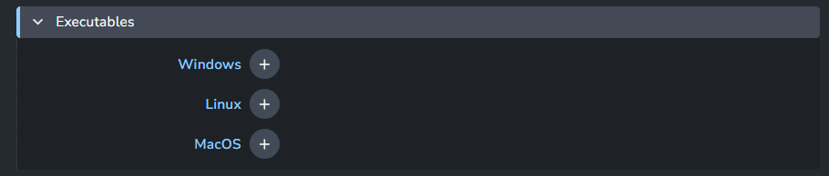
   4. **Arguments:** Define default arguments (`--nukex` for instance)
   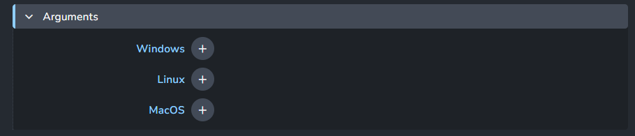
   5. **Environment:** Extend application's main environment.
   6. **+ button:** To add more variants.

:::info Naming Conventions for Names and Labels

We currently allow the use of any characters. 
However, we adhere to a specific naming convention alongside the default settings. 
For names, we typically use lowercase letters, numbers, and hyphens (`-`).
For labels, both uppercase and lowercase letters, as well as periods (`.`), are used.

:::

#### Additional Applications

It's possible to use applications addon to launch any applications that are not in built-in integrations that come with AYON.

:::note
Additional applications will only _launch_ but offer no further AYON integration (e.g. menus, creators, publishers) as that requires an AYON addon for that application, at which point it should not be under _additional applications_ anymore.
:::

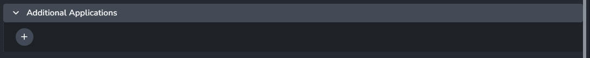
- **+ button:** Add application group.

Application group in additional applications exposes few more attributes:

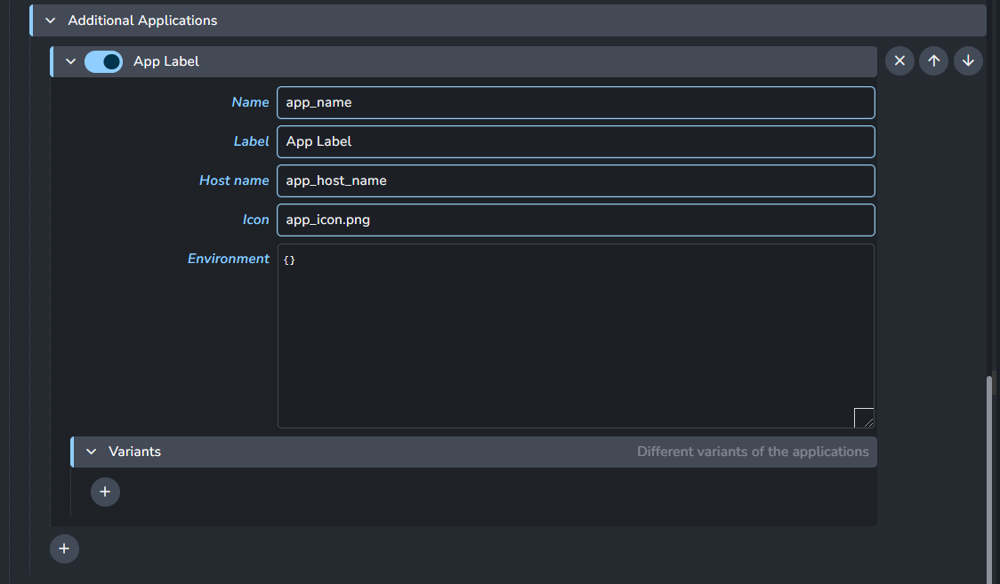

- **Application Name:** The name of the application.
- **Application Label:** The label of the application and the application group (the name next to the toggle).
- **Application Icon:** The icon that would be displayed by the AYON launcher.

:::tip Application Icon
<!-- TODO: Add more info about what ayon expects regards the application icon. -->
:::

### Applications filters
These filters define the applications that will be shown in the launcher tool. It is profile based filtering that allows to filter applications for specific task types.

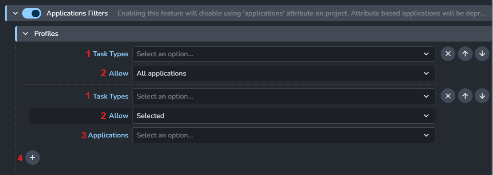

1. **Task Types:** Choose from a list of task types to determine which ones the filter profile will affect. If you want the profile to apply to all tasks, leave it blank.
2. **Allow:** Determines the mode of the filter, there are two options:
   1. **All applications**
   2. **Selected:** when chosen, the Applications list will show up.
3. **Applications:** List of applications available for profile filter.
4. **+ button:** Add new profile filter.

:::tip Default studio profile
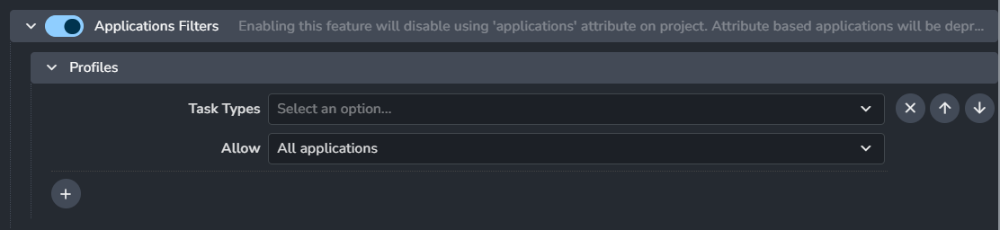
Using default settings will show all applications for all task types.
It is recommended to have one default profile without task types filter, with standard set of applications used in the studio.
:::

### Tools Definitions

A tool in AYON is anything that needs to be selectively added to your DCC applications. Most often these are plugins, modules, extensions or similar depending on what your package happens to call it.

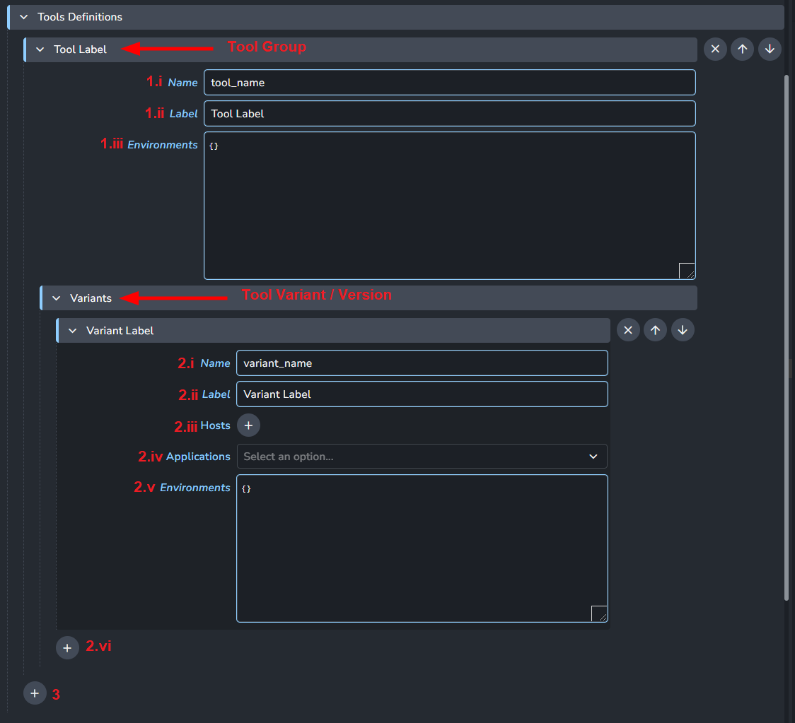
> Tools Definitions settings are very similar to Applications Definitions settings.

1. **Tool Group:**
   1. **Name:** Tool name.
   2. **Label:** Tool label. Name is used if not filled.
   3. **Environments:** Environments variables that will be applied to all tool variants.
2. **Tool Variants:**
   1. **Name:** Tool variant name.
   2. **Label:** Tool variant label. Name is used if not filled.
   3. **Hosts:** List of host names you want the tool variant to work with.
   4. **Applications:** Filter applications for which is tool applicable.
   5. **Environments:** tool variant environments
   6. **+ button:** Add new tool variant.
3. **+ button:** Add new tool group.

:::tip Tool Examples

AYON comes with some major CG renderers pre-configured as an example, but these and any others will need to be changed to match your particular environment.

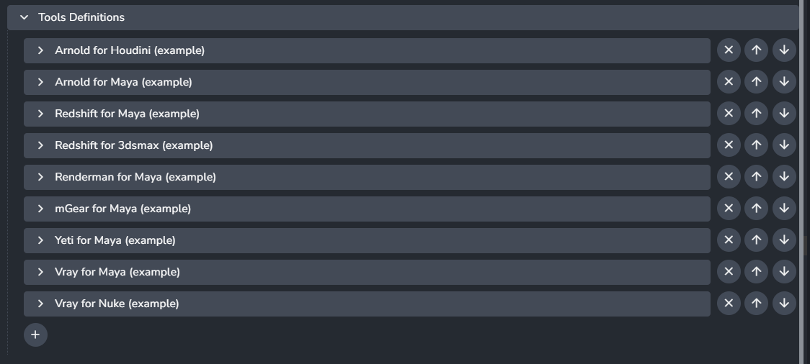

<details><summary>Pre-configured Example - Autodesk Arnold</summary>

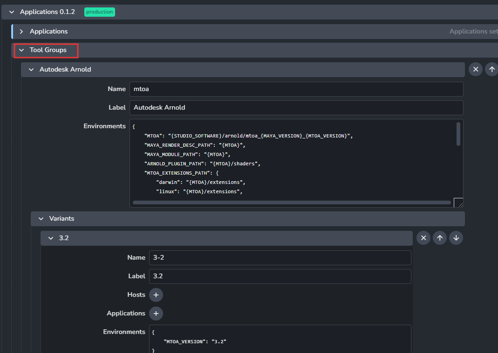

In this example you can see that we set most of the environment variables in the general MTOA level, and only specify the version variable in the individual versions below. Because all environments within AYON setting will resolve any cross references, this is enough to get fully dynamic plugin loading as far as your folder structure where you store the plugins is nicely organized.

MTOA will automatically set the `MAYA_VERSION` (which is set by Maya Application environment) and `MTOA_VERSION` into the `MTOA` variable. We then use the `MTOA` to set all the other variables needed for it to function within Maya.
</details>
:::

### Tools filters
Tools that will be used on application launch. It is profile based filtering that allows to filter tools for a context. Tools can have more specific filtering than applications.

All the tools defined in Tools Definitions can then be assigned to projects, certain task types or even selectively for only certain folders. You can also change the tools versions on any project level all the way down to individual asset or shot overrides. So it is possible to upgrade you render plugin for a single shot, while not risking the incompatibilities on the rest of the project.


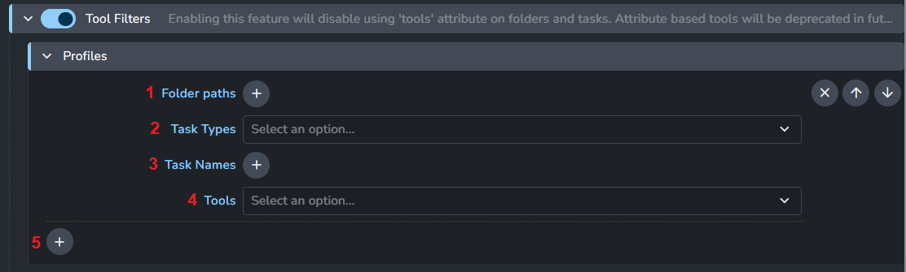

1. **Folder Paths:** Folder paths to determine which ones the filter profile will affect. *It supports regex patterns.*
2. **Task Types:** Choose from a list of task types to determine which ones the filter profile will affect.
3. **Task Names:** List of task names to determine which ones the filter profile will affect.
4. **Tools:** Tools list to determine which ones the filter profile will affect.
5. **+ button:** Add application group filters profiles.

:::tip Example Filter profile
Find example of Tool definition and a profile Filter in the FAQ section below:
[How to make a tool available for all folder paths in a project for a specific application variant?](addon_applications_admin#how-to-make-a-tool-available-for-all-folder-paths-in-a-project-for-a-specific-application-variant-)
:::

## FAQ
### How to use application variant settings?

<details><summary>How to use application variant settings?</summary>

Variant group settings is used to add more versions of an application.
There are two ways of doing it.

1. **Add new executable** to an existing application version. This is a good way if you have multiple fully compatible versions of your DCC across the studio. Nuke is a typical example where multiple artists might have different `v#` releases of the same minor Nuke release. For example `12.2v3` and `12.3v6`. When you add both to `12.2` Nuke executables they will be treated the same in AYON and the system will automatically pick the first that it finds on an artist machine when launching. Their order is also the order of their priority when choosing which version to run if multiple are present.
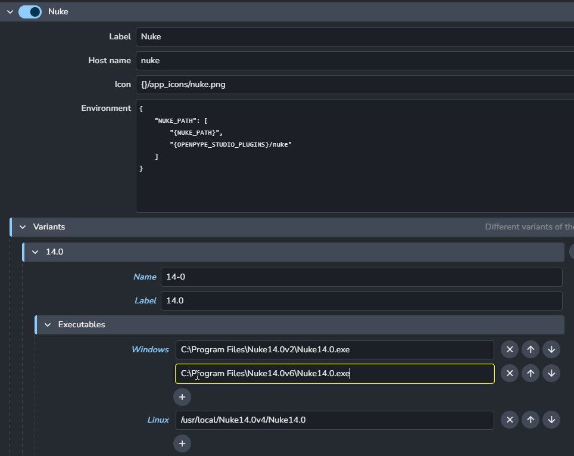

1. **Add version** in case you want this version to be selectable individually. This is typically used for bigger releases that might not be fully compatible with previous versions. Keep in mind that if you add the latest version of an Application that is not yet part of the official AYON release, you might run into problems with integration. We test all the new software versions for compatibility and most often, smaller or bigger updates to AYON code are necessary to keep everything running.
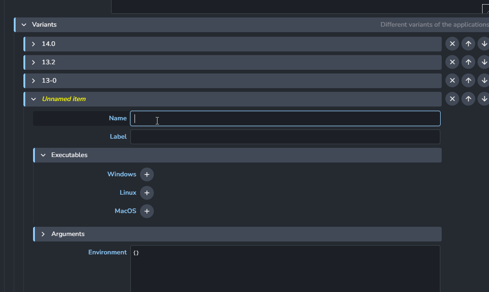

</details>

### What does AYON offer to customize the application environments?

<details><summary>What does AYON offer to customize the application environments?</summary>

> Originally answered by Roy Nieterau on ynput's forums [Maya - User prefs and studio prefs](https://community.ynput.io/t/maya-user-prefs-and-studio-prefs/1683/3)

1. Global Environment Variables: `ayon+settings://core/environments`
2. Per application group environment variables. e.g. maya: `ayon+settings://applications/applications/maya/environment`
3. Per application variant environment variables, e.g. maya 2025: `ayon+settings://applications/applications/maya/variants/0/environment`
4. Tools environment variables.

Tools are special in that you can set tools to apply to only to certain contexts, e.g. only certain assets or shots instead of project-wide.

</details>

### What is the syntax AYON uses for defining environments in settings?

<details><summary>What is the syntax AYON uses for defining environments in settings?</summary>

The syntax closely resembles JSON syntax rules:

- Each variable consists of a name/value pair, with both keys and values should be strings.
  ```json
   {
      "MY_VARIABLE": "1"
   }
   ```
- Variables are separated by commas.
    ```json
   {
      "VARIABLE_1": "A",
      "VARIABLE_2": "B",
      "VARIABLE_3": "C"
   }
   ```
- Square brackets enclose lists of values.
   ```json
   {
      "MY_VARIABLE": ["A", "B", "C"]
   }
   ```
- Curly braces contain groups of variables.
  ```json
   {
      "STUDIO_CONFIGS": {
        "windows": "win-path",
        "darwin": "mac-path",
        "linux": "linux-path"
    }
   }
   ```
- Note that environment variables are not cumulative by default. If you're appending to variables like `PYTHONPATH` or `PATH`, ensure you include the original variable at the end of the list.
   ```json
   {
      "PYTHONPATH": [
         "my/path/to/python/scripts",
         "{PYTHONPATH}"
      ]
   }
   ```

:::tip cross-platform environments
It's important to note that we **recommend** using list assignments for variables.
For instance, setting `"MY_VARIABLE": "A;B;C"` works on Windows but not on UNIX, where the path separator is `:`. Therefore, it should be `A:B:C` on UNIX systems.
Defining `"MY_VARIABLE": ["A", "B", "C"]` ensures the correct separator is used automatically based on the platform.

This functionality is handled by [`acre`](https://github.com/ynput/acre), which AYON utilizes to construct environment variables. Acre includes support for [platform-specific assignments](https://github.com/ynput/acre?tab=readme-ov-file#platform-specific-paths-acreparse), guaranteeing the use of the right separator based on the platform.
:::

</details>

### How to update the task types list in the filter settings?

<details><summary>How to update the task types list in the filter settings?</summary>

- in **Studio settings:** Task types list  is generated from the default anatomy preset. 
-  in **Project settings:** Task types list is generated from the project's anatomy. 
To navigate quickly, click `a+a`.

</details>

### How to make a tool available for all folder paths in a project for a specific application variant?

<details><summary>How to make a tool available for all folder paths in a project for a specific application variant?</summary>

To achieve this result, you'd need to adjust two settings:

1. In Tools Definitions: Set Hosts and Applications. This effectively makes your tool work only for the specified hosts and apps.
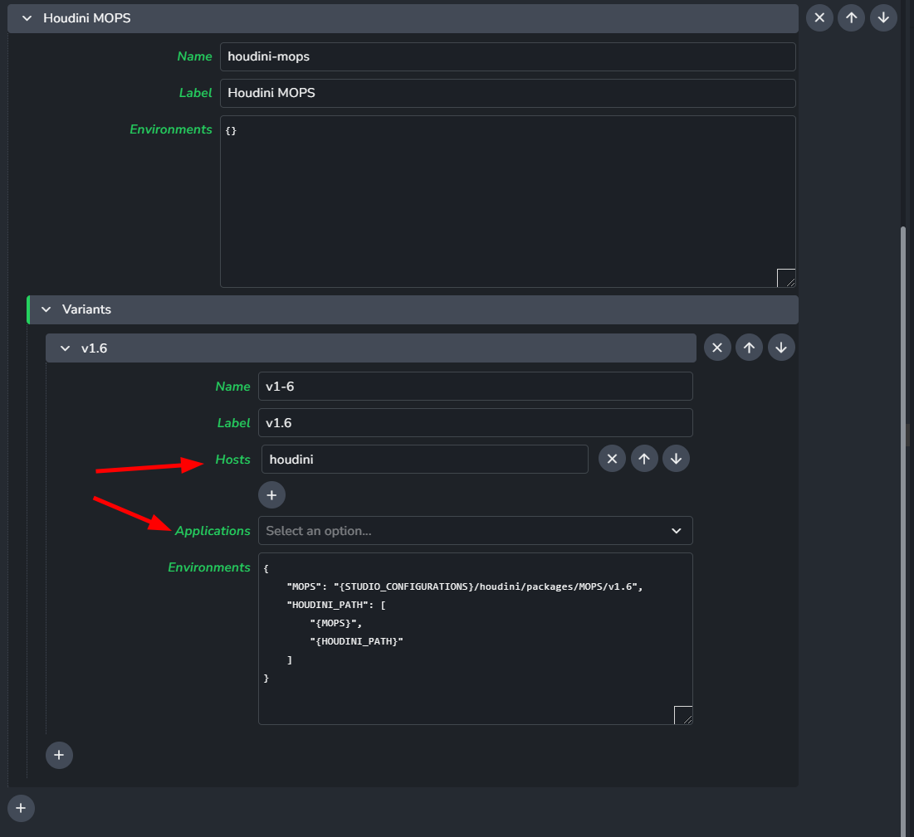
2. In Tools Filtering: Don't set Folder Path. This effectively makes your tool available for all folder paths in the whole project.


</details>

## Legacy: Applications and Tools attributes

Settings based filtering was introduced in applications addon release 1.0.0 . Before that applications were set with `applications` attribute on project (located under project anatomy) and tools were set using `tools` attribute on Project, Folder and Task entities.

For backwards compatibility the settings do allow to switch between new settings and attributes and the legacy behavior, so we don't break existing productions without option to change it back.

:::note Legacy behavior
The legacy behavior is enabled by **disabling** the filters in settings:
:::

By default, the settings based filters are used, but that is automatically changed to use attributes when settings from older version of applications addon are converted, so it is not needed to change it manually for backwards compatibility from older addons.

:::warning Deprecated
Please keep in mind that `applications` and `tools` attributes are deprecated, and they will be removed in future versions of applications addon. It is recommended to use the 1.0.0+ application and tool filtering instead.
:::