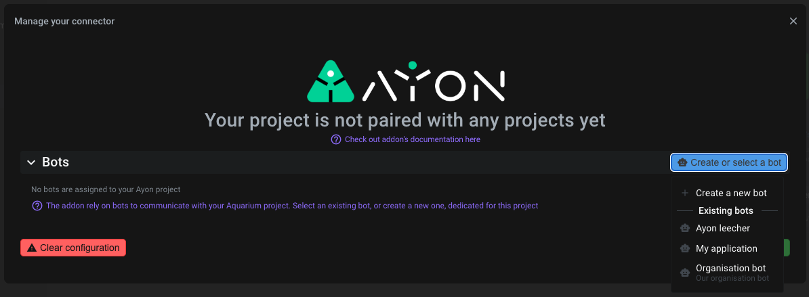
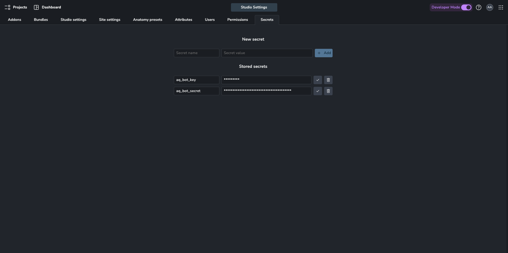
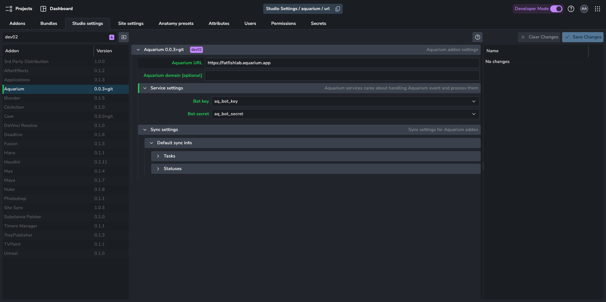
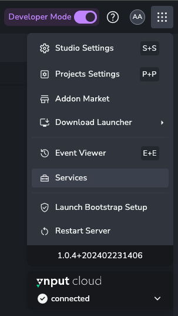
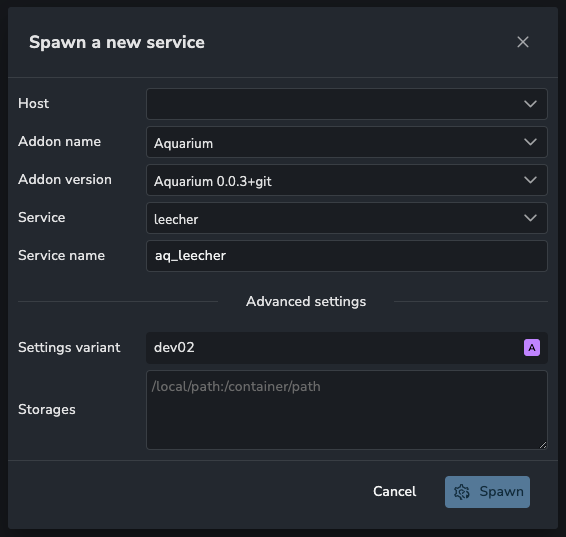

import ReactMarkdown from "react-markdown";
import versions from '@site/docs/assets/json/Ayon_addons_version.json'

<ReactMarkdown>
{versions.Aquarium_Badge}
</ReactMarkdown>

import Tabs from '@theme/Tabs';
import TabItem from '@theme/TabItem';

## Introduction

Aquarium addon, allow you to:

 - Create new Ayon project using existing Aquarium's data
 - Create new Aquarium project using existing Ayon's data
 - Keep your Ayon project in sync with Aquarium, using Ayon services system and Aquarium's events.
 - Publish media

:::info
In the future, new feature will be added, based on your requests. Feel free to [reach us](https://support@fatfi.sh).
:::

We are open to receive new pull request (PR). Follow our [developer documentation to start](addon_aquarium_developer).

## Configuring addon

First, you need to install the addon. It's available from Ayon market or you can install it from its repository. For that follow our [developer documentation](addon_aquarium_developer) or [Ayon's manual installation guide](admin_server_installing_addons)

### Getting Aquarium bot

Synchronizing Ayon and Aquarium rely on a specific account type called Bot.

Go into your Aquarium `project settings`, `connectors` tab and select `Ayon`.

Select an existing bot, or create a dedicated bot for this project

When you create a bot, a `bot secret` is created. It's like a password, but for bot. So keep it safe ! It won't be shown twice. If you lost that secret, you will need to generate a new one.

### Setting Ayon Secrets

Go back to Ayon. From your `Studio settings`, select your `Secret` tab, and create two new secrets :

 - One to store your bot_key
 - Another one to store your bot_secret

Choose the name you want, but if you don't have any idea, `aq_bot_key` and `aq_bot_secret` is a good start 👍

### Aquarium addon Studio settings configuration

Once secrets are configured then Aquarium addon can be set. In your `Studio settings` or `Project settings` is you want a specific configuration only for the selected project, choose your `Aquarium` addon, and fill the inputs.

:::tip
Don't forget to select the correct bundle version on which you want to set this configuration.
:::

Here is the detail of each option:

- **Aquarium URL** is your specific Aquarium URL you use to access to.
- **Aquarium domain** is specific for Fatfish Lab developers, or customers who run Aquarium in a non DNS environment.
- **Service settings** is all the setting dedicated to Aquarium services
  - Select the **Bot key** secret you want to use
  - Select the **Bot secret** you want to use
- **Sync settings** is all the settings for synching data
  - **Default sync info** regroup all default data transformation. It's used to transform Aquarium data to Ayon. Those settings are optional, if they are not provided, the addon will try to translate it for you.
    - **Tasks** is for translating Aquarium's tasks to Ayon's tasks names
    - **Statuses** is for transforming Aquarium's tasks statuses to Ayon's statuses

## Starting Ayon Aquarium addon service

Aquarium addon rely on two services to synchronize your projects:

- Leecher, responsible to listening Aquarium events, and store them into Ayon's database for later process
- Processor, responsible to processing specific Aquarium events, stored in Ayon's database. The processor "only" transform the data and then pass it to the Addon API.

This requires to ASH to be working so the service can be attached to it. In main menu select Services.

Use **New service** button.

Once ASH is working then worker options should be offering any available workers. Find `Aquarium` addon name and the same version which is used in your bundle. For easier late recognition, make sure to prefix your service with `aquarium_` or just `aq_`. Hit **Spawn** and wait for status of service to be set to green *Running*.

:::info
Don't forget to repeat the same action for the processor
:::