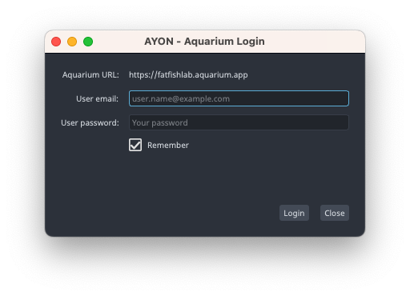

import ReactMarkdown from "react-markdown";
import versions from '@site/docs/assets/json/Ayon_addons_version.json'

<ReactMarkdown>
{versions.Aquarium_Badge}
</ReactMarkdown>

import Tabs from '@theme/Tabs';
import TabItem from '@theme/TabItem';

## Introduction

The Aquarium addon integration allow you to

 - Authenticate the user
 - Publish media

:::tip We need you
You are looking for other integrations or feature ? [Contact our team](mailto:support@fatfi.sh) to exchange about your need !
:::

## Signing to your Aquarium account

From the launcher tray menu, click on Aquarium to show the sign-in form. Enter your Aquarium credential here.

:::info
This form will automatically open when the launcher start and the user is not login
:::