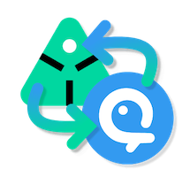

import ReactMarkdown from "react-markdown";
import versions from '@site/docs/assets/json/Ayon_addons_version.json'

<ReactMarkdown>
{versions.Aquarium_Badge}
</ReactMarkdown>

import Tabs from '@theme/Tabs';
import TabItem from '@theme/TabItem';

## Introduction

Welcome in the developer documentation of Aquarium addon and thanks for looking into it.

This documentation is here to provide information on :

- [How this code is structured](#code-structure) ?
- [How to setup your developer environment](#developer-environment) ?

:::info
Disclaimer: We are new developers into Ayon's ecosystem.
The following documentation might require some improvements and we may have missed steps.
Feel free to update this file or directly reach us at [support@fatfi.sh](mailto:support@fatfi.sh)
:::

## Code structure

This addon is composed by 3 main parts:

- [Client](#client)
- [Server](#server)
  - API
  - Frontend
- [Services](#services)
  - Leecher
  - Processor

### Directory

#### Client

Client code is used in the [Ayon Launcher](https://github.com/ynput/ayon-launcher), the AYON pipeline desktop application.

:::info
The client integration is not finished yet.
:::

This client integration allow you to

 - Authenticate the user
 - Publish media

#### Server

Python server-side part of the addon. It's mainly used to declare specific addon API endpoints, used by the leecher and processor services to keep your data in sync.

It's also responsible to declare specific addon settings, in your Ayon server and project settings.

##### Frontend

This folder is used to provide a web UI in your Ayon settings to pair projects between Ayon and Aquarium and also to trigger a full project sync.

#### Services

Syncing data between Ayon and Aquarium relies on [Ayon services system](dev_event_system.md).

This addon use two services:

- **Leecher**
  - It's listening Aquarium's events, and store them into Ayon database for async processing.
- **Processor**
  - It's looking for specific Aquarium events in Ayon's database and process them to transform data into compatible Ayon's structure and send request to addon server API endpoints to interact with the server.

## Developer environment

### Requirements

You will need to clone several Ayon repositories in order to run everything locally:

- You need to [install Docker](https://docs.docker.com/engine/install/) first.
- [Ayon Docker](https://github.com/ynput/ayon-docker)
- [Ayon Core](https://github.com/ynput/ayon-core)
  - You can clone this one, into `ayon-docker/addons/core` folder. Here is the steps :
    2. From the `core` folder execute this command:
       - `git clone ssh://git@github.com:ynput/ayon-core.git dev`
       - This command will clone the repository and rename it `dev`, in order to follow [Ayon addon directory structure](https://help.ayon.app/articles/4089565#oxeyie32ie8)
- [Ayon dependencies](https://github.com/ynput/ayon-dependencies-tool)
- [Aquarium addon](https://github.com/ynput/ayon-aquarium)
  - You can clone this one, into `ayon-docker/addons` folder. Here is the steps :
    1. Create a folder `ayon-aquarium` in `ayon-docker/addons` folder
    2. From the `ayon-aquarium` folder execute this command:
       - `git clone ssh://git@github.com:ynput/ayon-aquarium.git dev`
       - This command will clone the repository and rename it `dev`, in order to follow [Ayon addon directory structure](https://help.ayon.app/articles/4089565#oxeyie32ie8)

### Optional requirements

If you are looking for Python type checking, you will need extra steps:

1. Clone [Ayon Backend](https://github.com/ynput/ayon-backend) repository
2. Clone [Aquarium python API](https://github.com/fatfish-lab/aquarium-python-api)
3. Create a new pyenv dedicated for development `pyenv virtualenv ayondevaquarium` using python 3.10.12
4. Enable your pyenv `pyenv shell ayondevaquarium` and/or select this pyenv in your IDE.
5. Install dependencies from your local repositories
   1. `python -m pip install -e /path/to/aquarium-python-api`
   2. `python -m pip install -e /path/to/ayon-backend`

### Setup your dev environment

#### 1. Start Ayon

Start your Ayon instances, from the Ayon Docker repository, using the command `docker compose up --build`. For a more precise steps, check out the [repository README file](https://github.com/ynput/ayon-docker).

#### 2. Create a service user

To interact with Ayon server, we need to create a service User.

1. On your Ayon server, create a service user from `Studio settings` > `Users` tab > `Add new user`. Choose `Service` in the access level section.
1. On the newly created Service User, generate an API Key.
   1. Keep that API key, we will use it later.

#### 3. Upload addon to Ayon

1. From your `ayon-aquarium` folder, execute the file `create_package.py`
2. Locate the `.zip` file created in the new folder `package`
3. From Ayon server web interface, go to `Studio settings` > `Bundles` tab.
4. Click on the button `Install addon` and upload your previous `.zip` file.
5. Restart your Ayon server

#### 4. Create a dev bundle

1. From the `Studio settings` > `Bundles` tab, create a new bundle `aquarium-dev` (choose the name you want)
2. Assign your self as a developer on this bundle
3. Locate `aquarium` line in the addon list, and select the version where you have a `+git` at the end.
4. Enable addon directory and paste the location of the client folder `ayon-docker/addons/ayon-aquarium/dev/client`
5. Locate `core` line in the addon list, and select the version where you have a `+git` at the end.
6. Enable addon directory and paste the location of the client folder `ayon-docker/addons/core/dev/client`
7. Don't forget to save your dev bundle by clicking on the top right button `Save bundle`

#### 5. Build Ayon dependencies

1. From the Ayon dependencies repository folder, copy the file `example_env` as `.env` file.
2. Edit this file and add your local Ayon dev server URL and your previously generated service API key.
3. Run the command `./start install`
4. Run the command `./start create -b aquarium-dev` (Use the name of the previously bundle you created)
   1. This command will create and upload the dependencies to your Ayon server

#### 6. Update bundle dependencies

1. From the `Studio settings` > `Bundles` tab, select your `aquarium-dev` bundle.
2. In the right panel, locate the section `Dependency Packages`
3. Edit dependencies of your OS to select the latest upload dependencies

---

Congratulations, you are now good to go developing ! 🎉

:::tip
Don't forget to restart your Ayon server if you work on the server part, it's the only way to take your modification in consideration.
:::