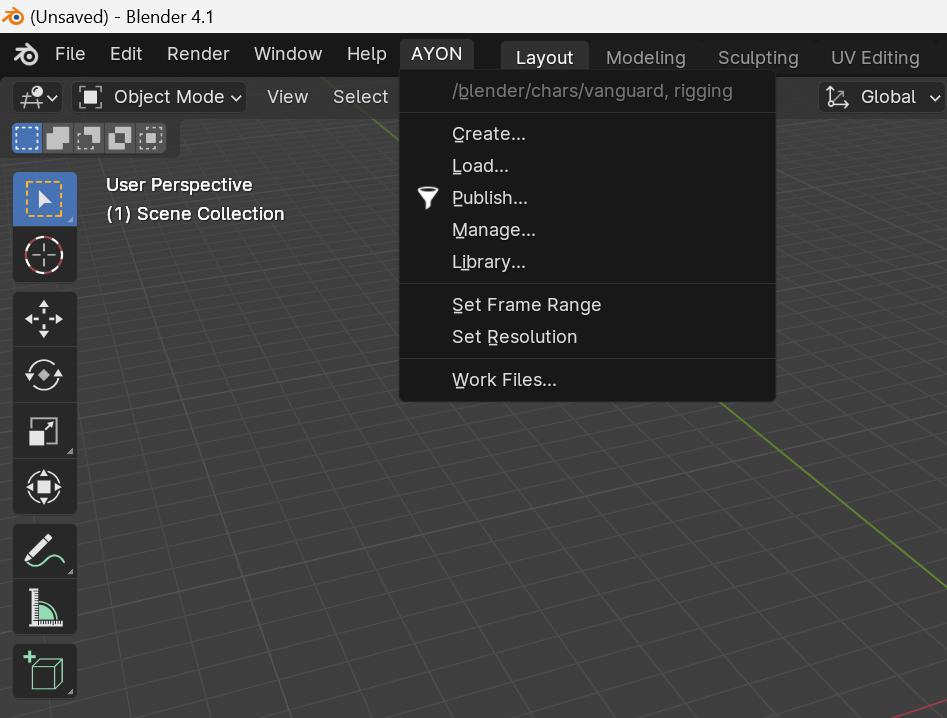
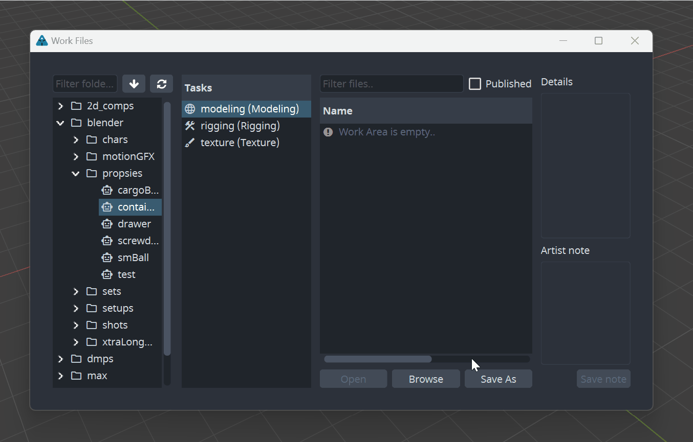
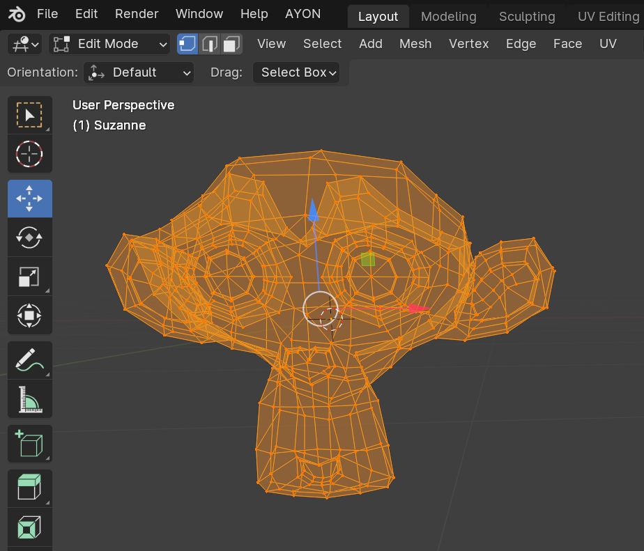

import ReactMarkdown from "react-markdown";
import versions from '@site/docs/assets/json/Ayon_addons_version.json'

<ReactMarkdown>
{versions.Blender_Badge}
</ReactMarkdown>

Once you **launch Blender** via AYON toolset (e.g. **using Launcher**) you will be introduced to **AYON Menu** present in the menu header which is also a clear indication of running Blender using AYON.

:::tip
Before starting to use the Blender AYON integration, please check the following user documentation sections to fully understand the core concepts of the AYON toolset and what it offers you as a user, as you will use those tools very frequently.
:::

## AYON Tools

-   [Work Files](artist_tools_workfiles)
-   [Create](artist_tools_creator)
-   [Load](artist_tools_loader)
-   [Manage (Inventory)](artist_tools_inventory)
-   [Publish](artist_tools_publisher)
-   [Library Loader](artist_tools_library_loader)

## Working with AYON in Blender

AYON streamlines collaborative projects, simplifying tasks like naming conventions, configurations, and file navigation. It employs a "data-driven" approach, meaning the data within a scene dictates the publishing process. To clarify, let's explore some examples.

## Setting scene data

Blender settings concerning **frame rate**, **resolution** and **frame range** are fully **handled by AYON**.
If set correctly on the AYON server or in Ftrack, Blender will automatically set the values for you.

:::tip
If for some reason those aren't set correctly, force resolution and frame range/fps any time using **Set Frame Range** and **Set Resolution** actions sitting in the AYON menu.
:::

## Saving your workfile

When wanting to save your Blender scene aka `Workfile`, instead of using regular actions `File` > `Save As`

...use `AYON` > `Workfiles` instead.

It will make saving, naming and versioning your file a breeze... 

You will use `Workfiles` tool not just for saving your work but for all `.blend` file operations like `File` > `Open` too.

Just navigate to `AYON` > `Workfiles` > `Open` instead.

For more details and what options it offers navigate to [Work Files](artist_tools_workfiles) user's docs section.

## Publishing

Publishing is a process of producing data which can be shared across your project and with your team members. It consists of several steps:

- creating of your data (model, rig etc.)
- creating of AYON publish instance (defines product type / data to be published from your workfile)
- publishing of a product (process of making such data publicly available)

### Intro
Let's begin with `model` product and how to approach publishing process.

Publishing a `model` product in Blender is quite simple. Begin by preparing your model, either from scratch or by importing it into Blender. While studio specifications may vary depending on the project, generally, no additional conventions are needed for your geometry.

### Creating Publish Instance

Once your model geometry been ready, select it (select multiple objects if needed) and navigate to

`AYON` > `Create...`

**Publisher** window will be introduced to you...

Choose `Model` Publish type and keep the `Variant` and `Use Selection` as is.
:::tip
See [Variant](artist_concepts.md#variant) and [Product](artist_concepts.md#product)
for more detail on what they are and how they are used in AYON.
:::

`Use selection` toggle will use whatever you have selected in the Blender Outliner before triggering `Create...` 
This is usually what you want.

Now click on **Create >>** button.

You'll notice then after you've created new **Model** instance, there is a new
collection in the Outliner called after your product and variant, in our case it is
`/assets/props/suzanne_modelMain`. The objects selected when creating the `Model` publish instance got parented under a locator
representing the newly created product.

And that's it, you have your first model ready to be published as `model` product.

Now save your scene if you didn't already!

...again using `AYON` > `Workfiles` > `Save As`

:::tip
You are **free to perform** an ordinary `File > Save` aka `CTRL`+`S` at **any time** besides using the Workfiles, which are more suited for `Save As`, aka creating new versions.
:::

### Publishing Model

Finally, let's publish our model! Go to **AYON → Publish...**. You will be presented with following window:

:::note
Content of this window can differ depending on your studio's AYON configuration.
For more details see [Publisher](artist_tools_publisher) user's docs section.
:::

Items in left column are instances you will be publishing. You can disable them
by clicking on the toggle next to them.

See that in this case we are publishing the Blender model named
`modelMain` and the workfile `workfileModeling` (its instance is generated
automatically for any workfile). Also `Context` being implicit widget and just resolves the
product location within a project aka so called **Context**. You can't disable this one.

On the right side, you can enable or disable optional validators or extractors
for the selected instance.

Lets do dry-run on publishing to see if we pass all validators.
Click on the funnel icon at the bottom next to the `Publish` button.

...validators are run.

### Fixing Validation Issues

For the sake of demonstration, we intentionally kept the model in `Edit Mode`, to
trigger the validator designed to check if model not being in such a state.

The report tab in the publisher window shows us that we have problem with
validator `Validate Object Mode`.

From there you can see that there is problem with the
object `Suzanne`. Some validators have option to fix problem for you or just
select objects that cause trouble. This is the case with our failed validator.

On top you can see a button `Select Invalid`. This
will select offending object in Blender.

Fix is easy. Without closing the Publisher window we just turn back to `Object Mode`.
Then we need to reset the **Publisher** to make it notice changes we've made. Click on arrow
circle button at the bottom and it will reset the Publisher to initial state.

Run validators again (by funnel icon) to see if everything is ok now.

The validation should pass properly without any errors now.

Click the `Publish` button when ready.

Publish process will now take its course. Depending on data you are publishing
it can take a while. You should end up in the report tab of the publisher window,
with a success message and information about published data as seen on the picture below.

You can dismiss the publisher window now.

### Loading models
Once you have some published product available you can use **AYON** and its **Loader** tool to bring such
product(s) into your active Blender workfile.

Navigate to **AYON → Load...**

By selecting your Suzanne's `modelMain` and performing right click on it and choosing **Append Blend (Blend)** action.

:::note
**AYON Loader** offers you the ability to load available published products using different methods, which will vary depending on the occasion. Check
[Asset Loader](artist_tools_loader) for more details.
:::

## Creating Rigs

Creating and publishing rigs with AYON follows similar workflow as with
other publish types. Simply by first creating your rig and selecting its parts before populating the scene with `rig` publish instance type in the Publisher window and finally performing publish action resulting into `rigMain` product.

### Preparing the rig

When creating rigs in Blender, it is important to keep a specific structure for
the bones and the geometry.

Let's first create a model and its control rig. For demonstration, We will create a simple model
for a robotic arm made of simple boxes.

I have now created the armature `RIG_RobotArm`. While the naming is not important,
you can just adhere to your naming conventions, the hierarchy is. Once the models
are skinned to the armature, the geometry must be organized in a separate Collection.
In this case, I have the armature in the main Collection, and the geometry in
the `Geometry` Collection.

When you've prepared your hierarchy, it's time to create *Rig instance* in AYON.
Select your whole rig hierarchy and go **AYON → Create...**. Select **Rig**.

A new collection named after the selected Product and Variant should have been created.
In our case, it is `character1_rigDefault`. All the selected armature and models
have been linked in this new collection. You should end up with something like
this:

### Publishing rigs

Publishing rig is done in same way as publishing everything else. Save your scene
and go **AYON → Publish**. For more detail see [Publisher](artist_tools_publisher).

### Loading rigs

You can load rig with [Loader](artist_tools_loader). Go **AYON → Load...**,
select your rig, right click on it and click **Link rig (blend)**.

## Layouts in Blender

A **Layout** is a set of loaded products that are loaded in your scene. You can produce
layout from selected products and version manage such set via AYON toolset.

### Publishing a layout

Working with Layout is easy. Just load your assets into scene with
[Loader](artist_tools_loader) (**AYON → Load...**). Populate your scene as
you wish, translate each piece to fit your need. When ready, select all imported
stuff and go **AYON → Create...** and select **Layout**. When selecting rigs,
you need to select only the armature, the geometry will automatically be included.
This will create set containing your selection and marking it for publishing.

Now you can publish is with **AYON → Publish**.

### Loading layouts

You can load a Layout using [Loader](artist_tools_loader)
(**AYON → Load...**). Select your layout, right click on it and
select **Link Layout (blend)**. This will populate your scene with all those
models you've put into layout.

:::note
This user docs section is still work in progress
:::