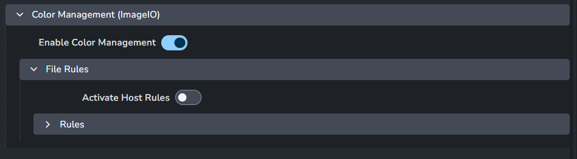

import ReactMarkdown from "react-markdown";
import versions from '@site/docs/assets/json/Ayon_addons_version.json'

<ReactMarkdown>
{versions.Cinema4d_Badge}
</ReactMarkdown>

## Overview
The AYON Cinema4D integration addon allows you to manage your Cinema4D workfiles, load versioned content and manage it all nicely directly within the AYON ecosystem and easily produce predictable caches back out for easy loading into other integrations in the AYON ecosystem.

## Requirements
### Install Qt library for Cinema4D

A Qt library must be installed for Cinema4D to ensure the AYON tools can run, either make sure
a `PySide6` or `PySide2` library is available on `PYTHONPATH` matching the Python version of the Cinema4D release.

Alternatively, you can use the Tray launcher to trigger the `Terminal` tool to open a command-line initialized for the Cinema4D application. From there you should be able to run:
```cmd
c4dpy.exe -m pip install --ignore-installed PySide6
```

## Addon Settings

### Color Management (ImageIO)
> Setting Location: `ayon+settings://cinema4d/imageio`



This setting allows admins to override the global color management settings. For more details, please see [Host specific overrides](admin_colorspace.md#host-specific-overrides).

## Known Issues
### High DPI scaling

The Redshift render view may appear oddly scaled on high DPI monitors due to some Qt scaling environment variables that AYON sets by default. To resolve this, launch Cinema4D with the environment variable: `QT_AUTO_SCREEN_SCALE_FACTOR=0`

This can be easily setup in the Application environment settings:
```json
{
 "QT_AUTO_SCREEN_SCALE_FACTOR": "0"
}
```