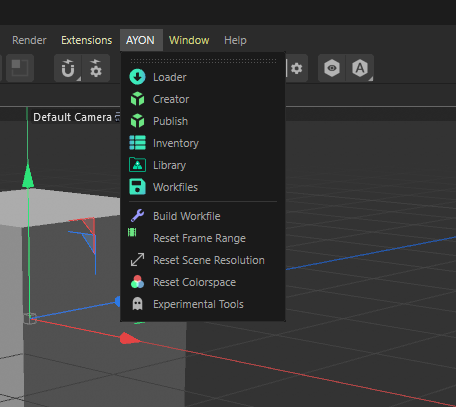

import ReactMarkdown from "react-markdown";
import versions from '@site/docs/assets/json/Ayon_addons_version.json'

<ReactMarkdown>
{versions.Cinema4d_Badge}
</ReactMarkdown>

## Working with AYON in Cinema4D

The AYON Cinema4D integration addon allows you to manage your Cinema4D workfiles, load versioned content and manage it all nicely directly within the AYON ecosystem and easily produce predictable caches back out for easy loading into other integrations in the AYON ecosystem.

## Addon Features

### AYON Menu

Once you launch **Cinema4D** via AYON Launcher, an AYON Menu will be present in the menu header which is a clear indication of running **Cinema4D** in AYON context.

This AYON Menu provides access to AYON's tools for workfiles, loading and managing content and publishing (exporting) from your Cinema4D workfile.

- **AYON Global Tools**
  - [Work Files](artist_tools_workfiles.md)
  - [Create](artist_tools_creator.md)
  - [Load](artist_tools_loader.md)
  - [Manage (Inventory)](artist_tools_inventory.md)
  - [Publish](artist_tools_publisher.md)
  - [Library Loader](artist_tools_library_loader.md)
- **Workfile actions**
  - Reset Frame Range
  - Reset Scene Resolution
  - Reset Colorspace
- **Pipeline Tools**
  - Experimental Tools

### AYON Global Tools

These are the standard AYON core tools in tandem with the Integrations.

### Workfile Actions

They are used to set scene data.

- Reset Frame Range: Set the Cinema4D timeline frame range and FPS as defined on the current task in AYON.
- Reset Scene Resolution: Set the render resolution as defined on the current task in AYON.
- Reset Colorspace: Set the OCIO conifg as defined on the current task in AYON.

### Pipeline Tools

This section is dedicated to Pipeline tools. 
It can contain AYON tools built specifically for cinema4D or generic AYON experimental tools.

## Publishing Products
### Publish workflow

TODO: Add info about using the creator and how it affects the scene.

### Available Products to publish

TODO: Add a list of available products.

## Loading Products
### Loading workflow

TODO: Explain how the loaders add products to the scene.

### Available Loaders

TODO: Add a list of available loaders.

## FAQ

TODO: Add an questions, other wise feel free to remove the FAQ section.