import ReactMarkdown from "react-markdown";
import versions from '@site/docs/assets/json/Ayon_addons_version.json'

<ReactMarkdown>
{versions.Deadline_Badge}
</ReactMarkdown>

import Tabs from '@theme/Tabs';
import TabItem from '@theme/TabItem';

## Introduction

AYON integration for Deadline mainly uses deadline webservice to send jobs.

The integration consists of two parts:

- The Deadline custom plugins.
- A `GlobalJobPreLoad` Deadline Script (this gets triggered for each deadline job)

The `GlobalJobPreLoad` handles populating submitted jobs with proper environment variables using settings from the `AYON` Deadline Plug-in.

The addon also simplifies Unreal deadline submissions by leveraging the version control addon. See [UnrealEngine5](#unrealengine5).

## Preparation

For [AWS Thinkbox Deadline](https://www.awsthinkbox.com/deadline) support you need to set a few things up in both AYON and Deadline itself

1. Deploy AYON launcher to all nodes of Deadline farm. See [Install & Run](admin_launcher_distribute.md)
2. Set up *Deadline Web API service*. For more details on how to do it, see [here](https://docs.thinkboxsoftware.com/products/deadline/10.1/1_User%20Manual/manual/web-service.html).
3. Install our custom plugin and scripts to your deadline repository. It should be as simple as copying content of `ayon/modules/deadline/repository` to `path/to/your/deadline/repository`. See [Deadline Plugins](#deadline-plugins).
4. Create a new AYON Bundle with Deadline Addon version.
5. Configure Deadline addon settings. See [Addon Settings](#addon-settings) below.
6. Select which Deadline server should be used for project in `ayon+settings://deadline/deadline_server?project=YOUR_PROJECT`
7. Create service account on Ayon server http://YOUR_AYON/settings/users , `Generate new key` and store it, you would need it in Deadline plugin configuration.

:::note guide
You could check [deadline guide](https://community.ynput.io/t/ayon-openpype-deadline-setup/468) for more detailed steps and additional tips.
:::

### Authentication
Deadline supports username and passwords authentication to protect webservice from unwanted requests. (In Deadline `Tools>Configure Repository Options>Web Service Settings>Require Authentication`)

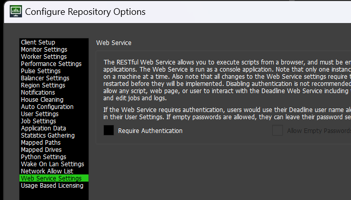

For this, admins need to enable authentication in the addon settings. See [System Deadline Webservice Info](#system-deadline-webservice-info).

### Deadline Custom Plugins

AYON Deadline addon assumes few deadline custom plugins to be installed.

:::info
Deadline custom plugins and the `GlobalJobPreLoad` script are shipped with AYON deadline addon.
In Deadline addon, you'll find repository overlay where you can just copy its content to Deadline repository and it should work.

There are two ways to get them: Feel free to pick either one.
1. Get the files form the downloaded addon `0.3.3` on starting the AYON Launcher.By default the addon will be downloaded to the path saved in the `AYON_ADDONS_DIR` environment variable. 

:::

Custom Plugins:
- [AYON](#ayon)
- [CelAction](#celaction)
- [HarmonyAYON](#harmonyayon)
- [UnrealEngine5](#unrealengine5)
- [HuskStandaloneSubmitter](#huskstandalonesubmitter) (This one is not shipped with deadline addon. Get it from [Husk Standalone Submitter](https://github.com/BigRoy/HuskStandaloneSubmitter))

#### AYON

The `AYON` Deadline Plug-in must be configured to point to a valid AYON executable location. The executable need to be installed to
destinations accessible by DL process. Check permissions (must be executable and accessible by Deadline process)

- Enable `Tools > Super User Mode` in Deadline Monitor
- Go to `Tools > Configure Plugins...`, find `AYON` in the list on the left side, find location of AYON
executable. It is recommended to use the `ayon_console` executable as it provides a bit more logging.
- In case of multi OS farms, provide multiple locations, each Deadline Worker goes through the list and tries to find the first accessible
 location for itself.
- provide your Ayon server address and API key for service account generated in step 6 of [Preparation](#Preparation)
- provide additional servers if needed, they should follow this format: `{server url}@{token}`, e.g., `http://11.2.3.47@myapikey1`.

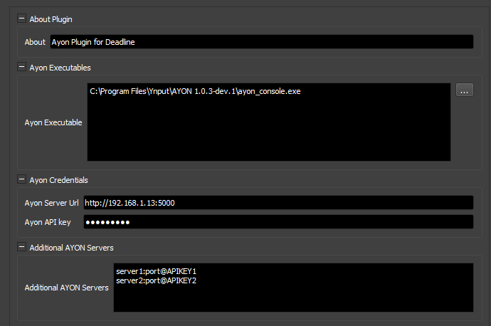

#### CelAction

It's required for CelAction submissions via deadline addon.
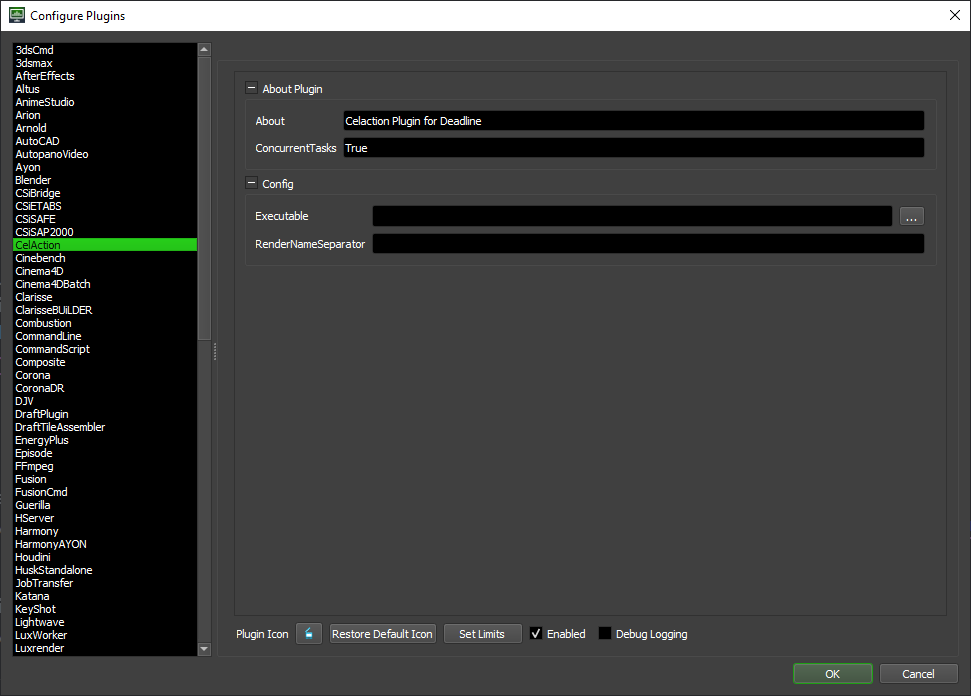

#### HarmonyAYON

It's required for Harmony submissions via deadline addon.
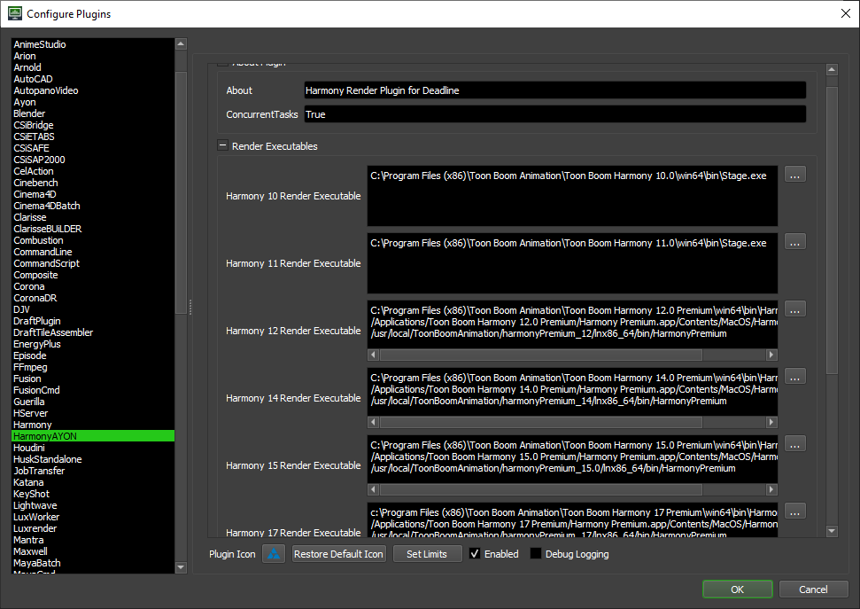

#### UnrealEngine5

It extends the official Unreal5 Plugin to support Unreal Perforce submissions.
It implements `PreLoad` scripts that syncs your project to change list id within the exported `changelist` before rendering.
For more info, check [Version Control - Support for Unreal and Deadline](addon_version_control_admin_get_started.md#support-for-unreal-and-deadline) and [Version Control - Deadline](addon_version_control_artist.md#deadline)

:::info
Unreal submissions via deadline addon requires `ayon-version-control` addon and configured (P4 credentials etc.). See [Version Control - Addon Settings](addon_version_control_admin_settings.md#addon-settings)
:::

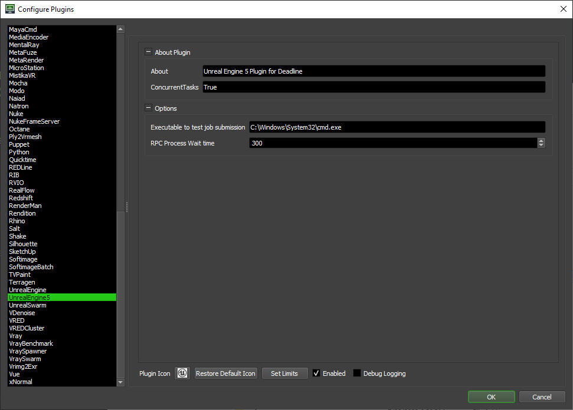

#### HuskStandaloneSubmitter

It's required for Houdini `usdrender` submissions via deadline addon.

:::info
This plugin is not shipped with `ayon-deadline` addon. 
It's also a repository overlay, so you can copy its content directly to your Deadline repository. Get it from [Husk Standalone Submitter](https://github.com/BigRoy/HuskStandaloneSubmitter)

If you have the `PATH` configured in your application addon as mentioned in  [How to submit houdini patch version to deadline?](addon_houdini_admin.md#how-to-publish-lookdev-from-houdini-), then you'd be able to only use `husk.exe` instead of the full path.
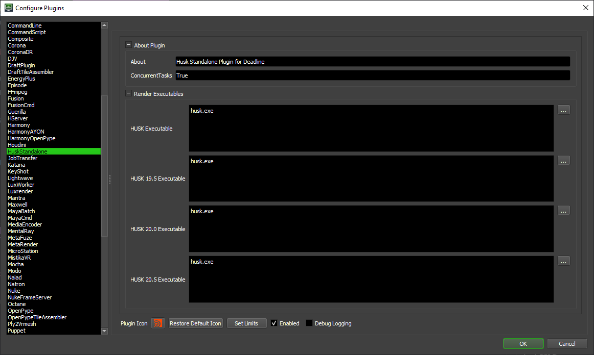
:::

## Addon Settings

### System Deadline Webservice Info
> Setting Location: `ayon+settings://deadline/deadline_urls`

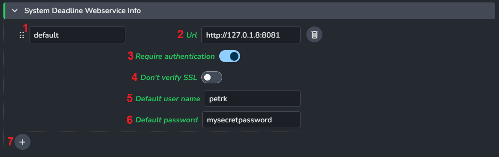

- `Url` - is IP or host name including port (example of locally running DL `http://127.0.0.1:8081`)
- `Require authentication` - DL webservice could be protected by username/password (set in Deadline Monitor in `Tools > Configure Repository Options > Web Service Settings > Require Authentication`)
- `Don't verify SSL` - if your Dl webservice is using SSL (eg. on https://) self-signed certificates might trigger an error. Disable verification of certificate here.
- `Default user name` - if `Require authentication` is enabled, this and next field provides possibility to fill single credentials for all artists publishing to Deadline. 
  
:::info
If every machine should have separate credentials, admin need to provide them in `Site Settings` on `Studio Settings` page.

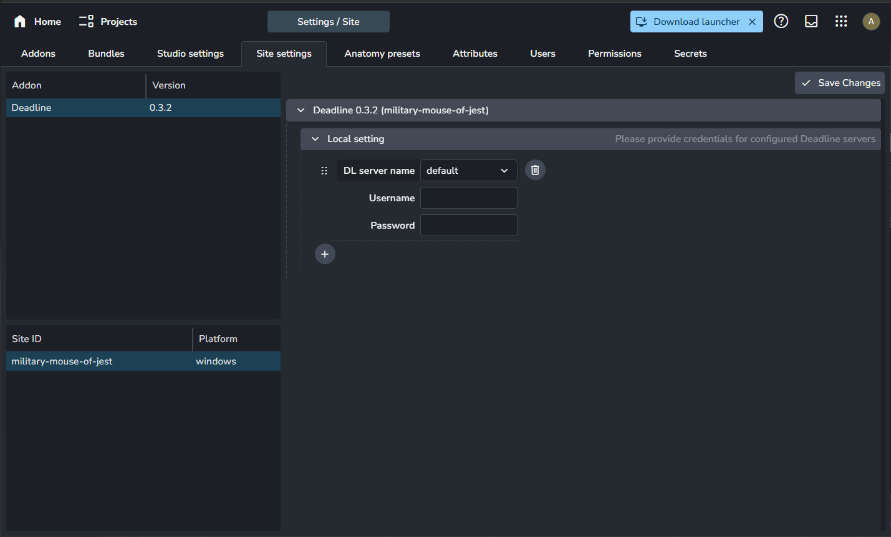
:::

## Addon Publish Plugins

### Collect Job Info
> Setting Location: `ayon+settings://deadline/publish/CollectJobInfo`

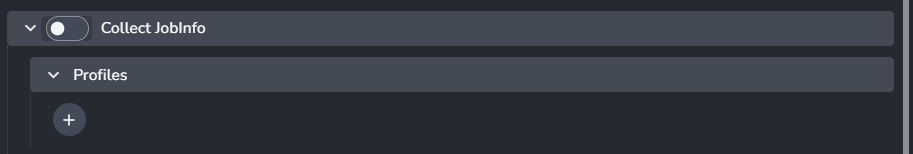

#### Profiles

- Host names
- Task Types
- Task names
- Frames per Task
- Priority
- Group
- Limit Groups
- Primary Pool
- Secondary Pool
- Machine Limit
- Machine List
- Machine List is a Deny
- Number of concurrent tasks
- Department
- Use GPU
- Delay Job
- Use Published Scene
- Use Asset dependencies
- Workfile Dependency
- Multiprocess
- Allowed environment keys
- Search & replace in environment values
- Additional JobInfo data
- Additional PluginInfo data
- Exposed Overrides
- **+** button

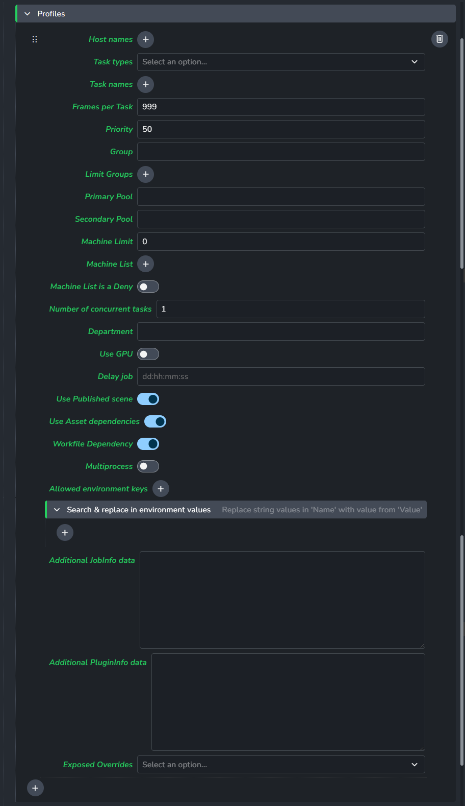

### Add AYON server to farm job
> Setting Location: `ayon+settings://deadline/publish/CollectAYONServerToFarmJob`

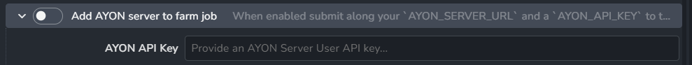

:::tip
This feature is handy for submissions from a separate AYON dev server.
:::

When enabled, submit your current `AYON_SERVER_URL` with the job to enforce using your current server. This requires modifying the Deadline AYON plugin configuration to add additional AYON servers. See [Deadline AYON Plugin](#ayon).

### Validate Expected Files
> Setting Location: `ayon+settings://deadline/publish/ValidateExpectedFiles`

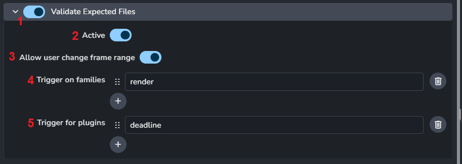

1. Enable
2. Active
3. Allow user change frame range
4. Trigger on families
5. Trigger for plugins

### After Effects to deadline
> Setting Location: `ayon+settings://deadline/publish/AfterEffectsSubmitDeadline`

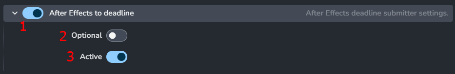

### Blender Submit to deadline
> Setting Location: `ayon+settings://deadline/publish/BlenderSubmitDeadline`

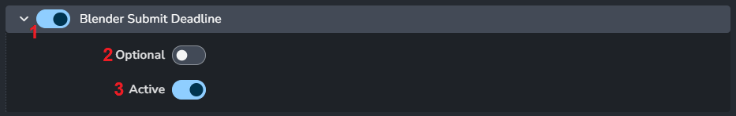

### Celaction Submit to deadline
> Setting Location: `ayon+settings://deadline/publish/CelactionSubmitDeadline`

### Fusion Submit to deadline
> Setting Location: `ayon+settings://deadline/publish/FusionSubmitDeadline`

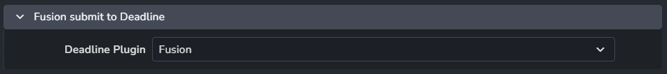

### Harmony Submit to deadline
> Setting Location: `ayon+settings://deadline/publish/HarmonySubmitDeadline`

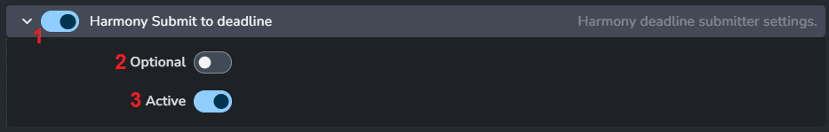

### Houdini Submit cache to deadline
> Setting Location: `ayon+settings://deadline/publish/HoudiniCacheSubmitDeadline`

### Houdini Submit render to deadline
> Setting Location: `ayon+settings://deadline/publish/HoudiniSubmitDeadline`

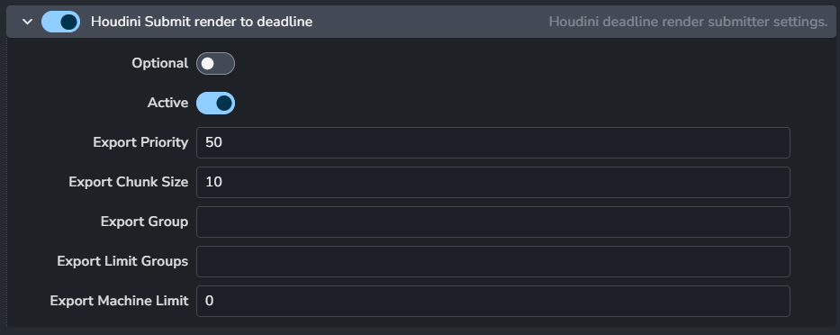

### Max Submit to deadline
> Setting Location: `ayon+settings://deadline/publish/MaxSubmitDeadline`

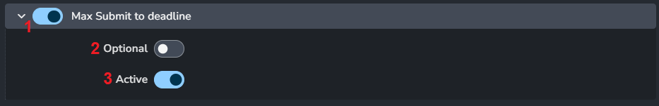

### Maya Submit to deadline
> Setting Location: `ayon+settings://deadline/publish/MayaSubmitDeadline`

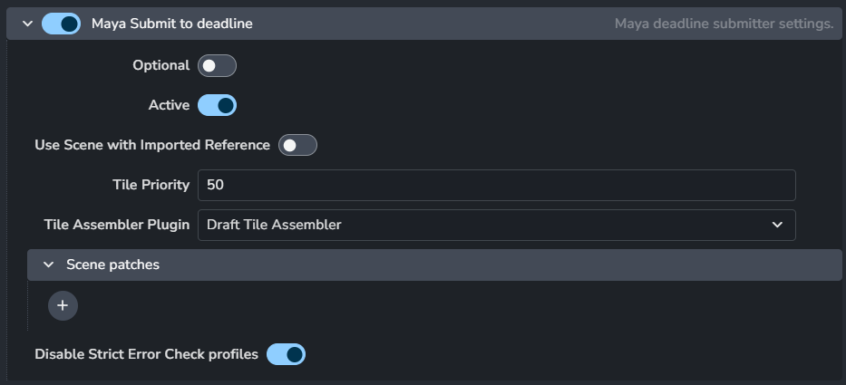
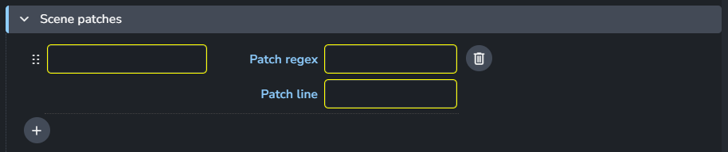

### Nuke Submit to deadline
> Setting Location: `ayon+settings://deadline/publish/NukeSubmitDeadline`

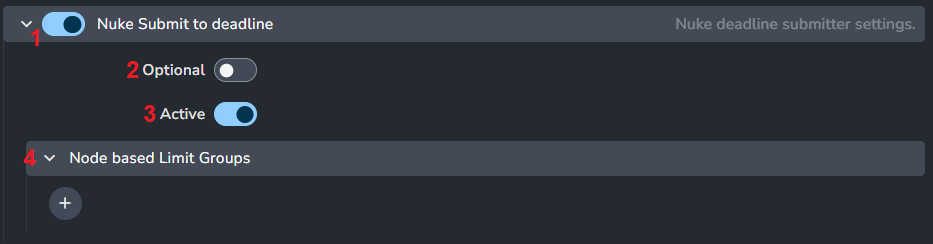

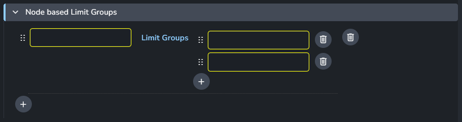

### Process submitted cache Job on farm
> Setting Location: `ayon+settings://deadline/publish/ProcessSubmittedCacheJobOnFarm`

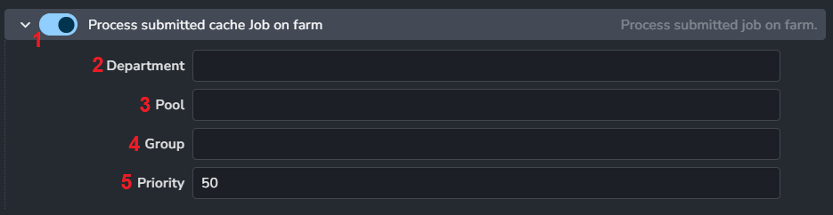

It submits a dependent AYON Job to publish the exported cache.

1. **Enable**
2. **Department**
3. **Pool**
4. **Group**
5. **Priority**

### Process submitted job on farm
> Setting Location: `ayon+settings://deadline/publish/ProcessSubmittedJobOnFarm`

It submits a dependent AYON Job to publish the rendered images.

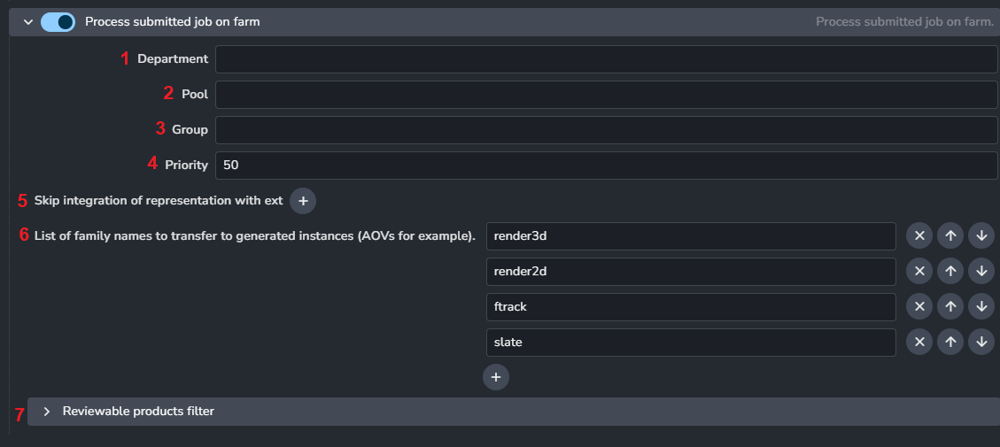

1. **Enable**
2. **Department**
3. **Pool**
4. **Group**
5. **Priority**
6. **Skip integration of representation with ext:** list of extensions that shouldn't be published.
7. **List of family names to transfer to generated instances (AOVs for example):** Ensure the AOV instances have these families if present.
8. **Reviewable products filter:** Add review for specific aov names.
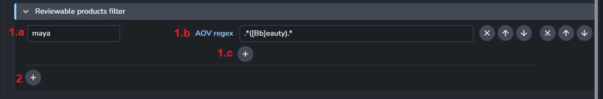
   1. **AOV Filter**
       1. **host_name:** Pipeline integration name supplied by an AYON addon.
       2. **AOV Regex:** AOV regex patterns for AOV filters.
       3. **+ icon:** Add more AOV regexes 
   2. **+ icon:** Add more filters

## Troubleshooting

### Publishing jobs fail directly in DCCs

- Double check that all previously described steps were finished
- Check that `deadlinewebservice` is running on DL server
- Check that user's machine has access to deadline server on configured port

### Jobs are failing on DL side

Each publishing from AYON consists of 2 jobs, first one is rendering, second one is the publishing job (triggered after successful finish of the rendering job).

- ** Jobs are failing with `AYON executable was not found` error **

    Check if AYON is installed on the Worker handling this job and ensure `AYON` Deadline Plug-in is properly [configured](#configuration)

- ** Render jobs are failing with `Got invalid credentials. Invalid API key for...` error **

    If you are sure that you provided correct AYON API key in Deadline `Configure Plugin`, check if you have enabled Deadline Secrets Management. 
    
    You will need to grant access to secrets to user or machine.

    You will need to run this command on Deadline Server machine:

    `deadlinecommand secrets GrantKeyAccessToServer {SECRETS_USER} defaultKey {NODE_ID}`

    See more details [Deadline Secrets Management - GrantKeyAccessToServer](https://docs.thinkboxsoftware.com/products/deadline/10.1/1_User%20Manual/manual/secrets-management/deadline-secrets-management.html#deadline-secrets-management-command-grantkeyaccesstoserver)

- ** Publishing job is failing with `ffmpeg not installed` error **

    AYON executable has to have access to `ffmpeg` executable, check AYON `ayon+settings://ayon_third_party`

    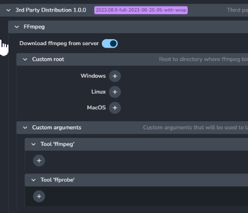

- ** Both jobs finished successfully, but there is no review on Ftrack **

    Make sure that you correctly set published family to be send to Ftrack.

    

    Example: I want send to Ftrack review of rendered images from Harmony :
        - `Host names`: "harmony"
        - `Families`: "render"
        - `Add Ftrack Family` to "Enabled"

    Make sure that you actually configured to create review for published product in `ayon+settings://deadline/publish/ProcessSubmittedJobOnFarm`

    

    Example: I want to create review for all reviewable products in Harmony :
      - Add "harmony" as a new key an ".*" as a value.

- ** Rendering jobs are stuck in 'Queued' state or failing **

    Make sure that your Deadline is not limiting specific jobs to be run only on specific machines. (Eg. only some machines have installed particular application.)

    Check job info [profiles](#profiles).

    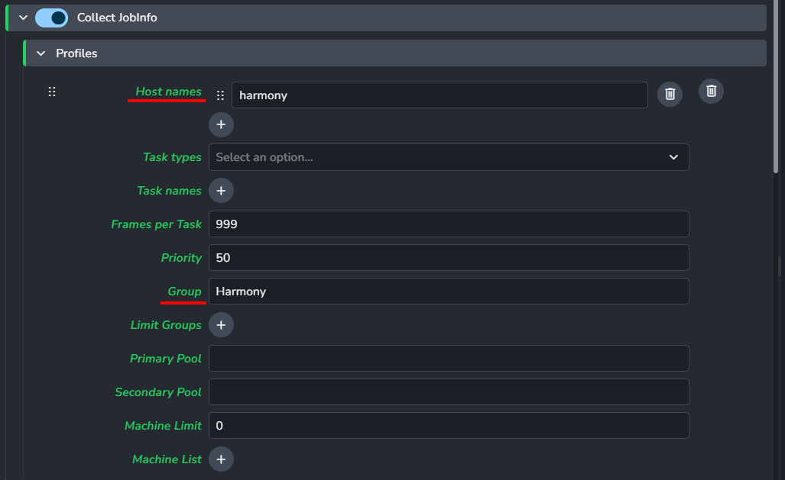

    Example: I have separated machines with "Harmony" installed into "harmony" group on Deadline. I want rendering jobs published from Harmony to run only on those machines.
