import ReactMarkdown from "react-markdown";
import versions from '@site/docs/assets/json/Ayon_addons_version.json'

<ReactMarkdown>
{versions.Flame_Badge}
</ReactMarkdown>

import Tabs from '@theme/Tabs';
import TabItem from '@theme/TabItem';

:::info Addon name
This addon integration is still at the **beta** stage. If you have any questions or need help, please contact us.
:::

<!-- TODO: Add documentation for Color Management section. also, explain why we need remapping. -->

## Hooks

### Install OpenTimelineIO to Flame

> Setting Location: `ayon+settings://flame/hooks/InstallOpenTimelineIOToFlame`

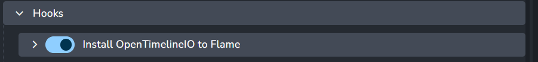

This hook installs the OpenTimelineIO library in the Flame environment, which is necessary for the integration to work correctly. The plugin is installed using the **pip** package manager, and the hook handles the installation process. You can also disable this hook if OpenTimelineIO is already installed manually in the Flame environment.

## Create plugins

### Create Shot Clip

> Setting Location: `ayon+settings://flame/create/CreateShotClip`

Set default values for all Creator attributes in the Creator UI from this settings category. This helps predefine the values for Creator attributes.
Let's break it into smaller sections: 

#### Shot hierarchy and rename settings

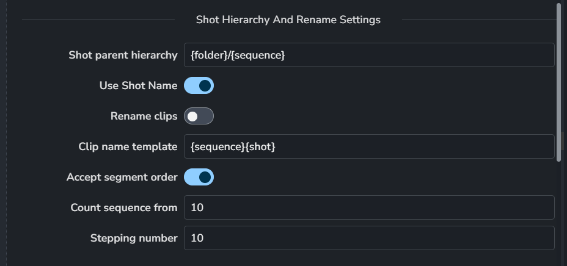

- **Shot parent hierarchy** - template for defining the parent hierarchy of the Shot folder.
- **Use shot name** - if enabled, Flames Timeline segment Shot name will be used for the Shot folder name.
- **Rename clips** - if enabled, the plugin will use renaming rules to rename the clips sequentially.
- **Clip name template** - template for defining the shot clip name.
- **Accept segment order** - if enabled, the plugin will use the segment's defined order for renaming the clips.
- **Count sequence from** - numeric value for defining the starting number for the shot name.
- **Stepping number** - numeric value for defining the incrementing number for the shot name.

#### Shot template keywords

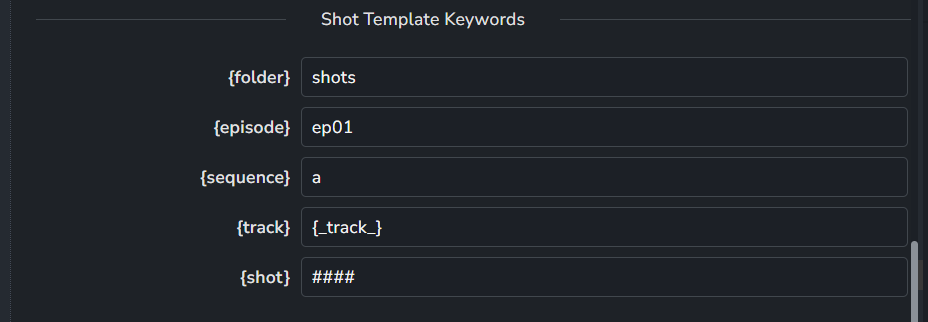

Following is a list of available keywords that can be used in *Shot parent hierarchy* or *Clip name template* of the *Shot hierarchy and rename settings* section above:
- **{folder}** - Literal value for the Folder token. Text and numbers can be used.
- **{episode}** - Literal value for the Episode token. Text and numbers can be used.
- **{sequence}** - Literal value for the Sequence token. Text and numbers can be used.
- **{track}** - Literal value for the Track token. Text and numbers can be used. Flames original track name could be accessed via the **{\_track\_}** token.
- **{shot}** - Literal value for the Shot token. Text and numbers can be used. Hashes are used to define the number of digits in the sequence number. Original flame segment name could be accessed via the **{\_shot\_}** token.

#### Vertical synchronization of attributes

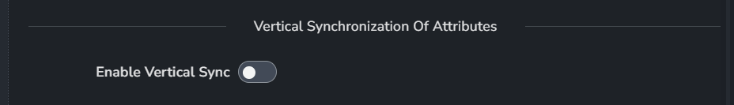

- **Enable vertical sync** - If enabled, clips on the timeline in multiple tracks will be synchronized vertically with the same attributes. Shot names will also be synchronized. The workflow assumes that the clips above the main hero track are vertically aligned without overlaps. Clips can be shorter than the main hero track clip, but not longer. The plugin will use the main hero track clip as a reference for vertical synchronization.

#### Shot attributes

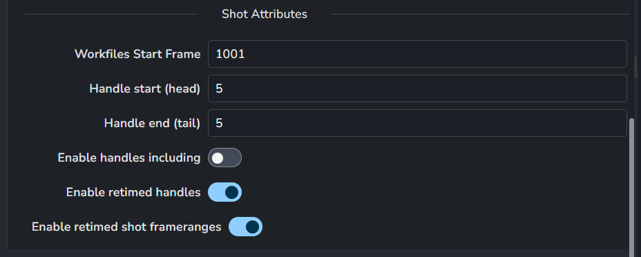

- **Workfile start frame** - Numeric value for defining the starting frame of the workfile. This value is set to Shot folder attributes as Frame start value.
- **Handle start (head)** - Numeric value for defining the maximum trimming value to be applied to the head of the clip. If the available media is shorter than the handle value, the clip will be trimmed to the available media length. The resulting value is then set to the Shot folder attributes as Handle start value.
- **Handle end (tail)** - Numeric value for defining the maximum trimming value to be applied to the tail of the clip. If the available media is shorter than the handle value, the clip will be trimmed to the available media length. The resulting value is then set to the Shot folder attributes as Handle end value.
- **Enable handles including** - If enabled, handles will be included in the workfile start frame value. Since AYON excludes handles by default, this option will recalculate the workfile start frame value to include them. Here is an example of the resulting calculation: `'workfile start frame' = 'workfile start frame' - 'handle start' + 1`
- **Enable retimed handles** - If enabled, shot attributes for handles will be recalculated based on the speed of the retimed clip. This option is useful when production wants to avoid including handles that result in a high number of frames due to high retime speeds. The handle values will be recalculated based on the retime value. For example: `'handle start' = 'handle start' * 'retime speed'` and `'handle end' = 'handle end' * 'retime speed'`
- **Enable retimed shot framerange** - If enabled, the shot attributes for the frame range will be recalculated based on retimed timeline segment. This option is useful disabled when production wants to keep unretimed working framerange. The frame range values will be recalculated based on the retime value. For example: `'workfile start frame' = 'workfile start frame' * 'retime speed'` and `'workfile end frame' = 'timeline segment duration' * 'retime speed'`

## Publish plugins

### Collect Timeline Instances

> Setting Location: `ayon+settings://flame/publish/CollectTimelineInstances`

The plugin collects timeline instances from the current timeline and publishes them to the AYON Server. It supports mapping attributes and presets for distributing sets of tasks to the final published Shot hierarchies.

:::caution Add Task

This feature is currently under this plugin, but we plan to separate it in the future. It is marked as experimental and not production-ready.

:::

#### XML Presets Attributes Parsable from Segment Comments

> Setting Location: `ayon+settings://flame/publish/CollectTimelineInstances/xml_preset_attrs_from_comments`

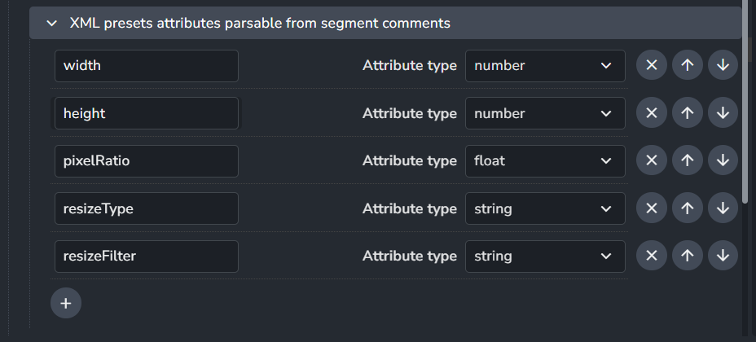

This option allows you to define which comment tokens should be temporarily assigned to a timeline item. This helps the integration get the correct values for the Shot folder attributes. It does not affect any existing comments in the timeline segments.

#### Add Tasks

> Setting Location: `ayon+settings://flame/publish/CollectTimelineInstances/add_tasks`

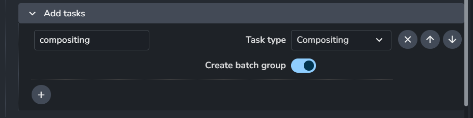

Any tasks added to this option will be distributed into the final hierarchy of published Shot folders. Task presets also support assigning Batchgroup creation (experimental feature).

### Extract Product Resources
> Setting Location: `ayon+settings://flame/publish/ExtractProductResources`

Plugin is responsible for extracting resources from
 the selected timeline instances and publishing them to the AYON Server. Plugin supports adding custom presets for transcoding resources on-the-fly via linking native Flame XML presets.

#### Publish clip's original media
> Setting Location: `ayon+settings://flame/publish/ExtractProductResources/keep_original_representation`

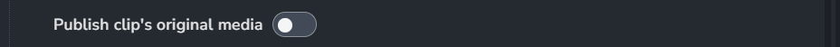

When enabled, publish keeps the original representation.

#### Export presets mapping
> Setting Location: `ayon+settings://flame/publish/ExtractProductResources/export_presets_mapping`

Preset's properties are divided into sections related to the output file, linking XML presets, transcoding representation settings, and after-publish loading settings.

:::info Preset properties
Thumbnail preset is hardcoded into plugin and is always added to the set of exports. It could be overridden by adding custom preset with the same name **thumbnail**.
:::

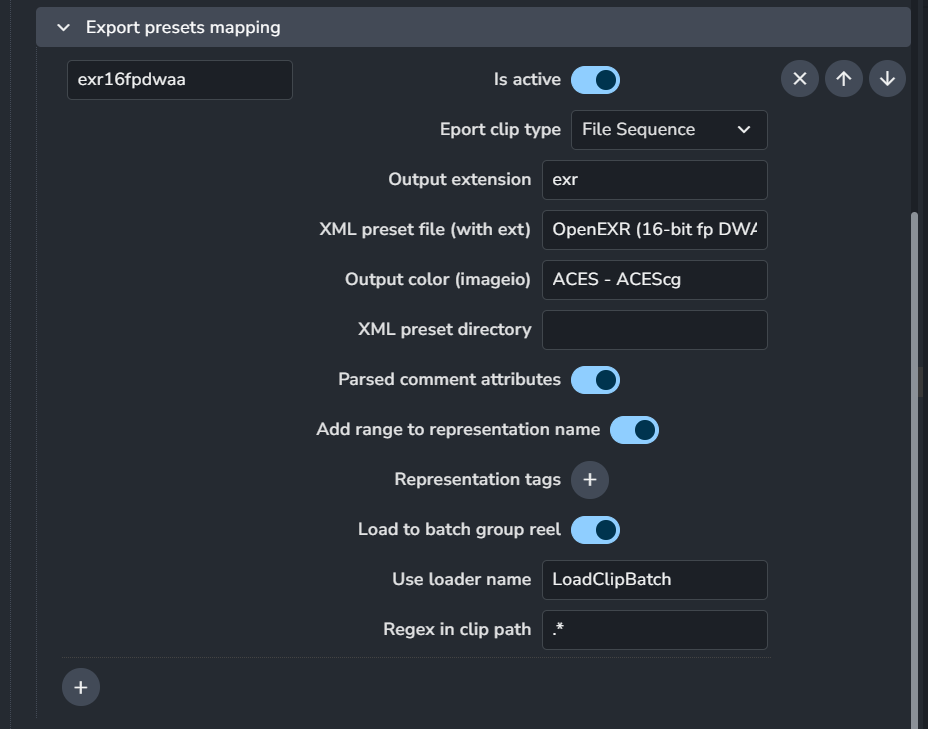

*   **Name** - Used to identify the preset. It can also be part of the output file name via the `outputName` anatomy template token. It serves as a unique representation name.
*   **Is active** - If the preset is active, it will be used during the export process.
*   **Activate by search pattern** - If the clip's media resource path matches the input regex pattern, the preset will be used.
*   **Output extension** - The output file extension for the published representation.
*   **Output color (imageio)** - Specifies the colorspace data to be stored in the representation. This is used downstream in the publishing process or by loading plugins.
*   **Export clip type** - The type of XML preset to be used for export.
*   **XML preset directory** - The absolute directory path where the XML preset is stored. If left empty, built-in directories are used, either shared or installed presets folder.
*   **XML preset file (with ext)** - The name of the XML preset file with its extension.
*   **Distribute parsed comment attributes to XML preset** - If enabled, previously collected clip comment attributes will be distributed to the XML preset. This can affect the resulting resolution of the exported media.
*   **Add range to representation name** - Adds frame range-related attributes to the publishing representation data for downstream use in the publishing process.
*   **Representation tags** - Adds tags to the representation data for downstream use in the publishing process. For example, marking the representation as reviewable.
*   **Load to batch group reel** - If enabled, the representation will be loaded to the batch group reel after publishing (connected to IntegrateBatchGroup).
*   **Use loader name** - Defines which loader plugin should be used for loading the representation after publishing (connected to IntegrateBatchGroup).

### Integrate Batch Group

> Setting Location: `ayon+settings://flame/publish/IntegrateBatchGroup`

:::caution Plugin state

The plugin is currently in the experimental state and not production-ready. Settings will be updated in the future.

:::

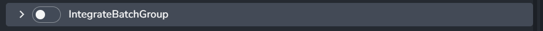

When enabled, It integrate published shot to batch group.

## Loading plugins

### Load Clip

> Setting Location: `ayon+settings://flame/load/LoadClip`

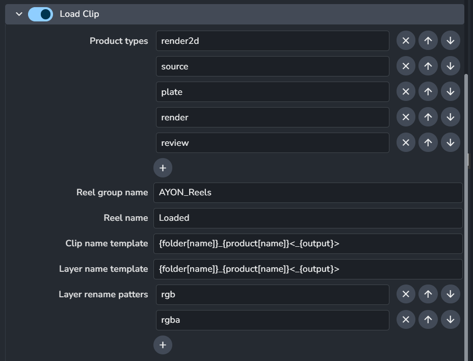

* **Product types** - filtering inputs for what product types this plugin should be used.
* **Reel group name** - name of the reel group where the clips should be loaded. If the reel group does not exist, it will be created.
* **Reel name** - name of the reel where the clips should be loaded. If the reel does not exist, it will be created.
* **Clip name template** - template for defining the loaded clip name.
* **Layer name template** - template for defining the loaded clip OpenClip layer.
* **Layer rename patterns** - list of patterns for renaming the OpenClip layers.

### Load as clip to current batch

> Setting Location: `ayon+settings://flame/load/LoadClipBatch`

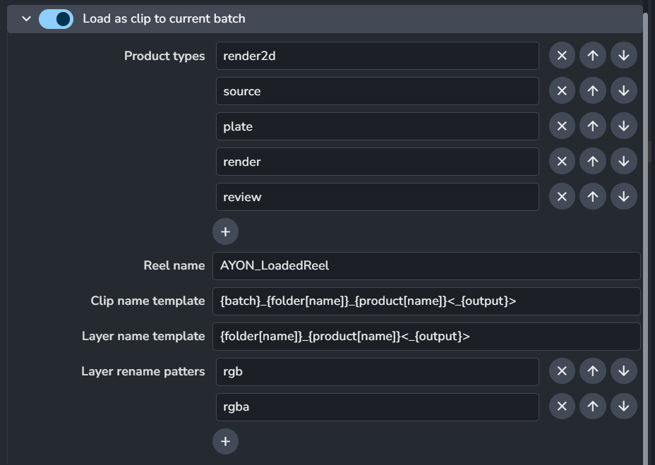

* **Product types** - filtering inputs for what product types this plugin should be used.
* **Reel name** - name of the reel where the clips should be loaded. If the reel does not exist, it will be created.
* **Clip name template** - template for defining the loaded clip name.
* **Layer name template** - template for defining the loaded clip OpenClip layer.
* **Layer rename patterns** - list of patterns for renaming the OpenClip layers.
