import ReactMarkdown from "react-markdown";
import versions from '@site/docs/assets/json/Ayon_addons_version.json'

<ReactMarkdown>
{versions.Flame_Badge}
</ReactMarkdown>

:::info Addon name
This addon integration is still at the **beta** stage. If you have any questions or need help, please contact us.
:::

## Launch Flame

:::tip
It's expected to have only one instance of Flame running. Please close any open Flame instances before launching Flame from the launcher.
:::

Head to the AYON launcher, select your folder and task, and then launch Flame by clicking its icon in the launcher.

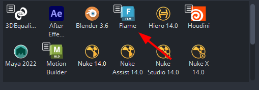

## AYON Flame Menus

<!-- TODO: Add a tip about how to show the publisher window -->

AYON Integration adds AYON menus in multiple locations within the Flame UI.

| Main Menu | Timeline item Menu|
|--|--|
| 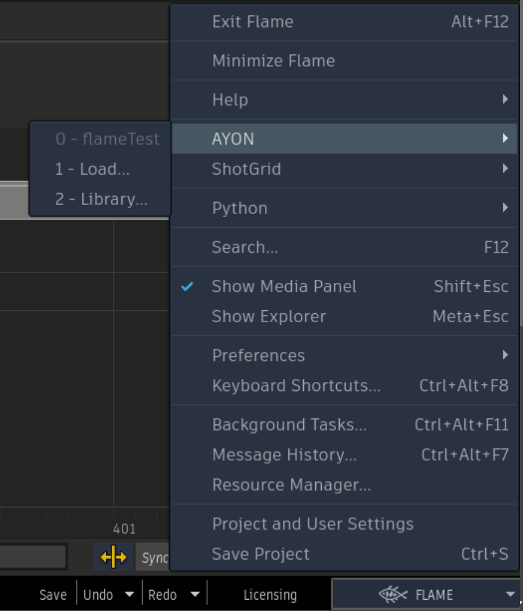 | 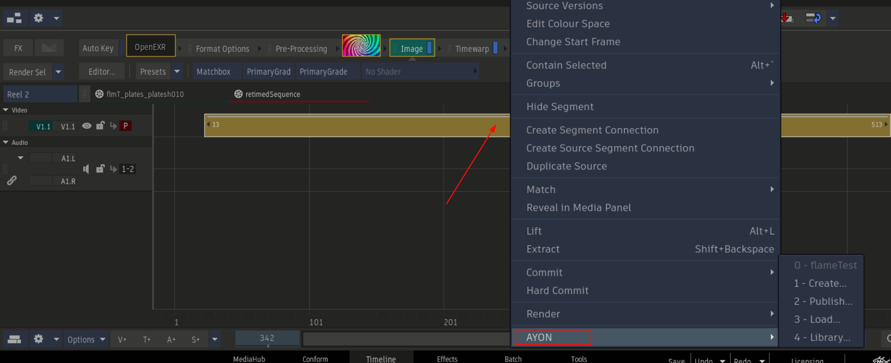 |

| Reels Menu | Media Panel Menu |
|--|--|
| 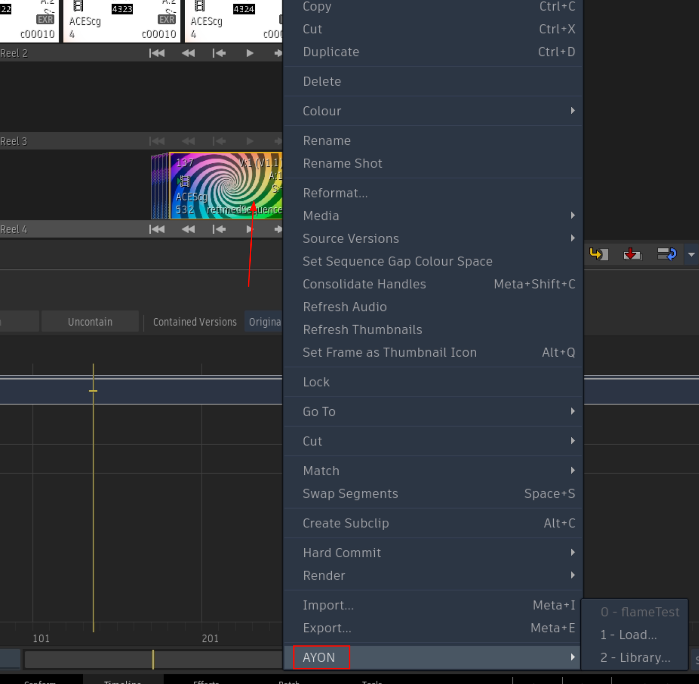 |  |

## Create and Publish Products

The current publishing process is
1. Create a publish instance using `Create` menu.
2. Click publish ▶️ button in the [Publisher](artist_tools_publisher.md) Tool!

:::info
Flame addon is currently using the old creator.

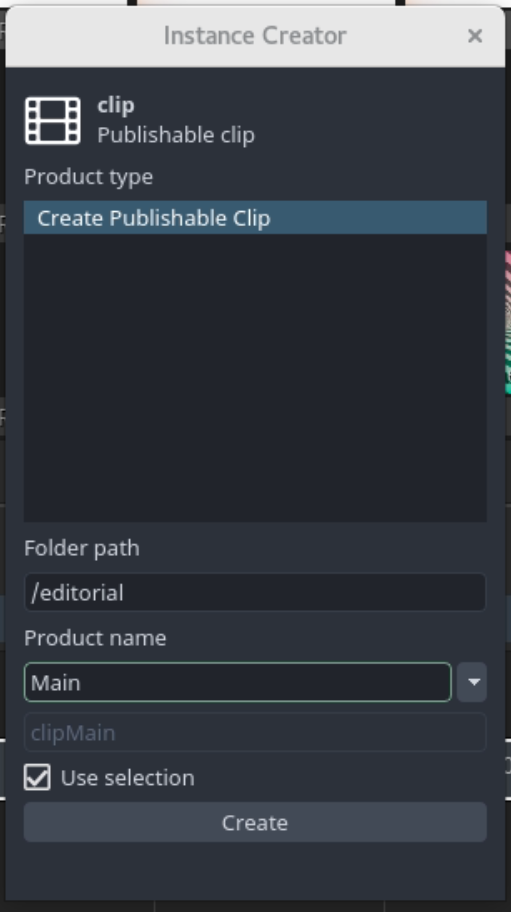
:::

### Publishable Clip

Steps for making a publishable clip:
- Select your clips in the timeline.
- Go to **AYON -> Create**, and select **Create Publishable Clip**.
- **AYON publish attributes creator** window will appear where you can specify multiple options for your publish instance.
- After that, you can go to **AYON -> Publish** which runs some validations before exporting and publishing your clip.

Once you create a publish instance, you'll start noticing that your clip is marked.
these marks are objects that hold AYON publish metadata.
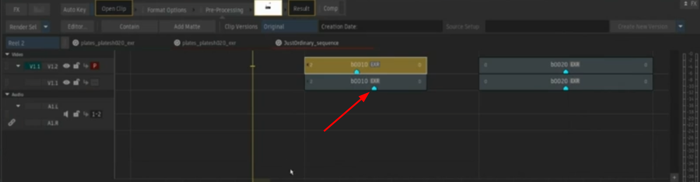

:::info AYON Publish attributes creator

**AYON publish attributes creator** provides various options for you to tweak your publish instances.
e.g. You can rename the clips, specify frame padding and etc.
<!-- TODO: Break down the creator options -->
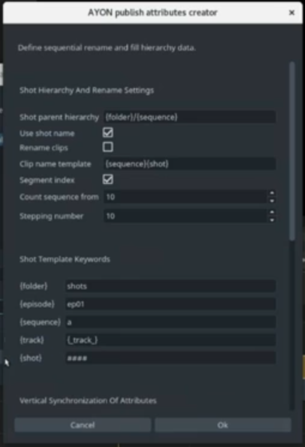
:::

### Reviewable source

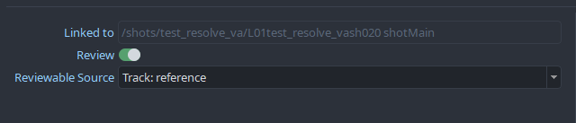

In case you wish to publish reviewable video per `plate`:
<<<<<<< Updated upstream
1. Enable the `review` toggle
2. Select either the appropriate track name or `[clip's media]` (will use the clip's own source)
=======
1. Ensure the `review` toggle is enabled for the plate instance
2. Select either the appropriate track name or `[clip's media]` (will use the clip own source) as `Reviewable Source`
>>>>>>> Stashed changes

#### Vertical synchronization of attributes
* This feature allows to publish multiple plate variant(s) per shot.
* The timeline must contain multiple tracks, one of those being the hero (driving) track. Per shot, the clip on the hero track will be driving the shot creation (shot length, shot resolution...).
* First, you need to rename sequence tracks, so they can be used as product variant names. Just simply RMB click on the track and select _Rename Track_.
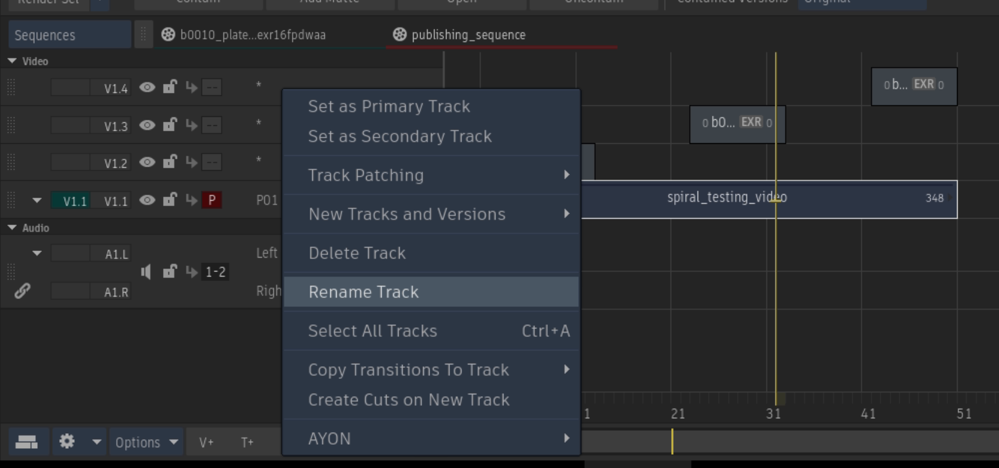
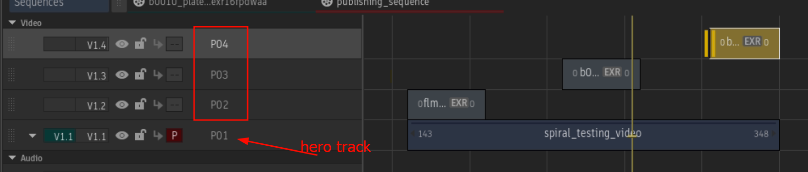

* To publish multiple plates for a shot proceed as following:

1. Set up a multiple track timeline. Rename each track to determine plate variants (e.g `P01`, `P02` and `P03`)
2. Pick-up one track to be the **hero** track and set your main plate clip onto it.
3. Then, for each shot, stack additional plate clip(s) on other tracks, aligned with the hero/main plate clip. Clips can be shorter than the main hero track clip, but not longer.
4. (Optional) You can setup another track to contain your review material
5. Select all clips that needs to be published
6. In the creator enable vertical align and select your main track as the hero track.
5. Create instances by hitting "Create"
6. Ensure all instances are parented to the same shot, which length is driven by the hero clip.

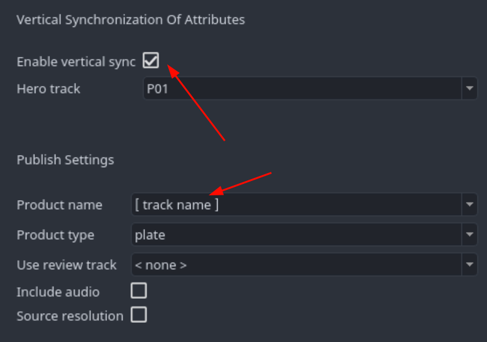

:::note
If you are working with only two tracks where one track is going to be used as plates (e.g. `main`) and the other one holds video clips for offlines and web preview (e.g. `review`), then **Enable vertical sync** is not required.
:::

<!-- TODO: Add a note about publish plugins so that artists are aware of the changes that happens on publishing? -->

### Speed retime and Timewarp

Clip retiming via `TimeWarp` FX is supported. When such an effect is applied to a clip, it is automatically detected and stored as metadata for the relevant `plate` product.

:::warning
Autodesk Flame as some internal logic to compute retiming that can be extracted out of the software.
AYON publisher relies on the logic from [FlameTimewarpML](https://github.com/talosh/flameTimewarpML) plugin to interpolate and gather the retiming. It works fine for most of the cases, but some limitations around speed-based timewarps and unusual curves are known. 
:::

## Loading Products

You can load products using [AYON Loader](artist_tools_loader.md) like any other addons.

Currently, we place the loaded media in the Media Panel as Reels or Batch clips with conversion to OpenClip. This allows you to manually place them in the timeline as needed.

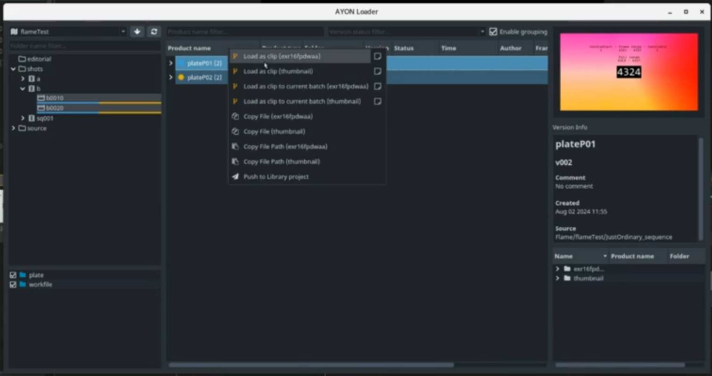

## Manage versions of loaded clips

Flame addon, *unlike other addons,* doesn't include **Inventory manager**.
Alternatively, you should be able to set versions of your loaded media via Reels and Media panel menus using `Source Versions` action.

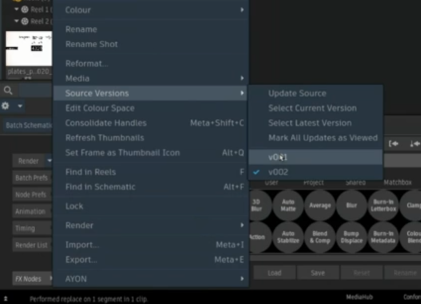