import ReactMarkdown from "react-markdown";
import versions from '@site/docs/assets/json/Ayon_addons_version.json'

<ReactMarkdown>
{versions.Flow_Badge}
</ReactMarkdown>

import Tabs from '@theme/Tabs';
import TabItem from '@theme/TabItem';

:::note Addon name
In Ayon, we've been using the name Shotgrid. But since we plan to change it, we'll start calling it Flow addon in our documentation. Sometimes, we might use SG too, just to keep things interesting.
:::

### Introduction

Flow ( previously known as ShotGrid or ShotGun) is a production tracking and asset management software that helps studios manage their projects, assets, and shots. The Ayon Flow integration allows you to seamlessly connect your Ayon Studio with Flow and automate the synchronization of your project data between the two systems. The integration enables you to synchronize folder attributes, status, tags, and reviewables between Ayon and Flow

Current version of the integration also supports following features:

- Folder attributes two way synchronization
- Folder tasks two way synchronization
- Status synchronization (currently only Ayon to Flow)
- Tags synchronization (currently only Ayon to Flow)
- Reviewables upload to Flow for review
- Three types of Ayon client (desktop) user login:
  - via environment variable,
  - via Tray widget for User email and password inputs,
  - via Tray widget for User email input - with secret shared User api key set in addon settings

### Configuring Ayon

Before any project can be synchronized form Flow first we need to configure the addon's Studio settings.

#### Setting up Flow Script connection

1. Go to your Flow server and within your admin menu (1) select Scripts menu item (2). 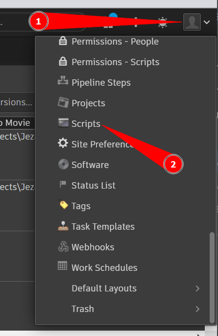
2. You'll need to create a new item for each access level and give it a name. We're calling our items `ayon_connector` and _`ayon_user_publishing`_. Each item is linked to a different **permission group**. It's important to know that the `ayon_connector` script is only for services, while `ayon_user_publishing` is for users logging into the Ayon Desktop app. This helps us manage different access levels. 
3. When you create a script item, remember to save the generated hash key right away because it's only shown once.

#### Setting Ayon Secrets

Add the ayon_connector key to Ayon Secrets and name it some easy way so here in our example we are naming it `sg_server_script_key`. You can also add the `ayon_user_publishing` secret here just for future reference, but it will never be used as within SG addon settings.

#### Flow addon Studio settings configuration

:::note Addon Frontend Tab
To be able to use Shotgrid tab in Studio settings you need to have correctly configured addon at production bundle state. Please restart the server after you finalized the settings. After that, you should see the Shotgrid tab in Studio settings.
:::

To get the addon's frontend tab working and sync all Flow projects, you need to set up a few things:

*   Shotgrid URL (`ayon+settings://shotgrid/shotgrid_server`)
*   ShotGrid's Script API key (`ayon+settings://shotgrid/service_settings/script_key`)
*   ShotGrid's Script Name (`ayon+settings://shotgrid/service_settings/script_name`)

#### Setting up the ShotGrid URL
First, enter your Flow server URL in the **Shotgrid URL** field. It looks something like `https://yourcompany.shotgrid.autodesk.com`.

#### Setting up the ShotGrid's Script API key for Services
Next, in the Services section, put your **ShotGrid's Script API key**. You should already have this key. Then, add your **ShotGrid's Script Name**. If you've followed the steps before, you might name it `ayon_connector`.

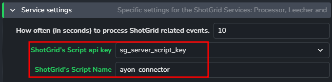

#### Setting login types for Users
You need to decide how users will log into the Ayon Desktop app. Here are three options:

1. **Via Environment variable** - This is the default login method. Enter the user's email as `AYON_SG_USERNAME` on each user's computer in your studio. With this method, users won't see their login details on the Tray app widget.
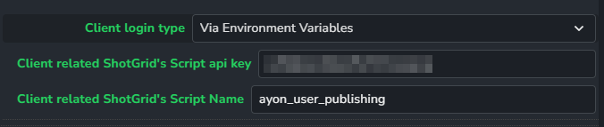

2. **Via Tray App with password** - Users log in with their email and password. It's a common method, and you can set permissions in Flow. You can create different permission groups for users. However, sometimes users might not have access to certain projects.
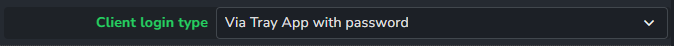

3. **Via Tray App with shared API key** - Users log in with their email only. The shared secret API key is in the addon settings. This lets you set one permission group for all users.
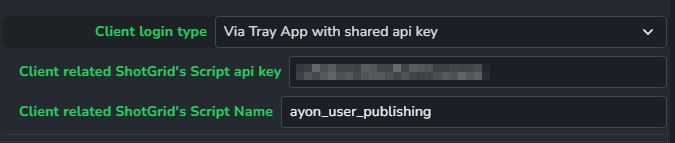

#### Setting up local storage for Flow

In order to use power of Flows file system you have to configure local storage settings. This is done by enabling local storage and adding local storage name which had been previously configured in **Flow's Admin menu** > **Site preferences** > **File management**. Here it is important to **Enable linking to local files** (1) and create preset (2) for multiplatform file system. Copy name of the created preset (3) and paste it in Ayon Studio settings.
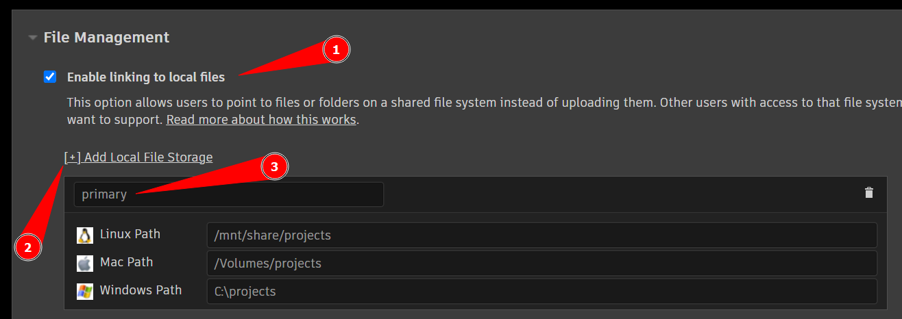

Paths should be mirroring defined paths in Ayon Anatomy root configuration. 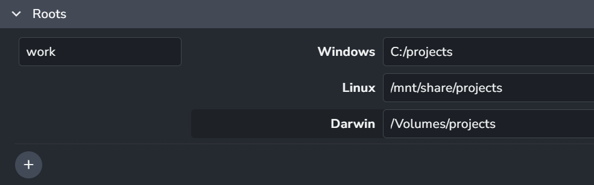

The name of the preset copied previously should be pasted in Ayon Studio settings. 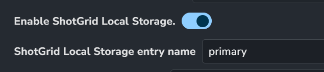

#### Anatomy preset configuration

To use the Flow addon with Ayon, you need to set up an Anatomy preset. This preset helps sync things between Ayon and Flow. To get started, you can create a new preset or pick an existing one. Right now, the only thing to remember is that _Task Types_, _Folder Types_, and _Statuses_ should each have only one item. Make sure it matches a common item you'd find in Flow.

Here's how to add a **Comp** task type with the shortcode **cmp**. Make sure to include it in the **Flow Admin menu** under **Pipeline steps**.

Follow these steps for Folder Type and Statuses too, as explained below.

To create new Anatomy preset follow these steps:

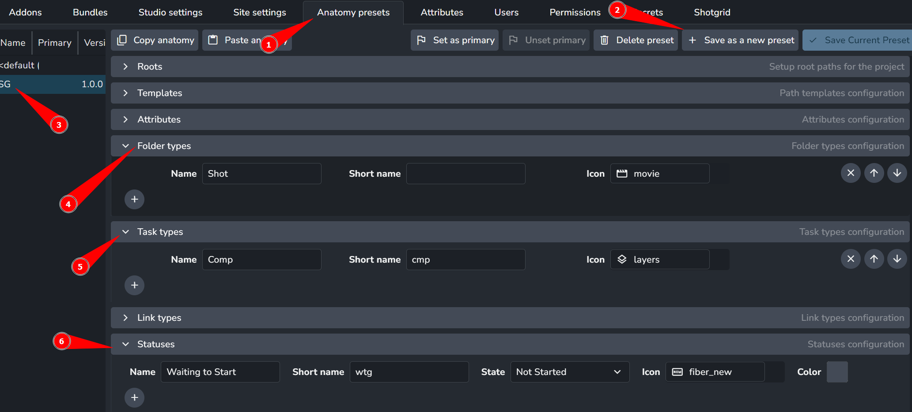

1. Go to **Anatomy presets** tab in Studio settings
2. Hit Save as new preset button
3. Name it something like Flow or SG
4. Remove all Folder types except one - make sure it has corresponding type in Flow
5. Remove all Task types except one - make sure it has corresponding type in Flow
6. Remove all Statuses except one - make sure it has corresponding status in Flow

And now the anatomy preset is ready to be used in Flow addon settings.

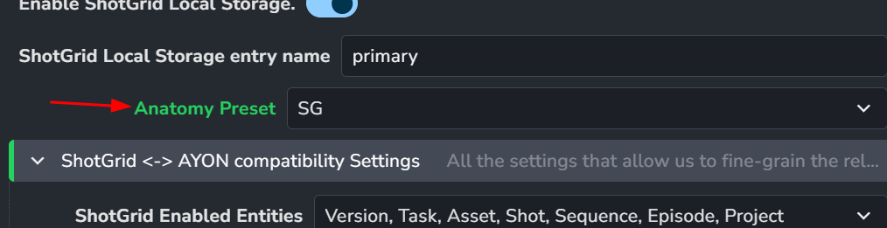

#### Selecting enabled entities for synchronization

Flow's enabled entity enumerator (`ayon+settings://shotgrid/compatibility_settings/shotgrid_enabled_entities`) lets us pick which entities to sync between Ayon and Flow. We do this by choosing the entities from the list and saving our choices. But remember, we must also turn on these entities in Flow's Project Tracking settings. Ensure all required entities are visible (not hidden).

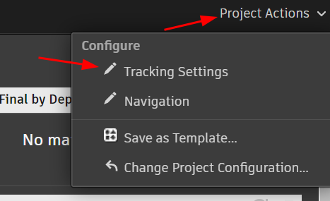

#### Configuring folder attributes synchronization

To sync folder attributes between Ayon and Flow, set up the **Folder Attributes Map**. Choose attributes to sync by adding the name to the **SG** column (1). Attributes with no value won't be considered. Use the **Scope** column (2) to pick only the Flow entities that should have the attribute. For instance, the **fps** attribute might be used only for Versions, Shots, and Project entities.

:::note SG attribute names
Use names without the "sg_" prefix, even though they exist in Flow's Field registry with this prefix. The system adds them automatically during synchronization. We first check if a name exists without the prefix and then try it with the prefix for the specific entity. If it's already in the registry, we use it; if not, we create it in Flow's field registry.

Check the Available Fields in **Flow's Admin menu** > **Fields**
:::

Here is a typical example of folder attributes mapping:

### Starting Ayon Flow addon service

### Creating Flow project and linking them together

### Configuring plugin settings

#### Targeting reviewables to Flow

You can effortlessly ensure that all reviewables will be uploaded to Flow. For this purpose, you simply need to attach a specific tag to Extract Review output presets. You can achieve this by following these steps:

1. Navigate either to your Studio Settings or any Project settings.
2. Find and add the **shotgridreview** tag to any of the selected preset's output.
   You can do this at the following path `ayon+settings://core/publish/ExtractReview/profiles/0/outputs`.

