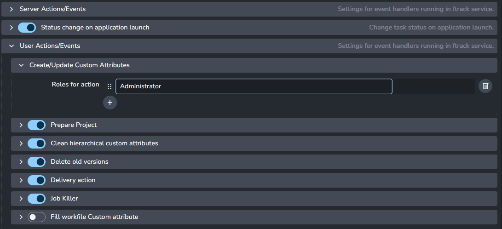

import ReactMarkdown from "react-markdown";
import versions from '@site/docs/assets/json/Ayon_addons_version.json'

<ReactMarkdown>
{versions.Ftrack_Badge}
</ReactMarkdown>

import Tabs from '@theme/Tabs';
import TabItem from '@theme/TabItem';

Ftrack is currently the main project management option for AYON. This documentation assumes that you are familiar with Ftrack and its basic principles. If you're new to Ftrack, we recommend having a thorough look at [Ftrack Official Documentation](https://help.ftrack.com/en/).

## Prepare Ftrack for AYON

### Server URL
If you want to connect Ftrack to AYON you might need to make few changes in Ftrack settings. These changes would take a long time to do manually, so we prepared a few Ftrack actions to help you out. First, you'll need to have Ftrack enabled in your AYON bundle, and enter the address to your Ftrack server.

### Login
Once your server is configured, restart AYON and you should be prompted to enter your [Ftrack credentials](addon_kitsu_artist.md#How-to-use-Ftrack-in-AYON) inside the standalone launcher to be able to run our Ftrack actions. If you are already logged in to Ftrack in your browser, it is enough to press `Ftrack login` and it will connect automatically.

For more details step by step on how to login to Ftrack in AYON to go [artist Ftrack login](addon_kitsu_artist.md#How-to-use-Ftrack-in-AYON) documentation.

### Ftrack Actions
After successfully connecting AYON with your Ftrack, you can right-click on any project in Ftrack and you should see a bunch of actions available. The most important one is called AYON Admin and contains multiple options inside. 

If you cannot see the Actions or custom attributes in Ftrack, it is likely due to an incorrect or missing Ftrack role assignment. To resolve this:
1.	Open the AYON – Ftrack Settings.
2.	Locate the specific Action or Event.
3.	Assign your Ftrack role to the relevant Action/Event to ensure you have the necessary permissions

Certain AYON Actions, such as publishing, are only accessible in Ftrack when you are logged into the standalone AYON Launcher.

### Custom Attributes
To prepare Ftrack for working with AYON you'll need to run [AYON Admin - Create/Update Custom Attributes](addon_ftrack_manager.md#create-update-custom-attributes), which creates and sets the Custom Attributes necessary for AYON to function.

## Event Server
Ftrack Event Server is the key to automation of many tasks like _status change_, _thumbnail update_, _automatic synchronization to AYON server_ and many more. Event server should run at all times to perform the required processing as it is not possible to catch some of them retrospectively with enough certainty.

### What you need?
1. You need a user which is used to connect to ftrack server, and it's API key.
2. A machine where the services will be running.

### Which user to use?
-   should have `Administrator` role (or a custom role added to all events inside the AYON Ftrack Addon settings)
-   the same user should not be used by an artist
-   the user should have permissions for private projects you want to sync

Follow these steps to generate an API key and configure the connection:
1.	Generate a Personal API Key
    - Navigate to your Ftrack profile settings by selecting My Account > Security Settings.
    -	Create a Personal API key and save it securely.
3.	Add Secrets in AYON
    -	In AYON, go to the Secrets page.
    -	Create two new secrets:
        -	`ftrack_username` – Enter your Ftrack username.
        -	`ftrack_api_key` – Paste the API key you generated in Ftrack.
4.	Configure the Ftrack Addon
    -	Open the AYON – Ftrack Addon settings.
    -	In the Service Settings, select the secrets you created (ftrack_username and ftrack_api_key) to complete the setup.

### How to run ftrack event server
At this moment event server consist of 2 processes Leecher and Processor. There are prepared docker images for each process. We do recommend to use [ASH (AYON service host)](admin_server_services.md#ash) to be able to control them from AYON server web. In that case make sure you have running ASH and create both services in **Services** on server.

1.	Click the Settings icon in the top-right corner of AYON and navigate to the Services page.
2.	Add two new services with the following configurations. If no workers appear at this stage, verify the ASH setup for issues.

> **1st Service: Ftrack Processor**  
Name: ftrack_processor  
Addon: Ftrack  
Addon Version: ftrack X.X.X  
Service: Processor  
Host: worker-01  

> **2nd Service: Ftrack Leecher**  
Name: ftrack_leecher  
Addon: Ftrack  
Addon Version: ftrack X.X.X  
Service: Leecher  
Host: worker-01  

There is option to run the services manually, in that case please check ftrack addon repository for more information.

### Where to run event server

We recommend you to run event server on stable server machine with ability to connect to AYON server and Ftrack web server. Best practice we recommend is to run event server as service. It can be Windows or Linux.
For a well functioning ftrack event server, we recommend a linux virtual server with Ubuntu or CentOS. CPU and RAM allocation needs differ based on the studio size, but a 2GB of ram, with a dual core CPU and around 4GB of storage should suffice.

* * *

## Ftrack events

Events are helpers for automation. They react to Ftrack Web Server events like change entity attribute, create of entity, etc.

### Sync to AYON

Automatic [synchronization to pipeline database](addon_ftrack_manager.md#synchronization-to-ayon-server).

This event updates entities on their changes Ftrack. When new entity is created or existing entity is modified. Interface with listing information is shown to users when [synchronization rules](addon_ftrack_manager.md#synchronization-rules) are not met. This event may also undo changes when they might break pipeline. Namely _change name of synchronized entity_, _move synchronized entity in hierarchy_.

### Synchronize Hierarchical and Entity Attributes

Auto-synchronization of hierarchical attributes from Ftrack entities.

Related to [Synchronize to AYON database](addon_ftrack_manager.md#synchronization-to-ayon-server) event _(without it, it makes no sense to use this event)_. Hierarchical attributes must be synchronized with special way so we needed to split synchronization into 2 parts. There are [synchronization rules](addon_ftrack_manager.md#synchronization-rules) for hierarchical attributes that must be met otherwise interface with messages about not meeting conditions is shown to user.

### Update Hierarchy thumbnails

Push thumbnails from version, up through multiple hierarchy levels

### Update status on task action

When launching an action on a task in Ftrack, the status of the task can be updated. The mapping happens from the value to key, ei. if the key is `Ready` and the value is `Not Ready`, then the status will be updated to `Ready` if its `Not Ready`.
The mapping happens on a first-come-first-serve basis, from the top to the bottom.

There are two special tokens that can be used; `__any__` and `__ignore__`

`__any__` - if this is in the value of a mapping, then any task status will be changed to the key (status) when launching an action.
`__ignore__` - if this is in the key of a mapping, then any status (case insensitive) in the values will be ignored for updating the task status.

By default any task status will be updated to `In Progress` when launching an action.

### Sync status from Task to Parent

List of parent object types where this is triggered ("Shot", "Asset build", etc. Skipped if it is empty)

### Sync status from Task to Asset Version

This will sync the status from the task to the latest asset version on the task.

:::note
 Due to a potential infinite status update loop, the event server user and the user updating the task status, need to be different. If it is the same user, the status will not be synced.
:::

### Sync status from Version to Task

Updates Task status based on status changes on its Asset Version.

The issue this solves is when Asset version's status is changed but the artist assigned to Task is looking at the task status, thus not noticing the review.

This event makes sure statuses Asset Version get synced to it's task. After changing a status on version, this event first tries to set identical status to version's parent (usually task). But this behavior can be tweaked in settings.

### Sync status on first created version

This event handler allows setting of different status to a first created Asset Version in Ftrack.

This is useful for example if first version publish doesn't contain any actual reviewable work, but is only used for roundtrip conform check, in which case this version could receive status `pending conform` instead of standard `pending review`

### Update status on next task
Change status on next task by task types order when task status state changed to "Done". All tasks with the same Task mapping of next task status changes From → To. Some status can be ignored.

## Publish plugins

### Collect Ftrack Family

Reviews uploads to Ftrack could be configured by combination of hosts, families and task names.
(Currently implemented only in Standalone Publisher, Maya.)

#### Profiles

Profiles are used to select when to add Ftrack family to the instance. One or multiple profiles could be configured, Families, Task names (regex available), Host names combination is needed.

Eg. If I want review created and uploaded to Ftrack for render published from Maya , setting is:

Host names: 'maya'
Families: 'render'
Add Ftrack Family: enabled

#### Advanced adding if additional families present

In special cases adding 'ftrack' based on main family ('Families' set higher) is not enough.
(For example upload to Ftrack for 'plate' main family should only happen if 'review' is contained in instance 'families', not added in other cases. )

