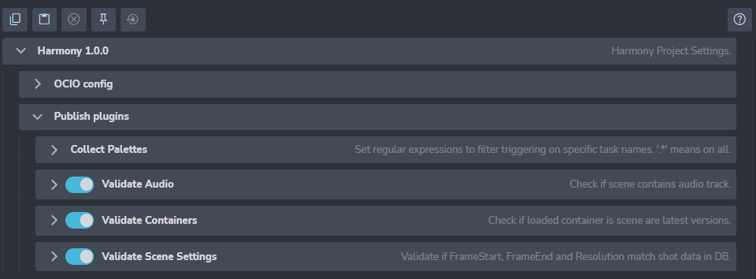

import Tabs from '@theme/Tabs';
import TabItem from '@theme/TabItem';

## ToonBoom Harmony settings

There is a couple of settings that could configure publishing process for **ToonBoom Harmony**.
All of them are Project based, eg. each project could have different configuration.

Location: Project Settings > Harmony (`ayon+settings://harmony`)

## OCIO config

## Publish plugins

### Collect Palettes

#### Allowed tasks

Set regex pattern(s) only for task names when publishing of Palettes should occur.

Use ".*" to publish Palettes for ALL tasks.

### Validate Audio

Ensures that there is an audio file in the scene.

If you are sure that you want to send render without audio, you can
disable this plugin by toggle next to plugin name.

If enabled, artist might decide to disable validation for each publish (for special use cases).
Limit this optionality by toggling `Optional`.
`Active` toggle denotes that by default artists sees that optional validation as enabled.
(Eg. admin allows artist disabling(`Optional`) validation, but it is enabled(`Active`) by default.)

### Validate Containers

Checks if all imported assets through `Loader` are in latest version. Limits cases that older version of asset would be used.

### Validate Scene Settings

Compares various values in current scene against values set in DB (or in Asset management system, eg. Ftrack).

#### Skip Frame check for Assets with

Set regex pattern(s) for filtering Asset name that should skip validation of `frameEnd` value from DB.

#### Skip Resolution Check for Tasks

Set regex pattern(s) for filtering Task name that should skip validation or `Resolution` value from DB.

#### Skip Timeline Check for Tasks

Set regex pattern(s) for filtering Task name that should skip validation `frameStart`, `frameEnd` check against values from DB.

## Render farm settings

* For setting up Deadline support see [here](module_deadline.md)