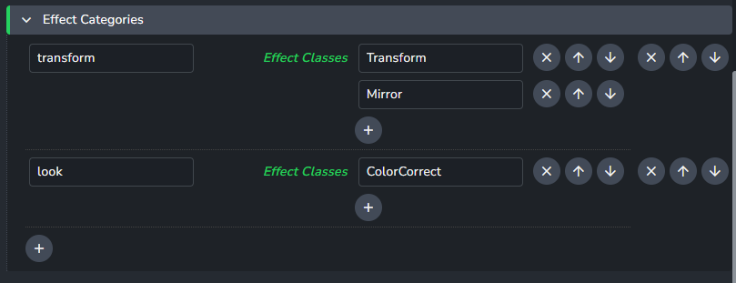
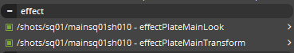

import ReactMarkdown from "react-markdown";
import versions from '@site/docs/assets/json/Ayon_addons_version.json'

<ReactMarkdown>
{versions.Hiero_Badge}
</ReactMarkdown>

## Custom Menu
You can add your custom tools menu into Hiero by extending definitions in **Hiero -> Scripts Menu Definition**.

## Publish plugins

### Collect Clip Effects

#### Effect Categories
This setting allow studios to split soft effect stacks into meaningful categories. For example splitting look related effects from transform related effects.

:::note Class Names
The names of the effect classes do not have to include any numbers. For example the `Text` effect's class is `Text2`, so just input `Text`.
:::

If there are no categories, then all effects will be published together.

The categories will sufficed to the subset name when publishing:

