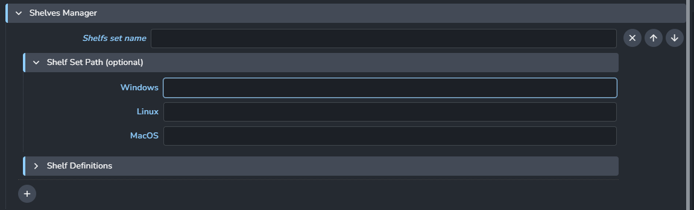
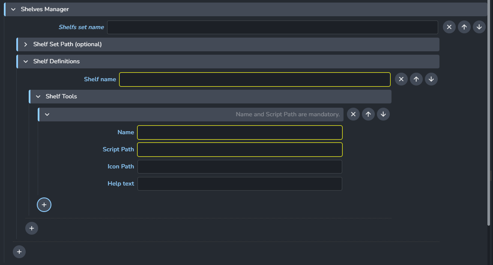
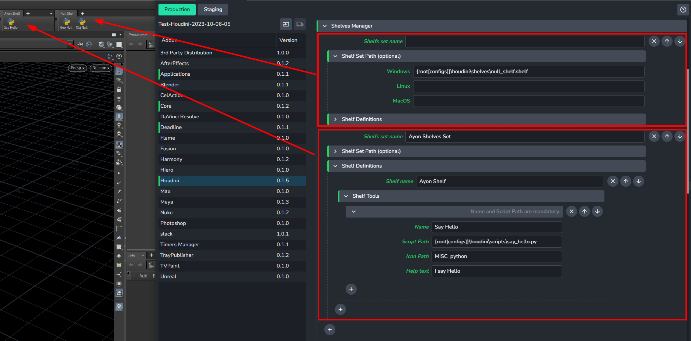
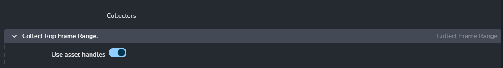

import ReactMarkdown from "react-markdown";
import versions from '@site/docs/assets/json/Ayon_addons_version.json'

<ReactMarkdown>
{versions.Houdini_Badge}
</ReactMarkdown>

## General

### Add Self Publish Button

Enabling this setting will cause Houdini creator to add a **self publish button** when creating new publish instances. More Info on how how the **self publish button** works [here](addon_houdini_artist.md#ayon-publishing-process)

### Update Houdini Vars on context change

Allows admins to have a list of vars (e.g. JOB) with (dynamic) values that will be updated on context changes, e.g. when switching to another asset or task.

:::info
**JOB** Var: If `JOB` is present in the Houdini var list and has an empty value, Ayon will set its value to `$HIP`
:::

1. **Update Houdini vars on context change :** Disabling this setting will leave all Houdini vars unmanaged and thus no context update changes will occur.
2. **(+) :** add new Houdini variable
3. **Var :** The Houdini variable you want to add. No need to include `$`.
  > For consistency reasons we always force all vars to be uppercase. e.g. `myvar` will be `MYVAR`
4. **Value :** The value you want Ayon to maintain. 
  > Using template keys is supported but formatting keys capitalization variants is not, e.g. `{Asset}` and `{ASSET}` won't work. For a list of available template keys go to [available template keys](#what-template-keys-are-available-for-use-in-houdini-settings).
1. **Treat as directory :** If activated, Ayon will consider the given value as a path of a folder.
  > If the folder does not exist on the context change it will be created by this feature so that the path will always try to point to an existing folder.

## Color Management (ImageIO)

Allows admins to override the global color management settings, check [Host specific overrides](admin_colorspace.md#host-specific-overrides)

## Shelves Manager

Allows admins to add studio's [Shelves](https://www.sidefx.com/docs/houdini/shelf/index.html) and scripts into Houdini. 

### Different Modes

:::info
You have two options to define a shelf which are mutually exclusive from one another:

- If you set a Shelf Set Path that shelf is loaded, any scripts defined below it are ignored.
- If you have no Shelf Set Path, then it'll create a shelf dynamically from the Shelf Scripts.
:::

Shelves manager works in two modes, it's either option 1 or 2.

1. Add a `.shelf` file by only setting the `Shelf Set Name` and `Shelf Set Path`.
  

2. **OR** set the `Shelf Set Name` and create `shelf definitions` with shelf scripts dynamically.
  > *Currently, Ayon just adds the new shelf definition in `default.shelf`*
  
  

### Shelves Example

:::info
Using template keys is supported but formatting keys capitalization variants is not, e.g. `{Asset}` and `{ASSET}` won't work. For a list of available template keys go to [available template keys](#what-template-keys-are-available-for-use-in-houdini-settings).
:::

In this example I made two shelves: 
1. `Null Shelf` which gets loaded from my pre-defined `null_shelf.shelf` file.
2. `Ayon Shelf` which includes my script `Say Hello`.
   

## Creator plugins
Enable or disable the plugins. Some of them have extra options such as defining the default products names.

- Create Alembic Camera
- Create Arnold Ass
- Create Arnold ROP
- Create Composite (Image Sequence)
- Create Houdini Digital Asset
- Create Karma ROP
- Create Mantra ROP
- Create PointCache (Abc)
- Create PointCache (Bgeo)
- Create Redshift Proxy
- Create Redshift ROP
- Create Review
- Create Static Mesh
- Create USD (experimental)
- Create USD render (experimental)
- Create VDB Cache
- Create VRay ROP

## Publish plugins
Enable or disable the plugins executed at publishing.

- Collect Asset Handles
- Collect Chunk Size
- Validate Instance in same Context
- Validate Latest Containers
- Validate Mesh is Static
- Validate Review Colorspace
- Validate Product Name
- Validate Unreal Static Mesh Name
- Validate workfile paths settings

### Collect Asset Handles

Disable this if you want the publisher to ignore start and end handles specified in the asset data for publish instances.
> Artists are allowed to override this value in the publisher UI.

### Validate Instance in same Context
When working in per-shot style you always publish data in context of current asset (shot). This validator checks if this is so. It is optional so it can be disabled when needed.

---

## FAQ

### When will I need to modify Houdini addon code ?
We've spent a lot of time making it possible to customize Houdini addon from settings.
e.g. you can add your studio's menus, tools and digital assets from settings. 

Still, you may need to modify Ayon addons only when :  
- Adding/Modifying/Customizing Launch Hooks
- Registering new Callbacks
- Adding/Modifying/Customizing plugins (create, publish, load, Actions)
- Adding a new Ayon launcher tray tool

### How to add my menus, tools and digital assets to Houdini ?
First, consider adding custom shelves as you can easily use them to share a lot of tools with your team.
However, if you need to add custom python libraries or custom OTLs or custom menus, updating environment variables is your way to make them available to your team. 

e.g., 
- `PYTHONPATH` to add a custom python library path
- `HOUDINI_MENU_PATH` to add a custom menu path
- `HOUDINI_OTL_PATH` to add a custom digital assets path

Ayon allows you to add environment variables as:
1. Global environment variable (it will be available for all DCCs)
2. Application specific (it will be available for a particular DCC)
3. Application variant specific (it will be available for a particular DCC version)
4. Tool (it will be available on demand per DCC per project per asset)

For a detailed guide visit: [Ayon/Openpype Env Vars and Tools Configuration Explained](https://community.ynput.io/t/openpype-env-vars-and-tools-configuration-explained/540)

### How to publish lookdev from Houdini ? 

Publishing and managing Lookdev in Houdini is within our plan.
The current solution to publish materials is to use HDAs as you can publish most of Houdini nodes as HDA.

### How to submit houdini patch version to deadline ?

The custom AYON Deadline `GlobalJobPreLoad` functionality can help with that by adding the application specific environment variables before the job starts rendering. Using that we can point the Deadline Houdini plugin to e.g. just `houdini` for Deadline to find the executable by name instead of full path. To ensure it's found we just need to make sure the executable is available on the `PATH` environment variable. Like so:
- update Houdini deadline config
  
- add Houdini dir to `PATH` environment variable and add `HOUDINI_VERSION` for each variant
  

### What template keys are available for use in Houdini settings?
Because Ayon is in Beta stage. Please refer to the code [here](https://github.com/ynput/OpenPype/blob/c61a601c78669d70c472c67016eeb77531f42bab/openpype/pipeline/context_tools.py#L671-L692) to check the current available template keys
 