import ReactMarkdown from "react-markdown";
import versions from '@site/docs/assets/json/Ayon_addons_version.json'

<ReactMarkdown>
{versions.Houdini_Badge}
</ReactMarkdown>

## Introduction
AYON Loader HDAs act as controllers that allow you to select AYON products to load into your scene.

- Generic Loader as its name implies it's generic, it loads any AYON product as a filepath.
- Lop Import (Load Asset): load USD assets. 
- Load Shot: Load USD shots.

| Generic Loader |
|--|
| Currently, Available in `OBJs`, `SOPs` and `LOPs`. 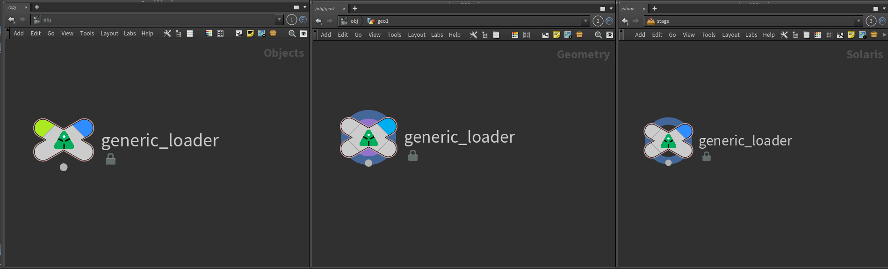 |

| LOP Import | Load Shot |
|--|--|
| 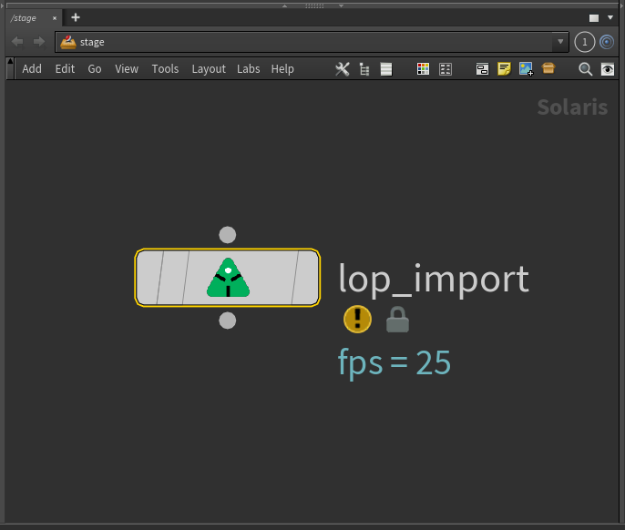 | 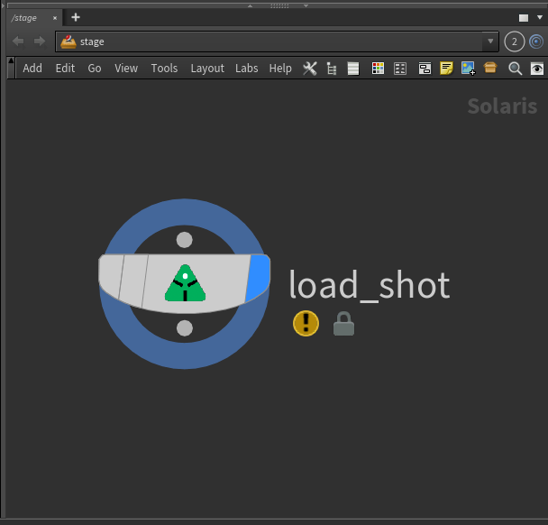 |

## Access Loader HDAs

### TAB Menu
All of these nodes are accessible in TAB menu.

| LOPs | OBJs | SOPs |
|--|--|--|
| 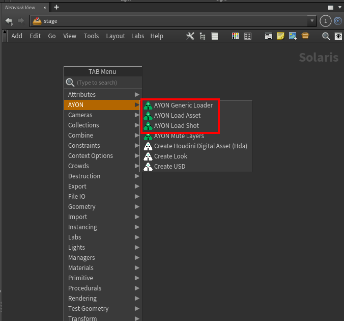 | 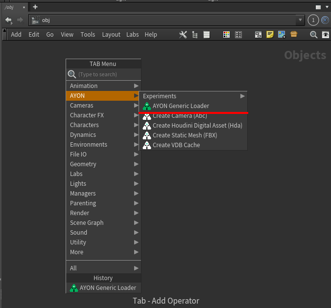 | 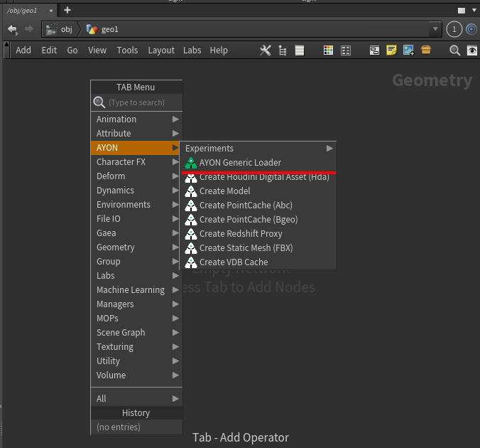 |

### Loader Tool
Some loaders depend on these nodes to perform loading.

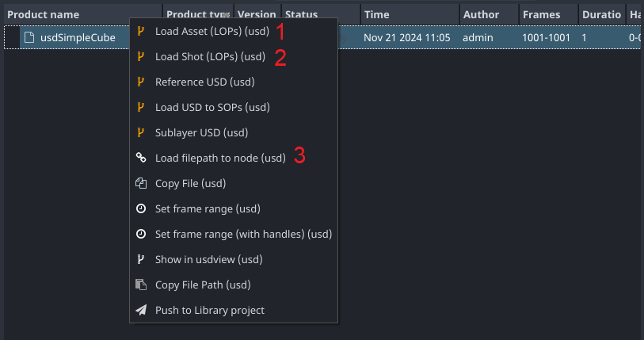

1. Load Asset: It creates a `LOP Import` node in `\stage`. 
2. Load Shot: It creates a `Load Shot` node in `\stage`. 
3. Load filepath to node: It creates a `Generic Loader` node in `\obj\AVALON_CONTAINERS`

### Quickly load into any string parm

You can find a parameter action `Load with AYON` when right-click any parameter of type file on any non Rop nodes.
this action will create a `Generic Loader` node in `\obj\AVALON_CONTAINERS` and copies its file parameter to the `File` parameter where the action was triggered.

:::tip
When using `Load with AYON` parm action with a file parm that's already connected to a `Generic Loader`, it'll pop up the parm panel for that `Generic Loader` node without creating a new `Generic Loader`. 
:::

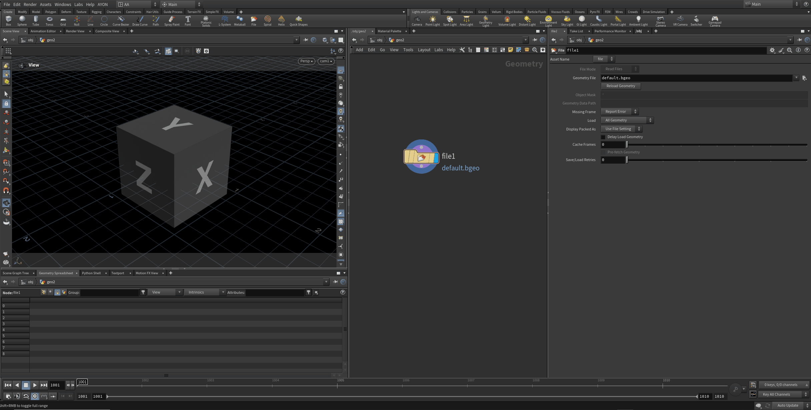

## Loader HDAs

### Generic Loader

#### Overview
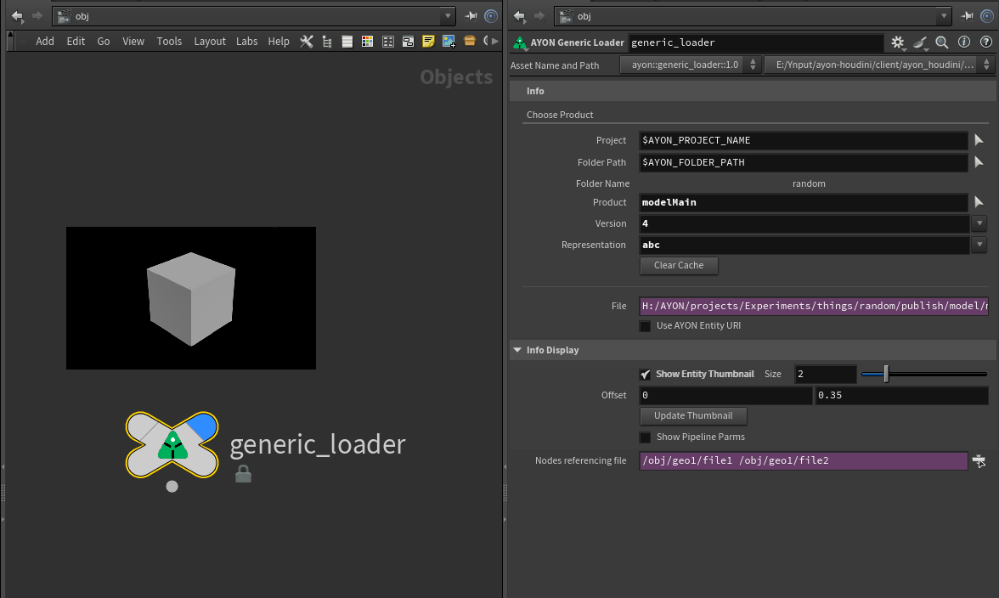

#### Parameters

- **Project**: Selected Project Name
- **Folder Path**: Selected Folder Path
- **Folder Name**: Label shows the name of the selected folder.
- **Product**: Selected Product.
- **Version**: Selected Version.
- **Representation**: Selected Representation (format).
- **Enable Representation Filter**: Enable to show the **Representation Filter** parameter.
- **Representation Filter**: A space-separated list of representation names to filter. When used, it filters the representation drop-down menu.
- **Clear Cache**: Clears node's cache.
- **File**: Shows the file of the selected product. It automatically applies `$F` and `<UDIM>` tokens.
- **Use AYON Entity URI**: When enabled the File parameter will turn into an AYON URI.
- **Show Entity Thumbnail**: When enabled, it shows the selected product's thumbnail and show extra parameters for adjusting the image in network view.
- **Size** & **Offset**: They are used to adjust the displayed thumbnail in network view.
- **Update Thumbnail**: Click to manually update the thumbnail, in some cases auto update doesn't work, so you'd need to force update.
- **Show Pipeline Parms**: It shows extra pipeline parms like `Representation ID`, It's mostly used for debugging and automations.
- **Nodes Referencing File**: It shows nodes referencing the `File` parameter.

#### How to use Generic Loader

Select project and folder path
Select product, version and representation.
Supports expressions and context options. more examples check

### Lop Import 

#### Overview
It uses a combination of [Generic Loader](#generic-loader) and [Reference](https://www.sidefx.com/docs/houdini/nodes/lop/reference.html) node

> The **representation filter** parameter on the inner Generic loader is set to 
> ```
> usd usda usdlc usdnc abc
> ```

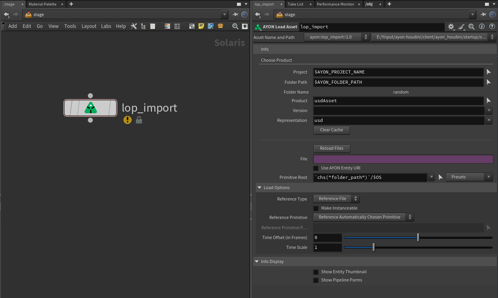

#### Parameters
It shares the same parameters with generic loader and also adds few more parameters.
It also exposes some parameters of [Reference](https://www.sidefx.com/docs/houdini/nodes/lop/reference.html) node. 

- **Reload Files**
- **Primitive Root** & **Presets**
- **Reference Type**
- **Make Instanceable**
- **Reference Primitive**
- **Reference Primitive Path**
- **Time Offset (in Frames)**
- **Time Scale**

#### How to use LOP Import
- Select products works the same with [generic loader](#how-to-use-generic-loader).
- Set `Primitive Root`, the `Presets`  menu provides default values for building assets and shots.

### Load Shot

#### Overview

It uses a combination of [Generic Loader](#generic-loader) and [Sublayer](https://www.sidefx.com/docs/houdini/nodes/lop/sublayer.html) node.

> The **representation filter** parameter on the inner Generic loader is set to 
> ```
> usd usda usdlc usdnc abc
> ```

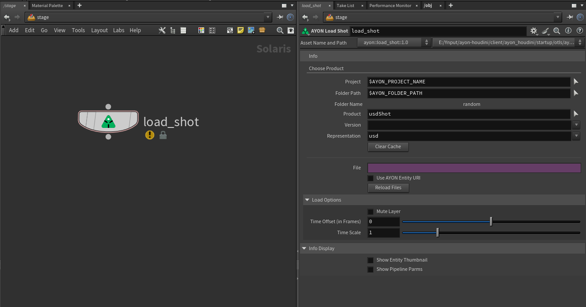

#### Parameters
It shares the same parameters with generic loader and also adds few more parameters.

- **Reload Files**
- **Mute Layer**
- **Time Offset (in Frames)**
- **Time Scale**

#### How to use Load Shot
- Selecting products works the same with [generic loader](#how-to-use-generic-loader).
- Keep in mind, it adds the loaded product as a sublayer.

## Example Usages
These are examples from various discussions on our community.
You can find here some inspiration.
Although They might not fulfill your needs at your studios, they can serve as good starting point.

:::tip
Feel free to share us your examples on [Ynput Community Forums](https://community.ynput.io/).
:::

### Context Options and MultiShots

You can use 'context options' entry to select from - where the user is capable of selecting any folder in the project.
e.g. you can create a menu that includes all folder paths that have tasks in the current project.

<details><summary>Create <code>Folder Path</code> context menu</summary>

You can create a Python Menu context option and use this:

```python
from ayon_core.pipeline import get_current_project_name
import ayon_api


project_name = get_current_project_name()
folders = ayon_api.get_folders(
	project_name,
    fields={"path"}, 
    has_children=False,
    has_tasks=True
)
paths = [(folder["path"], folder["path"]) for folder in folders]
paths.sort()

return paths
```

</details>

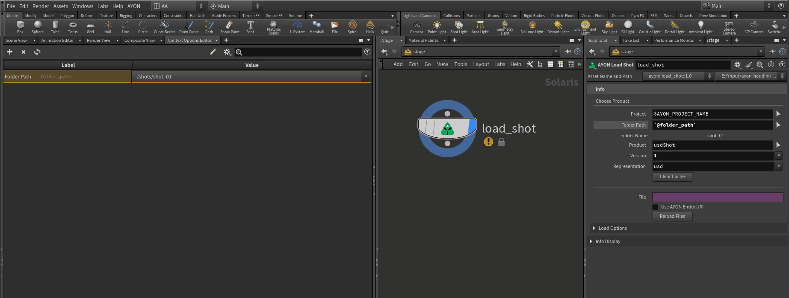

### Expressions and Context Options
AYON Loader HDAs also support expressions in different contexts.
e.g. we can leverage this feature to load multiple products in a loop using one loader.
This example depends on using the same name for the products except the number.

Firstly, I've published three products `pointcacherock_1`, `pointcacherock_2` and `pointcacherock_3`.
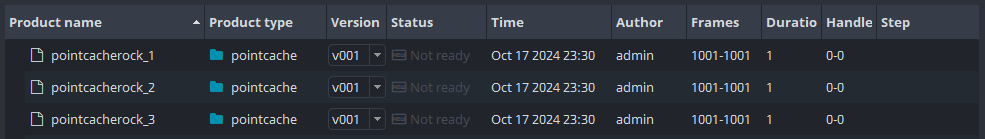

Then loaded them in my scene using loader HDAs in a loop using expressions.

- LOP, expressions and context options.
    ```
    pointcacherock_`@ITERATIONVALUE+1`
    ```
    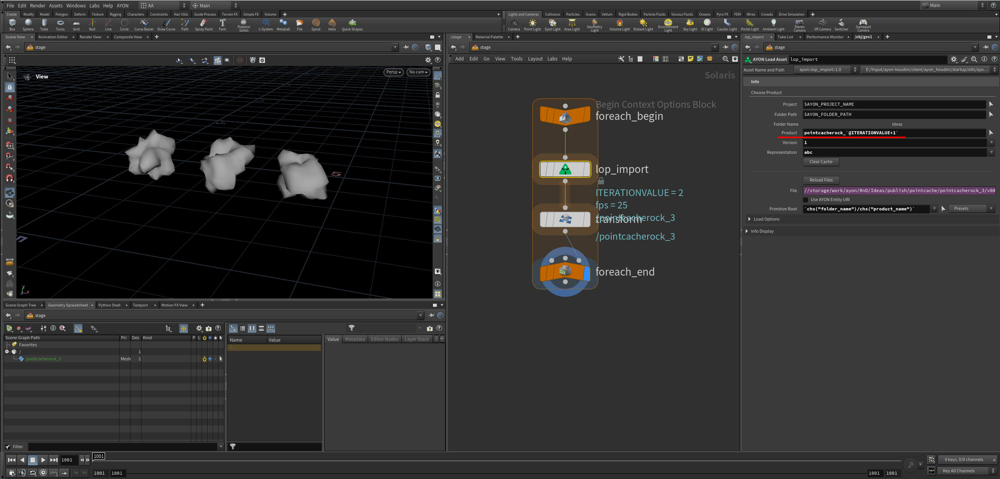
- SOP, expressions and detail attribute. 
    ```
    pointcacherock_`detail("../foreach_count","iteration", 0)+1`
    ```
    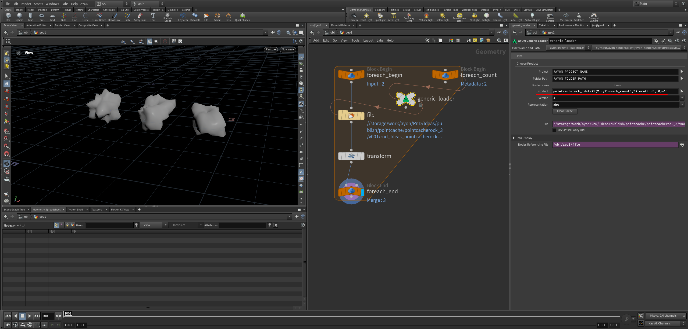


### Build your own HDAs using Generic Loader

One of the main usages of generic loader is enabling users creating their own loader HDAs.

:::info
This is a simple example, that is based on using a unified naming conventions for materials in my project.
textures were published with product type `image` and variant name `materialName_AOV` using [Tray publisher](addon_traypublisher_artist.md).
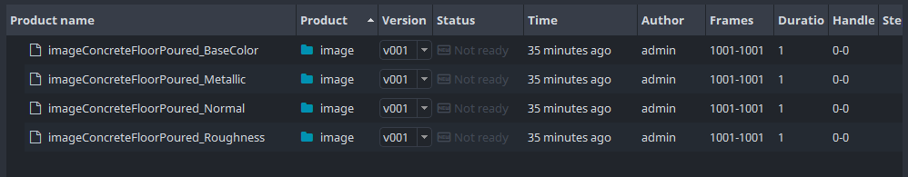

The material used in this example, [Concrete Floor Poured | Poliigon](https://www.poliigon.com/texture/mottled-matte-panel-concrete-texture-misty-grey/7656).
:::

Download the example custom HDA: [Expr_random_hda_Material_Loader_v001.hda](assets/houdini/artist/Expr_random_hda_Material_Loader_v001.hda).
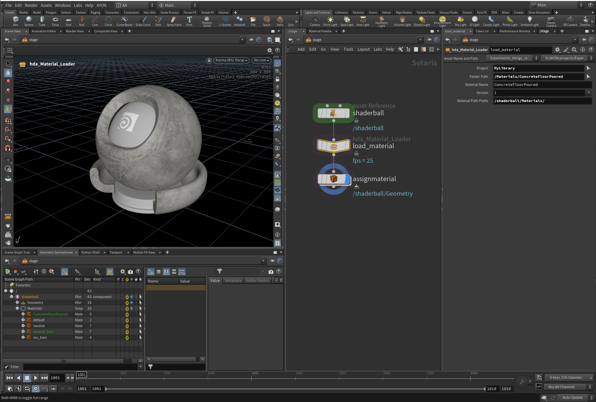


