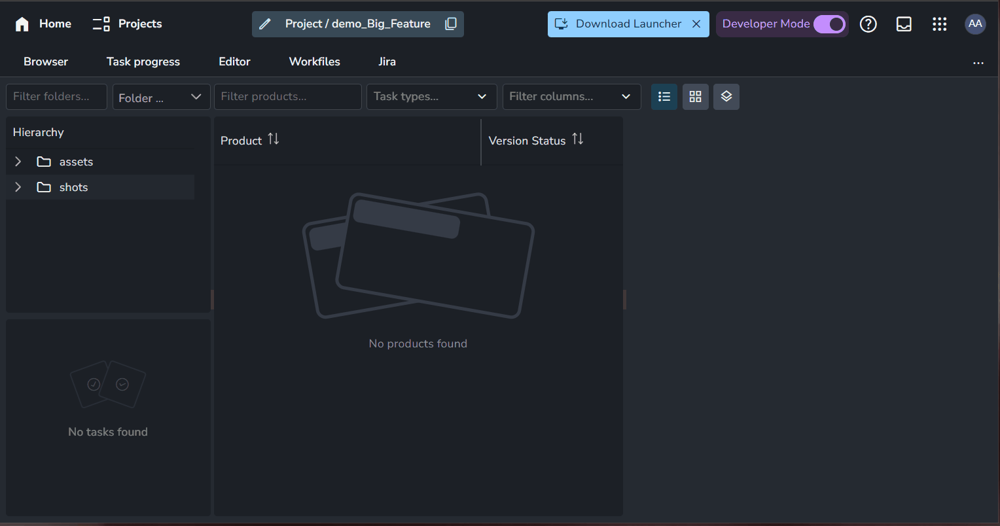
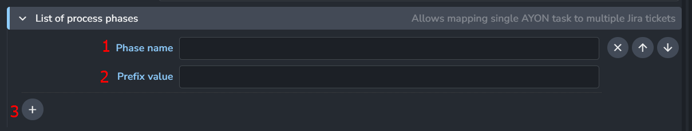
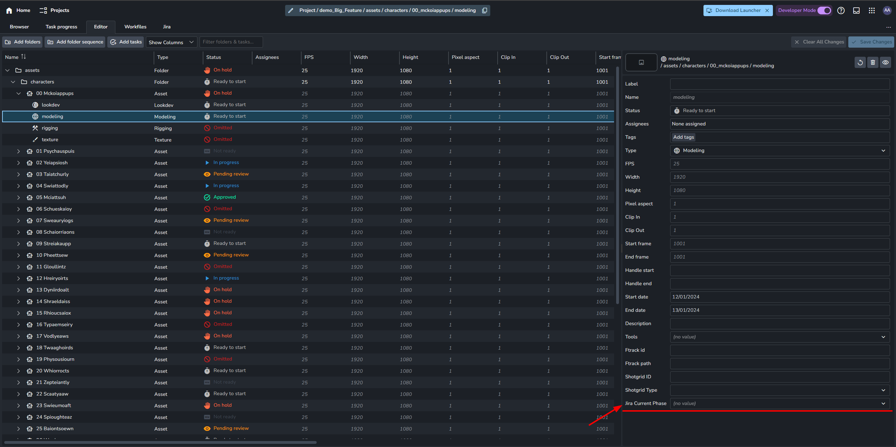
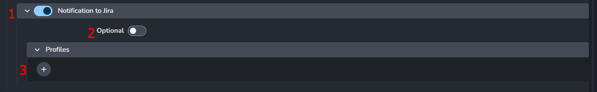

import ReactMarkdown from "react-markdown";
import versions from '@site/docs/assets/json/Ayon_addons_version.json'

<ReactMarkdown>
{versions.Jira_Badge}
</ReactMarkdown>

import Tabs from '@theme/Tabs';
import TabItem from '@theme/TabItem';

## Introduction

Jira Addon provides an initial attempt at integrating with the ticketing system Jira. This should allow setting up matching Jira tickets to AYON tasks and updating their status.

The addon's two main functionalities are:
- "Preparation of AYON and Jira tickets"
- "Sending notifications to Jira"

These functionalities allow the creation of multiple AYON tasks and matching Jira tickets on any folder path (e.g., `characters/Alice`, `sequences/seq01/shots/shot01/`).

It also allows updating the state of a Jira ticket by sending comments to the ticket during the publishing of the matching task (and possibly uploading thumbnails or reviews).


## Preparation of AYON and Jira tickets

The addon allows the creation of a set of AYON and matching Jira tickets based on prepared templates.

These templates are currently located in `server/templates`. They come in pairs, ending with `_Ayon_Template.json` and `_Jira_Template.json`. 
It's possible to have multiple Jira tickets connected to a single AYON task.

:::info
To add a new template, modify the source code of the addon by adding new templates to the `server/templates` folder. Then, run `create_package.py` and upload it to AYON.
:::

### Jira template

```json title="ayon-jira\server\templates\Tier_1_Outfit_Jira_Template.json"
{
    "jira_template": [
        {
            "Epic Link": "%Tier1CharacterNameOutfitName% - Concept",
            "Component": "Design",
            "AYON Task": "",
            "Summary": "Specify any design requirements for %Tier1CharacterNameOutfitName%",
            "Description": "What does this secondary  outfit need to accomplish for design?",
            "Custom ID": "2",
            "Depends_On": "",
            "Unblocks": "4",
            "IssueType": "Task",
            "Priority": "Medium",
            "Original Estimate": "0.5",
            "Int vs Ext": "Internal"
        },
        {
            "Epic Link": "%Tier1CharacterNameOutfitName% - Stood Up",
            "Component": "Character Art",
            "AYON Task": "Model",
            "Summary": "Create proxy mesh for %Tier1CharacterNameOutfitName% secondary outfit",
            "Description": "Matching concept and base body mesh proportions and joint locations, model/sculpt the proxy secondary  outfit for  %Tier1CharacterNameOutfitName%.  This mesh is a  clean animatable decimation fully representing the silhouette and overall proportions of the model including all of its secondary pieces and character customization requirements (ie - Jacket on/off if applicable).  This version must be delivered to and approved by Tech-Anim for proper deforming/animating, before continuing with the next stages.  The proxy does not have to be fully optimized but please stay within reasonable poly count (150k tris) for delivery.  Do not texture and UV this character but do assign material ID's and auto-unwrap so that we can place tinted tiling materials over the appropriate locations of the character for more accurate presentation and review in engine.  Review by Art Director, Lead, Tech Anim.  Initial delivery for review as DCC files.",
            "Custom ID": "8",
            "Depends_On": "7",
            "Unblocks": "9, 11",
            "IssueType": "Task",
            "Priority": "Medium",
            "Original Estimate": "4",
            "Int vs Ext": ""
        },
        
    ]
}
```

Example shows that 2 Jira tickets should be created, each value enclosed in `%` will be replaced by appropriate
value provided by whoever is triggering ticket creation via front end part of this addon.
(`%Tier1CharacterNameOutfitName%` in this example would be replaced by name of character, eg. `Robot` etc.)

- **Epic Link**: Name of the Epic. All tickets with the same value will be linked to the same Epic.
- **Component**: Group or department name associated with the ticket.
- **AYON Task**: AYON Task name.
- **Summary**: Name of the ticket.
- **Description**: Description of the ticket.
- **Custom ID**: A unique number used to identify the ticket within the template.
- **Depends_On** and **Unblocks**: Define links between Jira tickets based on the Custom ID.
- **IssueType**: Type of issue for the ticket.
- **Priority**: Priority level of the ticket.
- **Original Estimate**: Initial prediction of how long the task will take, following your default time unit.
- **Int vs Ext**: Specify whether the ticket is Internal or External.
  
:::tip
On Jira ticket creation, **Custom ID** and **AYON Task** will be replaced with the actual ticket key and task ID, which are only known upon creation.
:::

### AYON template

```json title="ayon-jira\server\templates\Tier_1_Outfit_Ayon_Template.json"
{    
    "ayon_template": {
        "tasks": {
            "Concept": {
                "current_phase": "",
                "concept_jira_id": "5",
                "concept_jira_ticket": ""
            },
            "Model": {
                "current_phase": "",
                "stood up_jira_id": "8",
                "stood up_jira_ticket": "",
            }
        }
    }
}
```

Example AYON templates show that two tasks should be created: `Concept` and `Model`.

- **current_phase**: Jira Current Phase
- **{epic}_jira_id**: Links tickets by `Custom ID`. For example, `"concept_jira_id": "5"` points to a ticket with `"Custom ID": "5"` from the `Jira_Template` and creates a link between the AYON task and the Jira ticket.
- **{epic}_jira_ticket**: Will be filled by the Jira ticket key, e.g., `KAN-201`, when the ticket is created.

### Triggering of creation



:::tip
Front end form is provided by this addon (addon must be added to `production` bundle!).
The frontend is added within each project.
:::

It contains fields:
- `Folder path` - should contain path of folder path for which task(s) defined in the templates should be create.
    you can fill in the value manually or you can use the eye drop icon to select your folder path.
- `Templates` - dropdown to select implemented templates

After providing values for these fields, `Create` button could be triggered.


## Installation and configuration

Addon is expected to be built by cloning it first from Github, then running `create_package.py` which will result
in zip file in `package` folder. This file should be used to be installed on AYON server.

Before running `create_packages`:
- provide/update templates in `server/templates` folder
- provide/update identifiers of Jira custom field in `server/custom_fields.py`
  - these custom fields must be created and applied on Jira tickets/epics by Jira admin

These parts of workflow are a bit manual process right now, but it is expected to be enhanced in the future.

## AYON Settings

### Jira Credentials

> Settings Location: `ayon+settings://jira` or override per project `ayon+settings://jira?project={project_name}`


Jira credentials are used for creating tickets and notifications.
You need to specify:

- **Jira server url**
- **Jira username**
- **Jira Password**
- **Jira project code**: Identifier of Jira project

### List of process phases

> Setting Location: `ayon+settings://jira/phases` or override per project `ayon+settings://jira/phases?project={project_name}`



It contains list of phases, where phase selects appropriate Jira ticket for single AYON task.

1. **Phase Name**: Phase Name
2. **Prefix Value**: is used in task metadata as a part of key containing Jira ticket key.
3. **+**: Add more phases

:::tip Set Phase to Folders and Tasks

The phase must be set in the folder/task attributes, found in the right column of the Editor page on the AYON server (e.g., asset), before work starts on this AYON task.


:::

### Notification to Jira

> Setting Location `ayon+settings://jira/publish/CollectJiraNotifications` 



It controls for which hosts/tasks/products comment to the Jira ticket should be sent.

1. **Main Toggle**: Enable `Notification to Jira` feature.
2. **Optional Toggle**: Allow users to disable this feature locally.
3. **+**: Add Notification profiles.

#### Notification profiles


- **Hosts:** List of host names you want the plugin to work with.
- **Task Types:** Choose from a list of task types to determine which ones the profile will affect.
- **Task Names:** List of task names to determine which ones the profile will affect.
- **Product names:** List of product names to determine which ones the profile will affect.
- **Product types:** List of product types to determine which ones the profile will affect.
- **Comment to ticket**: 
Comment content can use template keys (see [Available template keys](admin_settings_project_anatomy.md#available-template-keys)).
Few keys also have Capitalized and UPPERCASE format. Values will be modified accordingly. e.g. `{Folder[name]}` ➜ "Gun", `{PRODUCT[NAME]}` ➜ "RENDER".
Please be careful about which placeholder you put into the message, as some of them are not applicable for all products (`frame` etc.)
:::tip Comment Example
    {Product[name]} was published for {FOLDER[NAME]} in {task[name]} task.
:::
- **Upload thumbnail** and **Upload review**: Upload `thumbnail` and `review`, *if they are present in the publish*, to the Jira ticket.
- **Review file size limit (MB)**: Review might be too big to upload to occupy additional space on Jira, `Review file size limit` allows to replace upload
with link in the comment for too large review files.
