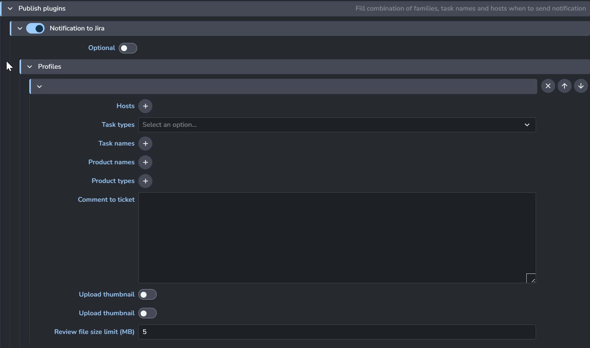

import ReactMarkdown from "react-markdown";
import versions from '@site/docs/assets/json/Ayon_addons_version.json'

<ReactMarkdown>
{versions.Jira_Badge}
</ReactMarkdown>

import Tabs from '@theme/Tabs';
import TabItem from '@theme/TabItem';

## Introduction

This addon provide initial attempt at integration with ticketing system Jira. This should allow to setup matching Jira
tickets to AYON tasks and update its status.

Addon's two main functionalities:
- "Preparation of AYON and Jira tickets"
- "Sending notifications to Jira",

These allow to create multiple AYON tasks and matching Jira tickets on any folder path (`characters/Alice`, `sequences/seq01/shots/shot01/`).

It also allows to update state of Jira ticket by sending comments to the ticket during publishing of matching task
(and possibly uploading thumbnails or reviews).


## Preparation of AYON and Jira tickets

Addon exposes creation of set of AYON and matching Jira tickets based on a prepared templates. 

These templates are currently located in `server/templates`, they come in pairs, ending with `_Ayon_Template.json` and `_Jira_Template.json`.
Workflow for allowing multiple Jira tickets connected to single AYON task was implemented based on requirements.

### Jira template

Example shows that 2 Jira tickets should be created, each value enclosed in `%` will be replaced by appropriate
value provided by whoever is triggering ticket creation via front end part of this addon.
(`%Tier1CharacterNameOutfitName%` in this example would be replaced by name of character, eg. `Robot` etc.)

`Epic Link` would be used as a name of Epic, all tickets with same value would be joined to the Epic
`AYON Task` will contain unique id to AYON task after its creation
`Summary` is used as name of ticket
`Description` is description of the ticket
`Custom ID` is unique number in this field for all tickets in the template, it creates `Depends_On` and `Unblocks`
links between Jira tickets. (Key of Jira ticket would be required for that, which is unknown until creation.
Values here are stand-ins to be replaced with appropriate ticket key.)

```
{
    "jira_template": [
        {
            "Epic Link": "%Tier1CharacterNameOutfitName% - Concept",
            "Component": "Design",
            "AYON Task": "",
            "Summary": "Specify any design requirements for %Tier1CharacterNameOutfitName%",
            "Description": "What does this secondary  outfit need to accomplish for design?",
            "Custom ID": "2",
            "Depends_On": "",
            "Unblocks": "4",
            "IssueType": "Task",
            "Priority": "Medium",
            "Original Estimate": "0.5",
            "Int vs Ext": "Internal"
        },
        {
            "Epic Link": "%Tier1CharacterNameOutfitName% - Concept",
            "Component": "Narrative",
            "AYON Task": "",
            "Summary": "Create narrative description for %Tier1CharacterNameOutfitName%'s secondary outfit",
            "Description": "What does this secondary  outfit need to accomplish narratively?",
            "Custom ID": "3",
            "Depends_On": "",
            "Unblocks": "4",
            "IssueType": "Task",
            "Priority": "Medium",
            "Original Estimate": "0.5",
            "Int vs Ext": "Internal"
        }
    }
}
```

### AYON template

Example AYON templates shows that 2 tasks should be created, `Concept` and `Model`.

`"concept_jira_id": "5"` points to identifier '5' from `Jira_Template.Custom ID` field and creates link between AYON task and Jira ticket.
These custom id identifiers must be unique in `Jira_Template` file.

`"concept_jira_ticket": ""` will be filled by Jira ticket key (`KAN-201`) when ticket is created

```
{    
    "ayon_template": {
        "tasks": {
            "Concept": {
                "current_phase": "",
                "concept_jira_id": "5",
                "concept_jira_ticket": ""
            },
            "Model": {
                "current_phase": "",
                "stood up_jira_id": "8",
                "stood up_jira_ticket": "",
                "presentable_jira_id": "15",
                "presentable_jira_ticket": "",
                "shippable_jira_id": "17",
                "shippable_jira_ticket": "",
                "polished_jira_id": "19",
                "polished_jira_ticket": ""
            }
        }
    }
}
```


### Triggering of creation

Front end form is provided by this addon (addon must be added to `production` bundle!).

It contains fields:
- `Folder path` - should contain path of asset for which task(s) defined in the templates should be created
  - value could be easily copied from:
    - copy box in the top middle in `Browser` page in the Project on AYON server
    - from right column with details for folder in the same page
    - project name prefix is not required, but doesn't cause an issue
- `Jira project key` - identifier of Jira project
- `Templates` - dropdown to select implemented templates

After providing values for these fields, `Create` button could be triggered.


### Installation and configuration

Addon is expected to be built by cloning it first from Github, then running `create_package.py` which will result
in zip file in `package` folder. This file should be used to be installed on AYON server.

Before running `create_packages`:
- provide/update templates in `server/templates` folder
- provide/update identifiers of Jira custom field in `server/custom_fields.py`
  - these custom fields must be created and applied on Jira tickets/epics by Jira admin

These parts of workflow are a bit manual process right now, but it is expected to be enhanced in the future.

##### AYON Settings

Settings could be set in `Studio Settings` or override per project in `Project Settings`.

Jira server url, username, password and jira project code needs to be provided for creation of tickets and notifications.


`ayon+settings://jira/phases` contains list of phases, where phase selects appropriate Jira ticket for single AYON task.
This phase must be set in right column of `Editor` page on the AYON server (on folder, eg. asset) before work starts
on this AYON task.

Prefix value is used in task metadata as a part of key containing Jira ticket key.

`ayon+settings://jira/publish/CollectJiraNotifications` controls for which hosts/tasks/products comment to the
Jira ticket should be sent.



Content of the comment is configurable with a use of Anatomy template keys, see https://ayon.ynput.io/docs/admin_settings_project_anatomy/#available-template-keys

Please be careful about which placeholder you put into the message, as some of them are not applicable for all products (`frame` etc.)

There is also possibility to upload `thumbnail` or `review` directly to the Jira ticket.

Review might be too big to upload to occupy additional space on Jira, `Review file size limit` allows to replace upload
with link in the comment for too large review files.
