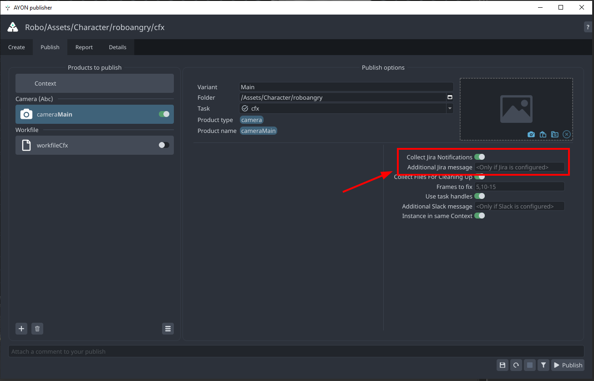

import ReactMarkdown from "react-markdown";
import versions from '@site/docs/assets/json/Ayon_addons_version.json'

<ReactMarkdown>
{versions.Jira_Badge}
</ReactMarkdown>

## About Jira Addon
On the artist side, the Jira Addon works in the backend, sending notifications to the linked Jira tickets for the current AYON Task.

## Artist Controls

In the publisher window, you can find Jira-related settings.

- **Collect Jira Notification:** This toggle is used to disable the plugin. It only shows up when the plugin is marked as `optional` by an admin.
- **Additional Jira Message:** This is an extra message added at the beginning of the Jira comment template specified in the settings.