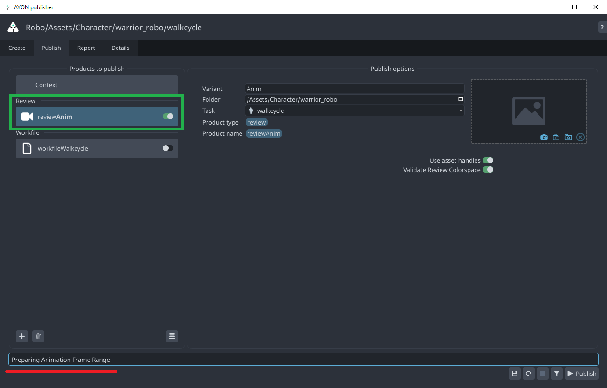
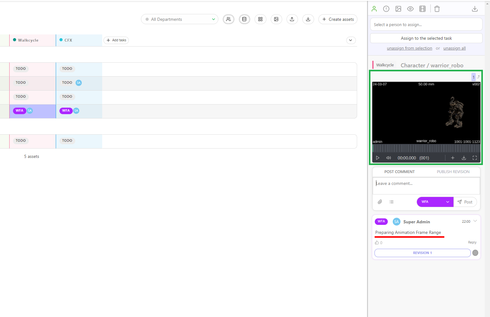

import ReactMarkdown from "react-markdown";
import versions from '@site/docs/assets/json/Ayon_addons_version.json'

<ReactMarkdown>
{versions.Kitsu_Badge}
</ReactMarkdown>

# How to use Kitsu in AYON

## Login to Kitsu module in AYON
1. Launch AYON, the `Kitsu Credentials` window will open automatically, if not, or if you want to log-in with another account, go to systray AYON icon and click on `Kitsu Connect`.
2. Enter your credentials and press *Ok*:

    

:::tip
In Kitsu, All the publish actions executed by `pyblish` will be attributed to the currently logged-in user.
:::

## Integrate Kitsu Note and Review

If they are enabled in Kitsu addon settings. 
- Your publish comment will be used as Kitsu note.
- When publishing a Review or Render, publisher can upload them to kitsu.

> Depending on the kitsu addon configuration, publisher also can update the task status.

| Publish Comment | Kitsu Note and Review |
|--|--|
|  |  |

