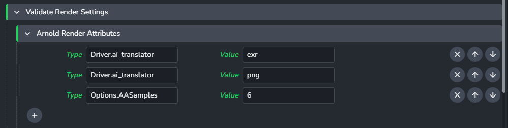
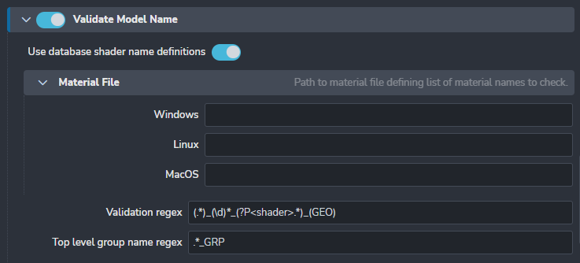
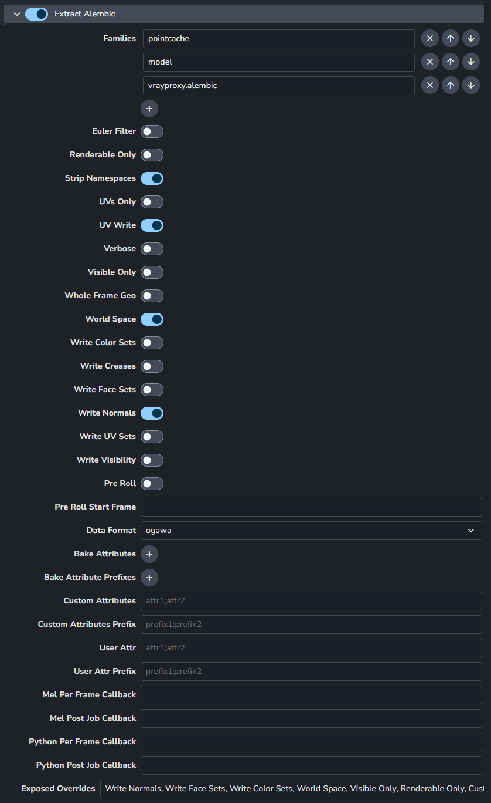
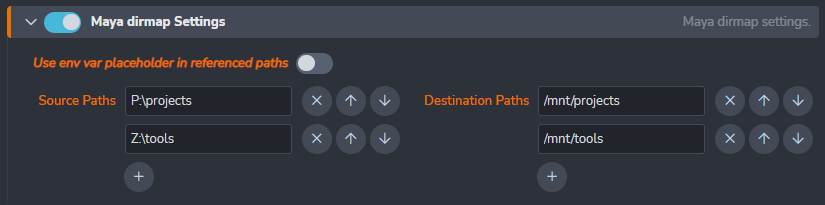
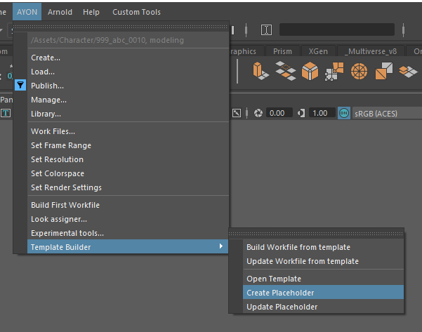
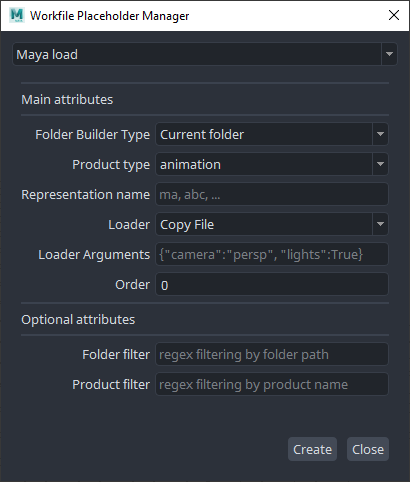
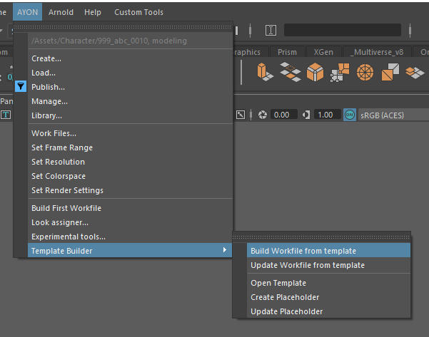

import ReactMarkdown from "react-markdown";
import versions from '@site/docs/assets/json/Ayon_addons_version.json'

<ReactMarkdown>
{versions.Maya_Badge}
</ReactMarkdown>

## Publish Plugins

### Render Settings Validator

`ValidateRenderSettings`

Render Settings Validator is here to make sure artists will submit renders with the correct settings. Some of these settings are needed by AYON but some can be defined by the admin using [AYON Settings UI](admin_settings.md).

AYON enforced settings include:

- animation must be enabled in output
- render prefix must start with `maya/<scene>` to make sure renders are in
correct directory
- there must be `<renderlayer>` or its equivalent in different renderers in
file prefix
- if multiple cameras are to be rendered, `<camera>` token must be in file prefix

For **Vray**:
- AOV separator must be set to `_` (underscore)

For **Redshift**:
- all AOVs must follow `<BeautyPath>/<BeautyFile>_<RenderPass>` image file prefix
- AOV image format must be same as the one set in Output settings

For **Renderman**:
- both image and directory prefixes must comply to `<layer>_<aov>.<f4>.<ext>` and `<ws>/renders/maya/<scene>/<layer>` respectively

For **Arnold**:
- there shouldn't be `<renderpass>` token when merge AOVs option is turned on

Additional check can be added via Settings - **Project Settings > Maya > Publish plugin > ValidateRenderSettings**.
You can add as many options as you want for every supported renderer. In first field put node type and attribute and in the second required value. You can create multiple values for an attribute, but when repairing it'll be the first value in the list that get selected.



In this example we've put `aiOptions.AA_samples` in first one and `6` to second to enforce
Arnolds Camera (AA) samples to 6.

Note that `aiOptions` is not the name of node but rather its type. For renderers there is usually
just one instance of this node type but if that is not so, validator will go through all its
instances and check the value there. Node type for **VRay** settings is `VRaySettingsNode`, for **Renderman**
it is `rmanGlobals`, for **Redshift** it is `RedshiftOptions`.

:::info getting attribute values
If you do not know what an attributes value is supposed to be, for example for dropdown menu (enum), try changing the attribute and look in the script editor where it should log what the attribute was set to.
:::

### Model Name Validator

`ValidateModelName`

This validator can enforce specific names for model members. It will check them against **Validation Regex**.
There is special group in that regex - **shader**. If present, it will take that part of the name as shader name
and it will compare it with list of shaders defined either in file name specified in **Material File** or from
database file that is per project and can be directly edited from Maya's *AYON Tools > Edit Shader name definitions* when
**Use database shader name definitions** is on. This list defines simply as one shader name per line.



For example - you are using default regex `(.*)_(\d)*_(?P<shader>.*)_(GEO)` and you have two shaders defined
in either file or database `foo` and `bar`.

Object named `SomeCube_0001_foo_GEO` will pass but `SomeCube_GEO` will not and `SomeCube_001_xxx_GEO` will not too.

#### Top level group name
There is a validation for top level group name too. You can specify whatever regex you'd like to use. Default will
pass everything with `_GRP` suffix. You can use *named capturing groups* to validate against specific data. If you
put `(?P<asset>.*)` it will try to match everything captured in that group against current asset name. Likewise you can
use it for **product** and **project** - `(?P<product>.*)` and `(?P<project>.*)`.

**Example**

You are working on asset (shot) `0030_OGC_0190`. You have this regex in **Top level group name**:
```regexp
.*?_(?P<asset>.*)_GRP
```

When you publish your model with top group named like `foo_GRP` it will fail. But with `foo_0030_OGC_0190_GRP` it will pass.

:::info About regex
All regexes used here are in Python variant.
:::

### Extract Alembic

`ExtractAlembic`



The settings below will become the default when extracting the alembics for `pointcache` and `animation`. Any attributes exposed in `Exposed Overrides` will be visible to the users to edit when publishing. When a user edits an attribute, the default settings below no longer has any effects on the publishing values. To enforce settings even when exposing attributes, you can utilize the validators; `ValidateAlembicDefaultsPointcache` and `ValidateAlembicDefaultsAnimation`.

- **Euler Filter**: Apply Euler filter while sampling rotations.
- **Renderable Only**: Only export renderable visible shapes.
- **Strip Namespaces**: Namespaces will be stripped off of the node before being written to Alembic.
- **UVs Only**: If this flag is present, only uv data for PolyMesh and SubD shapes will be written to the Alembic file.
- **UV Write**: UV data for PolyMesh and SubD shapes will be written to the Alembic file.
- **Verbose**: Prints the current frame that is being evaluated.
- **Visible Only**: Only export dag objects visible during frame range.
- **Whole Frame Geo**: Data for geometry will only be written out on whole frames.
- **World Space**: Any root nodes will be stored in world space.
- **Write Color Sets**: Write vertex colors with the geometry.
- **Write Face Sets**: Write face sets with the geometry.
- **Write Normals**: Write normals with the deforming geometry.
- **Write UV Sets**: Write all uv sets on MFnMeshes as vector 2 indexed geometry parameters with face varying scope.
- **Write Visibility**: Visibility state will be stored in the Alembic file. Otherwise everything written out is treated as visible.
- **Pre Roll**: When enabled, the pre roll start frame is used to pre roll the evaluation of the mesh. From the pre roll start frame to the Alembic start frame, will not be written to disk. This can be used for simulation run-up.
- **Pre Roll Start Frame**: The frame to start scene evaluation at. This is used to set the starting frame for time-dependent translations and can be used to evaluate run-up that isn't actually translated. NOTE: Pre Roll needs to be enabled for this start frame to be considered.
- **Data Format**: The data format to use to write the file.
- **Bake Attributes**: List of attributes that will be included in the Alembic export.
- **Bake Attribute Prefixes**: List of attribute prefixes for attributes that will be included in the Alembic export.
- **Custom Attributes**: Attributes matching by name will be included in the Alembic export. Attributes should be separated by semi-colon ;.
- **Custom Attributes Prefix**: Attributes starting with these prefixes will be included in the Alembic export. Attributes should be separated by semi-colon ;.
- **User Attr**: Attributes matching by name will be included in the Alembic export. Attributes should be separated by semi-colon ;.
- **User Attr Prefix**: Attributes starting with these prefixes will be included in the Alembic export. Attributes should be separated by semi-colon ;.
- **Mel Per Frame Callback**: When each frame (and the static frame) is evaluated the string specified is evaluated as a Mel command.
- **Mel Post Job Callback**: When the translation has finished the string specified is evaluated as a Mel command.
- **Python Per Frame Callback**: When each frame (and the static frame) is evaluated the string specified is evaluated as a python command.
- **Python Post Job Callback**: When the translation has finished the string specified is evaluated as a python command.
- **Exposed Overrides**: These are the attributes from above that will be exposed in the publisher for users to edit when publishing.

## AYON Tools
You can add your custom tools menu into Maya by extending definitions in **Maya -> Scripts Menu Definition**.


## Multiplatform path mapping
You can configure path mapping using Maya `dirmap` command. This will add bi-directional mapping between
list of paths specified in **Settings**. You can find it in **Settings -> Project Settings -> Maya -> Maya Directory Mapping**



## Templated Build Workfile

Building a workfile using a template designed by users. Helping to assert homogeneous products hierarchy and imports. Template stored as file easy to define, change and customize for production needs.

 **1. Make a template**

Make your template. Add families and everything needed for your tasks. Here is an example template for the modeling task using a placeholder to import a gauge.


If needed, you can add placeholders when the template needs to load some assets. **AYON > Template Builder > Create Placeholder**



- **Configure placeholders**

Fill in the necessary fields (the optional fields are regex filters)




    - Builder type: Whether the the placeholder should load current asset representations or linked assets representations

    - Representation: Representation that will be loaded (ex: ma, abc, png, etc...)

    - Family: Family of the representation to load (main, look, image, etc ...)

    - Loader: Placeholder loader name that will be used to load corresponding representations

    - Order: Priority for current placeholder loader (priority is lowest first, highet last)

- **Save your template**


 **2. Configure Template**

- **Go to Project Settings > Maya > Templated Build Settings**
- Add a profile for your task and enter path to your template


**3. Build your workfile**

- Open maya

- Build your workfile


