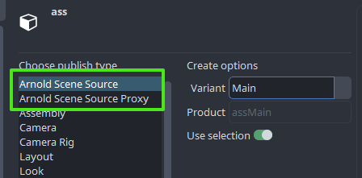
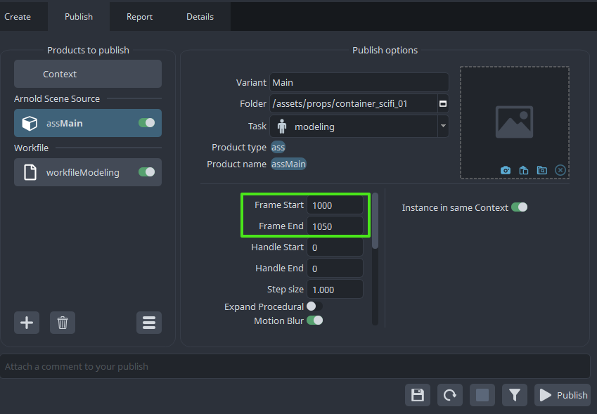
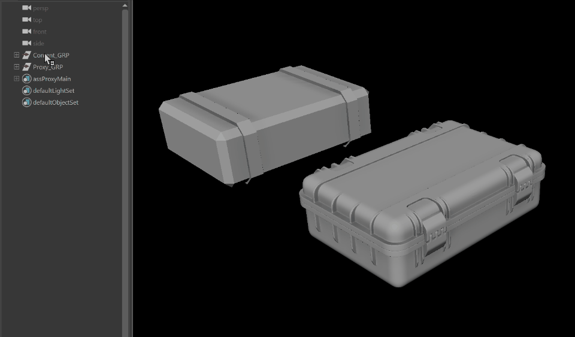
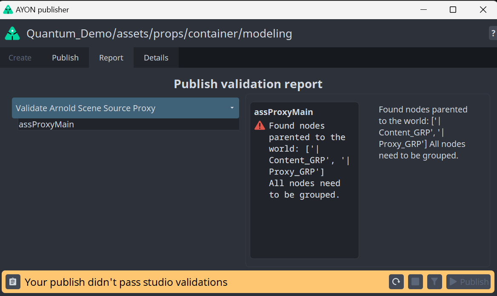
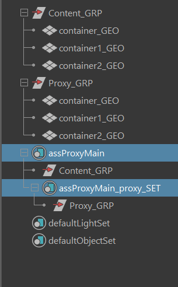
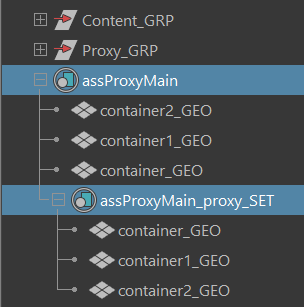
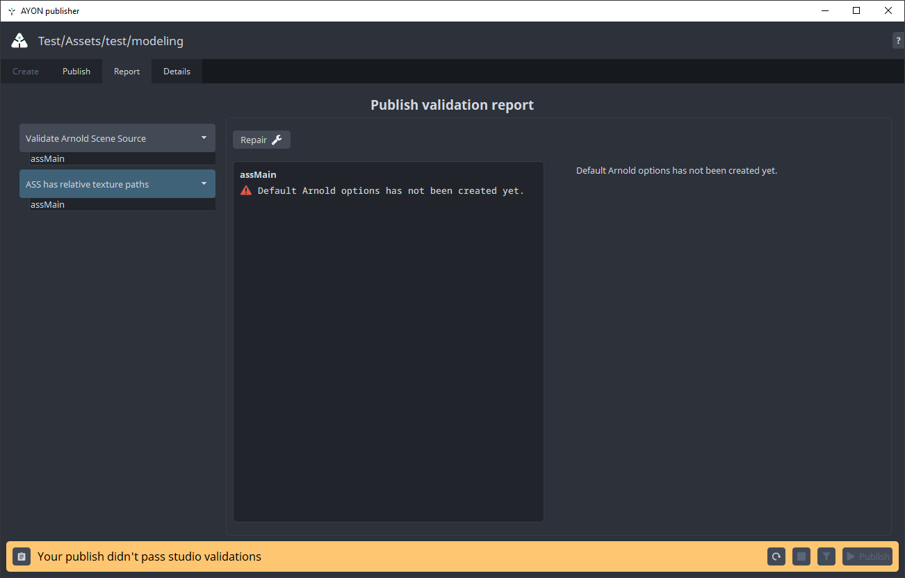

import ReactMarkdown from "react-markdown";
import versions from '@site/docs/assets/json/Ayon_addons_version.json'

<ReactMarkdown>
{versions.Maya_Badge}
</ReactMarkdown>

You are able to create two types of **Arnold Scene Source** product

- Arnold Scene Source
- Arnold Scene Source Proxy



## Arnold Scene Source (.ass)
**Arnold Scene Source** contains whatever user selects when creating the publish instance. Arnold Scene Source can be published as a single file or a sequence of files and its determined by the frame range set on the publish instance. Use those values for producing still or animated `standin`.



### Arnold Scene Source Proxy
The main difference of this product type being possibility to use proxy geometries for viewport performance reasons. If this is not an issue use the first standin type instead.
Once the publish instance have been created, there is a `proxy_SET` created inside of the `Main_SET`. Meshes assigned to the `proxy_SET` will be the viewport representation of the `standin`. Once render triggered, they are switched for the content of the `Main_SET` on the fly.
In order to utilize operators and proxies on the `standin`, the content and proxy nodes need to share the same names (including the shape names
and cbIDs).

:::note 
You can duplicate content keeping all its attributes using maya `Group` for objects used in `Main_SET` and `proxy_SET` each being in distinct `Group` as maya does not allow having the same objects within the same hierarchy.
:::



Here you can see we are having `Content_GRP` for renderable objects and `Proxy_GRP` for viewable objects in the maya viewport. Each having the same objects inside as duplicates differing only by level of detail. Note that offset of `Proxy` objects is just for sake of clarity and normally would be in the exact same location as high detail meshes for rendering aka `Content_GRP`.

:::note 
Use **Arnold Scene Source** product instead as there are not so many requirements / constraints when creating it if viewport performance not an issue.
:::

### Validation of the Arnold Scene Source publishes

After triggering publishing via Publisher a round of different validation checks being triggered informing user if anything setup wrong and offering set of `Repair` actions to fix those issues.

Most common `Validator` is for checking proper asset hierarchy. Just by following the report you are able to adjust your scene hierarchy to match the desired one.

Here is an example of wrong hierarchy set as the model `Groups` assigned to the `standin` being children of the World and no such a hierarchy being allowed so need to be adjusted properly.



And the invalid hierarchy seen in the Maya Outliner



Instead of having the `Content_GRP` and `Proxy_GRP` in the `standin` sets, you should put in the actual `objects` geometries instead to fix this validation failure. As seen below the correct one:




Validators `ASS has relative texture paths` and `Validate Arnold Scene Source cbID` allows you to set up
the context correctly by using `Repair` action.



Once all `Validators` being resolved you are ready to publish the `Arnold Scene Source` aka `Standin` product with the `.ass` representation being ready to be loaded using `Loader` tool located in the `Ayon toolset`. 

## Using Standins

You can use published `standin` in your workfile via `AYON / Load` action. User is able to load `Arnold Scene Source` , `Arnold Scene Source Proxy` and even `Alembic` products as `standin` allowing taking advantage of arnold features also for other products like `animation` and `pointcache`.


:::note Arnold Standins
You can highly optimize your workfiles by introducing `standins` instead of regular reference loading of products like `animation` as there wont be any files referenced-in just local `standin` but still managable using `Scene Inventory`.
:::

## Standins and LookDev
`Standin` supports `look` products and its assignment. If `look` product being available, You can assign the `look` to the loaded Arnold Scene Source `ass` and Alembic `abc` using 

`AYON -> Look Assigner...`

:::note Current Standins Limitation
`Look` assignment is not possible when using `Arnold Scene Source Proxy`
:::


:::note Limited support for shader assignments with standin nodes
Limited amount of attributes supported by using operator to assign shaders to the loaded standins.

```
primaryVisibility
castsShadows
receiveShadows
aiSelfShadows
aiOpaque
aiMatte
aiVisibleInDiffuseTransmission
aiVisibleInSpecularTransmission
aiVisibleInVolume
aiVisibleInDiffuseReflection
aiVisibleInSpecularReflection
aiSubdivUvSmoothing
aiDispHeight
aiDispPadding
aiDispZeroValue
aiStepSize
aiVolumePadding
aiSubdivType
aiSubdivIterations
```
:::

### Arnold Scene Source Proxy
If a product has a `proxy_SET` representation, this will be used as display in the viewport. At render time the standin path will be replaced using the recommended string replacement workflow:

https://help.autodesk.com/view/ARNOL/ENU/?guid=arnold_for_maya_operators_am_Updating_procedural_file_paths_with_string_replace_html

:::note for advanced users
You can stop the proxy swapping by disabling the string replacement operator found in the container.

:::
