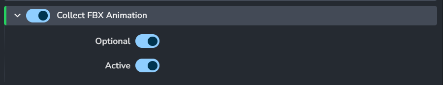
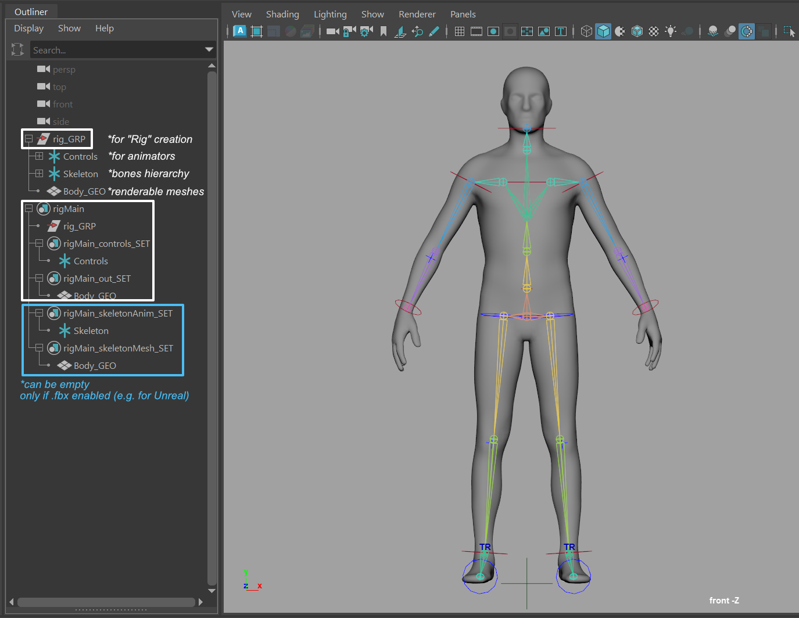

import ReactMarkdown from "react-markdown";
import versions from '@site/docs/assets/json/Ayon_addons_version.json'

<ReactMarkdown>
{versions.Maya_Badge}
</ReactMarkdown>

## AYON global tools

-   [Work Files](artist_tools_workfiles.md)
-   [Create](artist_tools_creator.md)
-   [Load](artist_tools_loader.md)
-   [Manage (Inventory)](artist_tools_inventory.md)
-   [Publish](artist_tools_publisher.md)
-   [Library Loader](artist_tools_library_loader.md)

## Working with AYON in Maya

AYON is here to ease you the burden of working on project with lots of
collaborators, worrying about naming, setting stuff, browsing through endless
directories, loading and exporting and so on. To achieve that, AYON is using
concept of being _"data driven"_. This means that what happens when publishing
is influenced by data in scene. This can by slightly confusing so let's get to
it with few examples.

## Publishing models

### Intro

Publishing models in Maya is pretty straightforward. Create your model as you
need. You need to adhere to specifications of your studio that can be different
between studios and projects but by default your geometry has to be named properly.
For example `sphere_GEO` or `cube1_GEO`. Geometry needs to have freezed transformations
and must reside under one group, for example `model_GRP`.


Note that `sphere_GEO` has frozen transformations.

### Creating instance

Now create **Model instance** from it to let AYON know what in the scene you want to
publish. Go **AYON → Create... → Model**


`Asset` field is a name of asset you are working on - it should be already filled
with correct name as you've started Maya or switched context to specific asset. You
can edit that field to change it to different asset (but that one must already exists).

`Product` field is a name you can decide on. It should describe what kind of data you
have in the model. For example, you can name it `Proxy` to indicate that this is
low resolution stuff. See [Product](artist_concepts.md#product).

:::tip USD Support
You can publish Models as USD, Check [Maya USD Contribution workflow](addon_usd_artist_maya_workflow.md#publishing-a-model) for more info.
:::

Read-only field just under it show final product name, adding product field to
name of the group you have selected.

`Use selection` checkbox will use whatever you have selected in Outliner to be
wrapped in Model instance. This is usually what you want. Click on **Create** button.

You'll notice then after you've created new Model instance, there is new set
in Outliner called after your product, in our case it is `modelMain`. The `modelMain`
set provides settings for you to includes some data when publishing. The settings can be found
in the channel box when you select the set.


These settings allow you to include either **Write Color Sets**, **Write Face Sets**,
or **Include Parent Hierarchy** as your exported preference before publishing.

:::note
The exported setting is solely valid for `Extract PointCache(Alembic)`.
:::

And that's it, you have your first model ready to publish.

Now save your scene (if you didn't do it already). You will notice that path
in Save dialog is already set to place where scenes related to modeling task on
your asset should reside. As in our case we are working on asset called
**Ben** and on task **modeling**, path relative to your project directory will be
`project_XY/assets/ben/work/modeling`. Let's save our scene as `model_test_v01`.

### Publishing models

Now let's publish it. Go **AYON → Publish...**. You will be presented with following window:


Note that content of this window can differs by your pipeline configuration.
For more detail see [Publisher](artist_tools_publisher.md).

Items in left column are instances you will be publishing. You can disable them
by clicking on square next to them. Green square indicate they are ready for
publishing, red means something went wrong either during collection phase
or publishing phase. Empty one with gray text is disabled.

See that in this case we are publishing from scene file `model_test_v01.mb` in
Maya model named `modelMain (ben)` (next item). Publishing of workfile is
currently disabled (last item).

Right column lists all tasks that are run during collection, validation,
extraction and integration phase. White items are optional and you can disable
them by clicking on them.

Lets do dry-run on publishing to see if we pass all validators. Click on flask
icon at the bottom. Validators are run. Ideally you will end up with everything
green in validator section.

### Fixing problems

To make things interesting, I intentionally forgot to freeze transformations
on `sphere_GEO` as I know it will trigger validator designed to check just this.


You can see our model is now marked red in left column and in right we have
red box next to `Transform Zero (Freeze)` validator.


From there you can see in **Records** entry that there is problem with `sphere_GEO`.
Some validators have option to fix problem for you or just select objects that
cause trouble. This is the case with our failed validator.

In main overview you can notice little up arrow in a circle next to validator
name. Right click on it and you can see menu item `select invalid`. This
will select offending object in Maya.


Fix is easy. Without closing Publisher window we just freeze transformations.
Then we need to reset it to make it notice changes we've made. Click on arrow
circle button at the bottom and it will reset Publisher to initial state. Run
validators again (flask icon) to see if everything is ok.

There are also `repair` actions for some validators. e.g. Mesh ColorSets
If you can't pass the validator, you can right-click and hit `repair`. It will
fix the stuff which triggers the validator in the scene.


When everything pass all the validations, you can write some comment if you want
and click play icon button to publish the instance when ready.

Publish process will now take its course. Depending on data you are publishing
it can take a while. You should end up with everything green and message
**Finished successfully ...** You can now close publisher window.

Ayon is able to publish model data in Alembic, Maya Scene, OBJ format; where
OBJ publisher needs to be enabled in the Settings. `ayon+settings://maya/publish/ExtractObj`


To check for yourself that model is published, open
[Asset Loader](artist_tools_loader.md) - **AYON → Load...**.
There you should see your model, named `modelMain`.

You can load your model by either referencing or importing.
Ayon can now support referencing the model in both Alembic
and Maya ASCII(ma) format, while it can load the model in four
different ways. You can choose to load your model in Alembic
format in Vray Proxy, Arnold Standin or GPU Cache. You can also
load the mesh in USD format if you have the multiverse USD plugin
installed in your machine.


## Look development

Look development in AYON is easy. It helps you with versioning different
kinds of shaders and easy switching between them.

Let see how it works.

### Loading model

In this example I have already published model of Buddha. To see how to publish
model with AYON see [Publishing Model](addon_maya_artist.md#publishing-models).

First of lets start with empty scene. Now go **AYON → Load...**


Here I am loading `modelBuddha`, its version 1 for asset **foo**.  Just right-click
on it and select **Reference (abc)**. This will load model into scene as alembic.
Now you can close Loader window.

### Creating look

Now you can create whatever look you want. Assign shaders, textures, etc. to model.
In my case, I assigned simple Arnolds _aiSurfaceShader_ and changed its color to red.


I am quite happy with it so I want to publish it as my first look.

### Publishing look

Select your model in outliner and ho **AYON → Create...**. From there
select **Look**. Make sure `use selection` checkbox is checked.
Mine product name is `Main`. This will create _Look instance_ with a name **lookMain**.

Close _Creator_ window.

Now save your scene, give it some sensible name. Next, go **AYON → Publish**.
This process is almost identical as publishing models, only different _Validators_
and other plugins will be used.

This should be painless and cause no trouble so go ahead, click play icon button at
the bottom and it will publish your look.

:::note publishing multiple looks
You can reference same model into scene multiple times, change materials on every
instance with what you need. Then on every model create _Look instance_. When
publishing all those _Look instances_ will be published at same time.
:::

### Loading looks into models

Now lets see how look are applied. Start new empty scene, load your published
model there as before (using _Reference (abc)_). If you didn't notice until now,
there are few yellow icons in left shelf:


Those are shortcuts for **Look Manager**, [Work Files](artist_tools_workfiles.md),
[Load](artist_tools_loader.md), and [Manage (Inventory)](artist_tools_inventory.md).

Those can be found even in top menu, but that depends on your studio setup.

You are interested now in **Look Manager** - first item with brush icon. Select
your Buddha model and open **Look Manager**.


This is **Look Manager** window. Yours would be empty until you click **Get All Assets**
or **Get Assets From Selection**. You can use later to quick assign looks if you have
multiple assets loaded in scene. Click on one of those button now.

You should now see all assets and their products loaded in scene, and on right side
all applicable published looks.

Select you asset and on the right side right click on `Main` look. Apply it.

You notice that Buddha model is now red, materials you've published are now applied
to it.

That way you can create looks as you want and version them using AYON.

## Setting scene data

Maya settings concerning framerate, resolution and frame range are handled by
AYON. If set correctly in Ftrack, Maya will validate you have correct fps on
scene save and publishing offering way to fix it for you.

For resolution and frame range, use **AYON → Set Frame Range** and
**AYON → Set Resolution**


## Creating rigs with AYON

Creating and publishing rigs with AYON follows similar workflow as with
other data types. Create your rig and mark parts of your hierarchy in sets to
help AYON validators and extractors to check it and publish it.

### Preparing rig for publish

When creating rigs, it is recommended (and it is in fact enforced by validators)
to separate bones or driving objects, their controllers and geometry so they are
easily managed. Currently AYON doesn't allow to publish model at the same time as
its rig so for demonstration purposes, I'll first create simple model for robotic
arm, just made out of simple boxes and I'll publish it.


For more information about publishing models, see [Publishing models](addon_maya_artist.md#publishing-models).

Now lets start with empty scene. Load your model - **AYON → Load...**, right
click on it and select **Reference (abc)**.

I've created few bones and their controllers in two separate
groups - `rig_GRP` and `controls_GRP`. Naming is not important - just adhere to
your naming conventions.

Then I've put everything into `arm_rig` group.

When you've prepared your hierarchy, it's time to create *Rig instance* in AYON.
Select your whole rig hierarchy and go **AYON → Create...**. Select **Rig**.
A set named after the rig product is created in your scene to mark rig parts for export. Notice that it has
four children object sets - `controls_SET`, `out_SET`,  `skeletonMesh_SET` and `skeletonAnim_SET`. Put your controls into `controls_SET`
and geometry to `out_SET`. You should end up with something like this:


The other two products `skeletonMesh_SET` and `skeletonAnim_SET` are used for the fbx workflow.

The `skeletonMesh_SET` defines the static FBX skeleton and mesh, put any skinned geometry here usually the same used for 'out_SET' too.

The `skeletonAnim_SET` defines the animated content that should be published to FBX from an animation scene
for the animation product type. This set should include only your animated skeleton.

:::tip Enable FBX for animation product type
Users need to enable **Collect Fbx Animation** before publishing it as animation product.


:::



### Publishing rigs

Publishing rig is done in same way as publishing everything else. Save your scene
and go **AYON → Publish**. When you run validation you'll mostly run at first into
few issues. Although number of them will seem to be intimidating at first, you'll
find out they are mostly minor things easily fixed.

* **Non Duplicate Instance Members (ID)** - This will most likely fail because when
creating rigs, we usually duplicate few parts of it to reuse them. But duplication
will duplicate also ID of original object and AYON needs every object to have
unique ID. This is easily fixed by **Repair** action next to validator name. click
on little up arrow on right side of validator name and select **Repair** form menu.

* **Joints Hidden** - This is enforcing joints (bones) to be hidden for user as
animator usually doesn't need to see them and they clutter his viewports. So
well behaving rig should have them hidden. **Repair** action will help here also.

* **Rig Controllers** will check if there are no transforms on unlocked attributes
of controllers. This is needed because animator should have ease way to reset rig
to it's default position. It also check that those attributes doesn't have any
incoming connections from other parts of scene to ensure that published rig doesn't
have any missing dependencies.

### Loading rigs

You can load rig with [Loader](artist_tools_loader.md). Go **AYON → Load...**,
select your rig, right click on it and **Reference** it.

## Point caches
AYON is using Alembic format for point caches. Workflow is very similar as
other data types.

### Creating Point Caches

To create point cache just create whatever hierarchy you want and animate it.
Select its root and Go **AYON → Create...** and select **Point Cache**.

After that, publishing will create corresponding **abc** files.

When creating the instance, a objectset child `proxy` will be created. Meshes in the `proxy` objectset will be the viewport representation where loading supports proxies. Proxy representations are stored as `resources` of the product.

Example setup:

| Create Point Cache | Adjust Hierarchy |
|--|--|
|  |  |

| Publish Point Cache |
|--|
|  |

#### Options

- **Frame Start**: which frame to start the export at.
- **Frame End**: which frame to end the export at.
- **Handle Start**: additional frames to export at frame start. Ei. frame start - handle start = export start.
- **Handle Start**: additional frames to export at frame end. Ei. frame end + handle end = export end.
- **Step**: frequency of sampling the export. For example when dealing with quick movements for motion blur, a step size of less than 1 might be better.
- **Refresh**: refresh the viewport when exporting the pointcache. For performance is best to leave off, but certain situations can require to refresh the viewport, for example using the Bullet plugin.
- **Include User Defined Attribudes**: include all user defined attributes in the publish.
- **Farm**: if your studio has Deadline configured, artists could choose to offload potentially long running export of pointache and publish it to the farm. Only thing that is necessary is to toggle this attribute in created pointcache instance to True.
- **Priority**: Farm priority.
- **Include Parent Hierarchy**: Set the root nodes if we don't want to include parents. The roots are to be considered the ones that are the actual direct members of the set.
- **Visible Only**: Does not filter out nodes that are only hidden on some frames as it counts "animated" or "connected" visibilities as if it's always visible.

#### Alembic Options


:::note
These options can differ from settings depending on studios settings. Not all options below would be exposed in the publisher.
:::

- **Euler Filter**: Apply Euler filter while sampling rotations.
- **Renderable Only**: Only export renderable visible shapes.
- **Strip Namespaces**: Namespaces will be stripped off of the node before being written to Alembic.
- **UVs Only**: If this flag is present, only uv data for PolyMesh and SubD shapes will be written to the Alembic file.
- **UV Write**: UV data for PolyMesh and SubD shapes will be written to the Alembic file.
- **Verbose**: Prints the current frame that is being evaluated.
- **Visible Only**: Only export dag objects visible during frame range.
- **Whole Frame Geo**: Data for geometry will only be written out on whole frames.
- **World Space**: Any root nodes will be stored in world space.
- **Write Color Sets**: Write vertex colors with the geometry.
- **Write Face Sets**: Write face sets with the geometry.
- **Write Normals**: Write normals with the deforming geometry.
- **Write UV Sets**: Write all uv sets on MFnMeshes as vector 2 indexed geometry parameters with face varying scope.
- **Write Visibility**: Visibility state will be stored in the Alembic file. Otherwise everything written out is treated as visible.
- **Pre Roll**: When enabled, the pre roll start frame is used to pre roll the evaluation of the mesh. From the pre roll start frame to the Alembic start frame, will not be written to disk. This can be used for simulation run-up.
- **Pre Roll Start Frame**: The frame to start scene evaluation at. This is used to set the starting frame for time-dependent translations and can be used to evaluate run-up that isn't actually translated. NOTE: Pre Roll needs to be enabled for this start frame to be considered.
- **Data Format**: The data format to use to write the file.
- **Custom Attributes**: Attributes matching by name will be included in the Alembic export. Attributes should be separated by semi-colon ;.
- **Custom Attributes Prefix**: Attributes starting with these prefixes will be included in the Alembic export. Attributes should be separated by semi-colon ;.
- **User Attr**: Attributes matching by name will be included in the Alembic export. Attributes should be separated by semi-colon ;.
- **User Attr Prefix**: Attributes starting with these prefixes will be included in the Alembic export. Attributes should be separated by semi-colon ;.
- **Mel Per Frame Callback**: When each frame (and the static frame) is evaluated the string specified is evaluated as a Mel command.
- **Mel Post Job Callback**: When the translation has finished the string specified is evaluated as a Mel command.
- **Python Per Frame Callback**: When each frame (and the static frame) is evaluated the string specified is evaluated as a python command.
- **Python Post Job Callback**: When the translation has finished the string specified is evaluated as a python command.

### Loading Point Caches

Loading point cache means creating reference to **abc** file with Go **AYON → Load...**.

Example result:


## Set dressing in Maya

Set dressing is term for easily populate complex scenes with individual parts.
AYON allows to version and manage those sets.

### Publishing Set dress / Layout

Working with Set dresses is very easy. Just load your assets into scene with
[Loader](artist_tools_loader.md) (**AYON → Load...**). Populate your scene as
you wish, translate each piece to fit your need. When ready, select all imported
stuff and go **AYON → Create...** and select **Set Dress** or **Layout**.
This will create set containing your selection and marking it for publishing.

:::note set dress vs layout
Currently *set dress* and *layout* are functionally identical
:::

Now you can publish is with **AYON → Publish**.

### Loading Set dress / Layout

You can load Set dress / Layout using [Loader](artist_tools_loader.md)
(**AYON → Load...**). Select you layout or set dress, right click on it and
select **Reference Maya Ascii (ma)**. This will populate your scene with all those
models you've put into layout.

### Multi-shot Layout in AYON

Multi-shot Layout Creator is automation that can quickly create Layouts for multiple
selected shots and prepare Camera Sequencer with correct timeline information.

It has 3 options:

- **Shot Parent Folder**: is folder that serves as parent for all shots to be used for layout creation
- **Group Loaded Assets**: is option that is propagated to the Layout instances themselves and indicate when you want to publish group of loaded asset
- **Associated Task Name**: is a name of task that will be associated to the Layout if it exists with the specific shot

*Note: if the `Associated Task Name` doesn't exist, created instance will be marked as invalid and will require some attention before publishing.*

## Rendering with AYON

AYON in Maya can be used for submitting renders to render farm and for their
subsequent publishing. Right now AYON support [AWS Thinkbox Deadline](https://www.awsthinkbox.com/deadline).

* For setting up Deadline support see [here](addon_deadline_admin.md)


### Creating basic render setup

If you want to submit your render to farm, just follow these simple steps.

#### Preparing scene

Lets start with empty scene. First I'll pull in my favorite Buddha model.
**AYON → Load...**, select model and right+click to pop up context menu. From
there just click on **Reference (abc)**.

Next, I want to be sure that I have same frame range as is set on shot I am working
on. To do this just **AYON → Set Frame Range**. This should set Maya timeline to same
values as they are set on shot in *Ftrack* for example.

I have my time set, so lets create some animation. We'll turn Buddha model around for
50 frames (this is length of my timeline).

Select model, go to first frame, key Y axis rotation, go to last frame, enter 360 to
**Channel Editor** Y rotation, key it and its done. If you are not sure how to do it,
you are probably reading wrong documentation.

Now let set up lights, ground and camera. I am lazy so I create Arnolds Skydome light:
**Arnold → Lights → Skydome Light**. As ground simple Plane will suffice and I'll set
my perspective view as I like and create new camera from it (`CTRL+SHIFT+C`) and rename
it from `persp1` to `mainCamera`.

One last thing, I'll assign basic *aiSurfaceShader* to my Buddha and do some little
tweaks on it.

#### Prepare scene for submission

As we have working simple scene we can start preparing it for rendering. AYON is fully utilizing
Render Setup layers for this. First of all, we need to create *Render instance* to tell AYON what
to do with renders. You can easily render locally or on render farm without it, but *Render instance*
is here to mark render layers you want to publish.

Lets create it. Go **AYON → Create...**. There select **Render** from list. If you keep
checked **Use selection** it will use your current Render Layers (if you have them). Otherwise,
if no render layers is present in scene, it will create one for you named **Main** and under it
default collection with `*` selector.

No matter if you use *Deadline*, AYON will try to connect to render farm and
fetch machine pool list.

So now my scene now looks like this:


You can see that it created `renderingMain` set and under it `LAYER_Main`. This set corresponds to
**Main** render layer in Render Setup. This was automatically created because I had not created any
render layers in scene before. If you already have layers and you use **Use selection**, they will
appear here, prefixed with `LAYER_`. Those layer set are created whenever you create new layer in
Render Setup and are deleted if you delete layer in Render Setup. However if you delete `LAYER_` set,
layer in Render Setup isn't deleted. It just means it won't be published.

Creating *Render instance* will also set image prefix in render settings to AYON defaults based on
renderer you use - for example if you render with Arnold, it is `maya/<Scene>/<RenderLayer>/<RenderLayer>_<RenderPass>`.

There are few setting on *Render instance* `renderingMain` in **Attributes Editor**:


Few options that needs explaining:

* `Primary Pool` - here is list of pool fetched from server you can select from.
* `Suspend publish Job` - job sent to farm will not start render automatically
but is in *waiting* state.
* `Extend Frames` - if checked it will add new frames to previous render, so you can
extend previous image sequence.
* `Override Existing Frame` - will overwrite file in destination if they exists
* `Priority` is priority of job on farm
* `Frames Per Task` is number of sequence division between individual tasks (chunks)
making one job on farm.

Now if you run publish, you notice there is in right column new item called
`Render Layers` and in it there is our new layer `Main (999_abc_0010) [1-10]`. First part is
layer name, second `(999_abc_0010)` is asset name and rest is frame range.

| Invalid Render Settings | No Default Camera |
|--|--|
|  |  |

You see I already tried to run publish but was stopped by few errors. Lets go
through them one by one just to see what we need to set up further in scene for
successful publish.

**No Default Cameras Renderable** is telling me:

```fix
Renderable default cameras found: [u'|persp|perspShape']
```

and so can be resolved by simple change in *Main* layer render settings.
All I have to do is just remove the `persp` camera from render settings and add there correct camera.

This leaves me only with **Render Settings** error. If I click on it to see
details, I see it has problem with animation not being enabled:

```fix
Animation needs to be enabled. Use the same frame for start and end to render single frame
```

Go to **Render Settings**, select your render layer and in **Common** tab change
in **File Output** `Frame/Animation ext` to whatever you want, just not _Single Frame_.
Set **Frame Range** `Start frame` and `End frame` according your needs.

If you run into problems with *image file prefix* - this should be set correctly when
creating *Render instance*, but you can tweak it. It needs to begin with `maya/<Scene>` token
to avoid render conflicts between DCCs. It needs to have `<RenderLayer>` or `<Layer>` (vray) and
`<RenderPass>` or `<Aov>` (vray). If you have more then one renderable cameras, add `<Camera>` token.

Sane default for arnold, redshift or renderman is:

```fix
maya/<RenderLayer>/<RenderLayer>_<RenderPass>
```

and for vray:

```fix
maya/<Layer>/<Layer>
```

Doing **AYON → Set Resolution** will set correct resolution on camera.

Scene is now ready for submission and should publish without errors.

:::tip what happens when I publish my render scene
When publishing is finished, job is created on farm. This job has one more dependent job connected to itself.
When render is finished, this other job triggers in and run publish again, but this time it is publishing rendered image sequence and creating quicktime movie for preview from it. Only those rendered sequences that have **beauty** AOV get preview as it doesn't make sense to make it for example from cryptomatte.
:::

### Attaching render to product

You can create render that will be attached to another product you are publishing, rather than being published on its own. Let's assume, you want to render a model turnaround.
In the scene from where you want to publish your model create *Render product*. Prepare your render layer as needed and then drag
model product (Maya set node) under corresponding `LAYER_` set under *Render instance*. During publish, it will submit this render to farm and
after it is rendered, it will be attached to your model product.

### Tile Rendering
:::note Deadline
This feature is only supported when using Deadline. See [here](addon_deadline_admin.md#ayontileassembler-plugin) for setup.
:::
On the render instance objectset you'll find:

* `Tile Rendering` - for enabling tile rendering.
* `Tile X` - number of tiles in the X axis.
* `Tile Y` - number of tiles in the Y axis.

When submittig to Deadline, you'll get:

- for each frame a tile rendering job, to render each from Maya.
- for each frame a tile assembly job, to assemble the rendered tiles.
- job to publish the assembled frames.

## Render Setups

### Publishing Render Setups

AYON can publish whole **Render Settings** setup. You can then version in and load it to
any Maya scene. This helps TDs to distribute per asset/shots render settings for Maya.

To publish render settings, go **AYON → Create...** and select **Render Setup Preset**.

In your scene will appear set `rendersetup<product>`. This one has no settings, only its presence
in scene will trigger publishing of render settings.

When you publish scene, current settings in **Render Settings** will be serialized to json file.

### Loading Render Setups

In any scene, you can load published render settings with **AYON → Load...**. Select your published
render setup settings, right+click on it and select **Load RenderSetup template**.

This will load and parse json file and apply all setting there to your Render Setting.

:::warning
This will overwrite all setting you already have.
:::

## Reviews

AYON supports creating review video for almost any type of data you want to publish.
What we call review video is actually _playblast_ or _capture_ (depending on terminology
you are familiar with) made from pre-defined camera in scene. This is very useful
in cases where you want to add turntable preview of your model for example. But it can
be used to generate preview for animation, simulations, and so on. You can either
publish review as separate product version, or you can attach generated video to product you
are publishing - for example attach video of turntable rotation to published model as in
following example.

### Setting scene for review extraction

Lets see how review publishing works on simple scene. We will publish model with
turntable preview video.

I'll be using Stanford University dragon model. Start with empty scene.
Create your model, import it or load from AYON. I'll just import model as OBJ
file.

After we have our model in, we need to set everything to be able to publish it
as model - for detail see [Publishing models](addon_maya_artist.md#publishing-models).

To recap - freeze transforms, rename it to `dragon_GEO` and put it into group
`dragon_GRP`. Then select this group and **AYON → Create...** and choose **Model**.

Now, lets create camera we need to generate turntable video. I prefer to animate
camera itself and not model because all animation keys will be associated with camera
and not model we want to publish.

I've created camera, named it `reviewCamera` and parent it under `reviewRotation_LOC`
locator. I set my timeline to 50 frames, key `reviewRotation_LOC` Y axis on frame
1 to 0 and on frame 50 to 360. I've also set animation curve between those two keys
to linear.

To mark camera to be used for review, select camera `reviewCamera` and go **AYON → Create...**
and choose **Review**.

This will create set `review<product>` including selected camera. You can set few options
on this set to control review video generation:

* `Active` - control on/off state
* `Frame Start` - starting frame for review
* `Frame End` - end frame for review
* `Handles` - number of handle frame before and after
* `Step` - number of steps
* `Fps` - framerate

Next step is to move your model set to review set so it will be connected to each other.

This is my scene:


You see that `modelMain` in under `reviewMain` with `reviewCamera`.

_* note that I had to fix UVs and normals on Stanford dragon model as it wouldn't pass
model validators_

### Publishing model with review

You can now publish your model and generate review video. Go **AYON → Publish...**,
validate if you will, and publish it. During publishing, Maya will create _playblast_
for whole frame range you've specified, then it will pass those frames to _ffmpeg_.
That will create video file, pass it to another extractor creating burnins in it
and finally uploading this video to ftrack with your model (or other type) published
version. All parts of this process - like what burnins, what type of video file,
settings for Maya playblast - can be customized by your TDs. For more information
about customizing review process refer to [admin section](addon_core_settings.md#publish-plugins).

If you don't move `modelMain` into `reviewMain`, review will be generated but it will
be published as separate entity.


## Inventory Actions

### Connect Geometry

This action will connect geometries between containers.

#### Usage

Select 1 container of type `animation` or `pointcache`, then 1+ container of any type.

#### Details

The action searches the selected containers for 1 animation container of type `animation` or `pointcache`. This animation container will be connected to the rest of the selected containers. Matching geometries between containers is done by comparing the attribute `cbId`.

The connection between geometries is done with a live blendshape.
