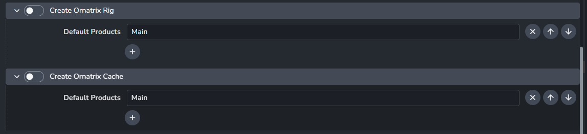
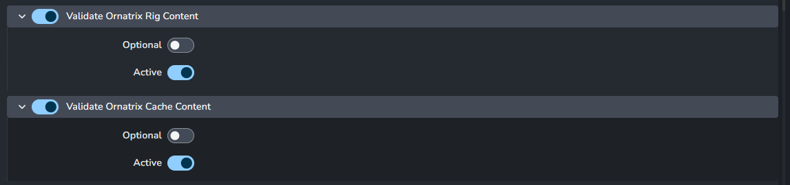

import ReactMarkdown from "react-markdown";
import versions from '@site/docs/assets/json/Ayon_addons_version.json'

<ReactMarkdown>
{versions.Maya_Badge}
</ReactMarkdown>

## Maya Addon Setting for Ornatrix Maya

### Creators

At present, we support two Orantrix product types. You can let artists create these products by enabling them in the Maya create settings.

- `ayon+settings://maya/create/CreateOxRig`
- `ayon+settings://maya/create/CreateOxCache`

### Validators

Currently, we provide content validation for the two Ornatrix product types.
Both validators ensure only Ornatrix-related nodes are included.
You can enable these validations, set them as optional to let artists skip them when publishing, or deactivate them if needed.

- `ayon+settings://maya/publish/ValidateOrnatrixRigContent`
- `ayon+settings://maya/publish/ValidateOrnatrixCacheContent`

### Loaders 

#### Ornatrix Rig Loader

Access the settings for the Ornatrix Rig Loader at:
- `ayon+settings://maya/load/OxRigLoader`

1. Toggle the loader on or off.
2. **Create Ornatrix Cache instance on load:**
    When enabled, an Ornatrix Cache instance is automatically created each time an Ornatrix rig is loaded into the scene, similar to how loading a character rig automatically creates the animation instance for publishing.

:::tip Customize Outliner Colors for Loaded Products

Set your preferred colors for the loader tool to highlight loaded Ornatrix products in Maya's Outliner.

Adjust the settings at: `ayon+settings://maya/load/colors`
  
Expect to see color boxes; clicking on them will bring up a color picker, giving you a range of colors to choose from.

Below are the default colors for Ornatrix products for your reference.

:::