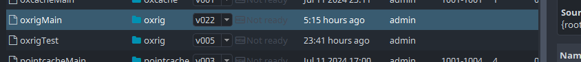

import ReactMarkdown from "react-markdown";
import versions from '@site/docs/assets/json/Ayon_addons_version.json'

<ReactMarkdown>
{versions.Maya_Badge}
</ReactMarkdown>

AYON supports Ephere's **Ornatrix** with the workflow of publishing and loading maya scene with Ornatrix data, Ornatrix groom presets and Ornatrix Alembic. It also supports to connect your target geometry with the loaded Ornatrix data (either from the maya scene or the groom preset.)

## Workflow
AYON has two creators for Ornatrix publishing: ```Ornatrix Rig``` and ```Ornatrix Cache```.

## Ornatrix Rig

### Creating and publishing

The **Ornatrix Rig** (product type: *oxrig*) publishes the geometry with the Ornatrix data.


Select your mesh (that has Ornatrix fur) and create the Ornatrix Rig instance.

:::tip
If the instance contains anything other than the mesh or the mesh has more than one hair shape, the publish validators will report the error to make sure there are always mesh(es) inside the instance.

:::

When it is published, several files are exported to the publish folder:

- Maya Scene with the Ornatrix data (.ma)
- Rig Setting data (.rigsettings)
- Ornatrix Almebic (.abc)
- Cache Setting data (.cachesettings)

### Loading



**Ornatrix Rig** supports to load maya scene (.ma) and Ornatrix alembic (.abc).


Both Maya Scene and groom preset allow for connecting ornatrix rig with the animation/pointcache rig.


## Ornatrix Caches

### Creating and publishing

There are two options to allow users to publish with ```Ornatrix Cache``` product type:

1. Create an ```Ornatrix Cache``` instance themselves by selecting the mesh with the Ornatrix data.
2. Load ornatrix rig which automatically creates the instance ready for publishing.


The cache family exports Ornatrix Alembic (.abc) which includes the Ornatrix data into the publish folder.

### Loading

The **Ornatrix Cache** supports to load Ornatrix alembic (.abc), Vray Proxy (.abc) and Arnold Scene Source (.abc).

## FAQ
### How to connect an Ornatrix rig to a pointcache or animation?
Once you load the Ornatrix Rig along with its corresponding pointcache, you can link them using AYON Inventory Actions:

1. Go to `AYON` -> `Manage...`
2. In the inventory select the assets from oxrig and animation/pointcache product type.
3. Right-click `Actions` -> `Connect Ornatrix Rig`
The Ornatrix geometry will be connected the animation rig with the transform and mesh attributes.

:::tip
The connection depends on the node's name. If it fails, ensure that the geometry's node name is consistent between your animation caches and the Ornatrix exports.

**Double geometry:** Be aware that your ornatrix rig and animated cache have the mesh geometry. After connecting the fur you will most likely want to hide one of the two to ensure you do not have two overlapping meshes during rendering.
:::