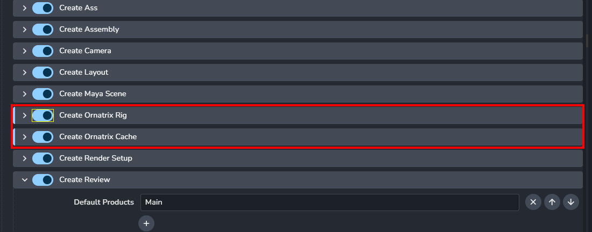
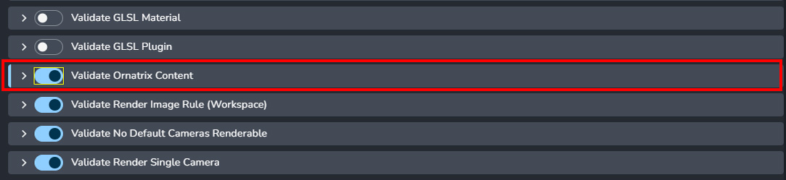
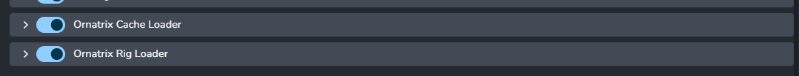

import ReactMarkdown from "react-markdown";
import versions from '@site/docs/assets/json/Ayon_addons_version.json'

<ReactMarkdown>
{versions.Maya_Badge}
</ReactMarkdown>

AYON supports Ephere's **Ornatrix** with the workflow of publishing and loading maya scene with Ornatrix data, Ornatrix groom presets and Ornatrix Alembic.It also supports to connect your target geometry with the loaded Ornatrix data(either from the maya scene or the groom preset)

## Maya Addon Setting before using AYON for Ornatrix Maya
On the AYON Studio Settings or Project Settings enable the Ornatrix plug-ins for Maya:

- Project settings > `Maya` > `Creators` > `Create Ornatrix Rig`
- Project settings > `Maya` > `Creators` > `Create Ornatrix Cache`
- Project settings > `Maya` > `Publishers` > `Validate Ornatrix Contents`
- Project settings > `Maya` > `Loaders` > `Ornatrix Cache Loader`
- Project settings > `Maya` > `Loaders` > `Ornatrix Rig Loader`








## Workflow
AYON has two creators for Ornatrix publishing: ```Ornatrix Rig``` and ```Ornatrix Cache```.

## Ornatrix Rig

### Creating and publishing

```Ornatrix Rig```(product type: *oxrig*) being to publish the asset with the Ornatrix data. Users select your mesh with Ornatrix fur and create ```Ornatrix Rig``` instance. When it is published, several files are exported to the publish folder:

- Maya Scene with the Ornatrix data (.ma)
- Groom Preset (.oxg.zip)
- Rig Setting data (.rigsettings)
- Ornatrix Almebic (.abc)
- Cache Setting data (.cachesettings)

### Loading


```Ornatrix Rig```supports to load maya scene (.ma), groom preset (.oxg.zip), Ornatrix alembic (.abc) and Ornatrix alembic to Hair Guide Node (.abc).


Both Maya Scene and groom preset allow for connecting ornatrix rig with the animation/pointcache rig.

Users need to go to `AYON` -> `Manage...`and select the assets from oxrig and animation/pointcache product type. Then they need to right-click `Actions` -> `Connect Ornatrix Rig` and the Ornatrix geometry would be connected the animation rig with the transform and mesh attributes.

Users can choose to load Hair Guide Node with Alembic by Ornatrix alembic to Hair Guide Node (.abc), which sets the alembic as file cache path inisde the node and they can select to connect the node with the node editor or edit it in the operator stack editor.

Once you finished on your Ornatrix rig, you can also go to `AYON` -> `Publish`. It will automatically create Ornatrix Cache instance and allow you to publish Ornatrix Alembic.
You can turn off the auto-creation by going to `AYON` server -> Project settings > `Maya` > `Loaders` > `Ornatrix Rig Loader` -> `Create Ornatrix Cache on load`


## Ornatrix Caches

### Creating and publishing

Users can either create ```Ornatrix Cache``` instance by their own or load ornatrix rig which automatically create the instance after launching the Publisher UI.

The cache family would export Ornatrix Alembic(.abc) which includes the Ornatrix data into the publish folder.

### Loading
```Ornatrix Rig```supports to load Ornatrix alembic (.abc) and Ornatrix alembic to Hair Guide Node (.abc).
