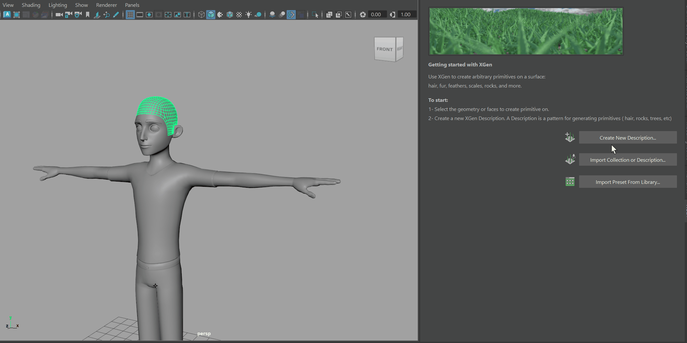
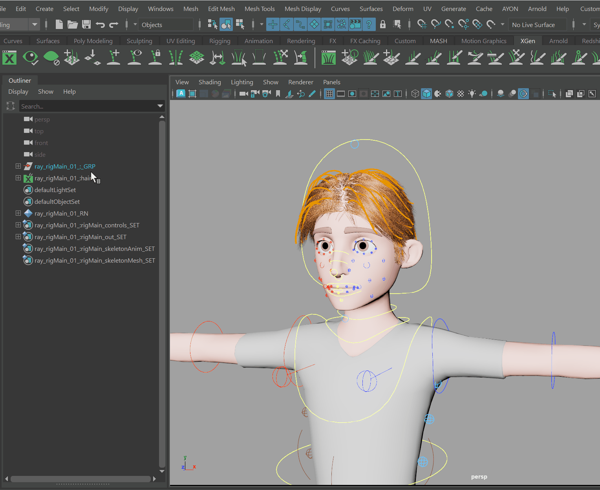
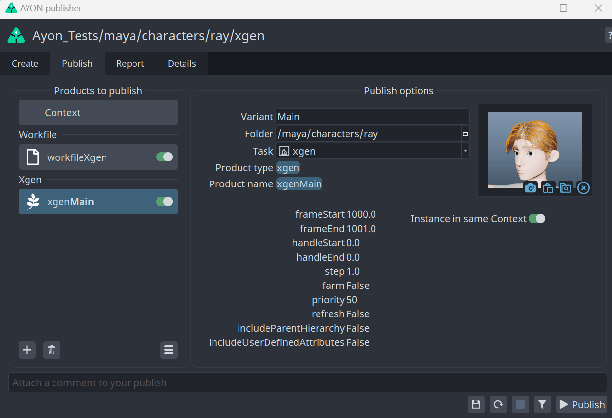
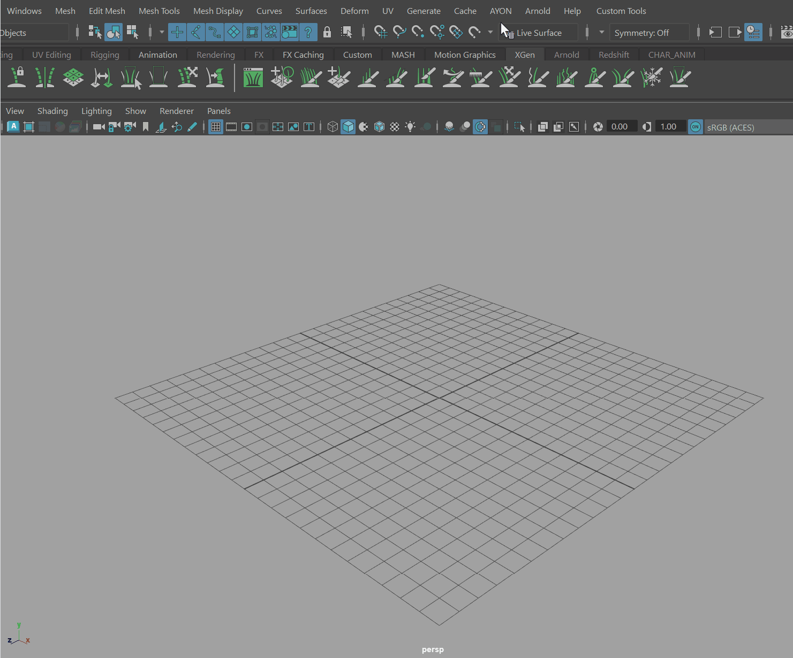
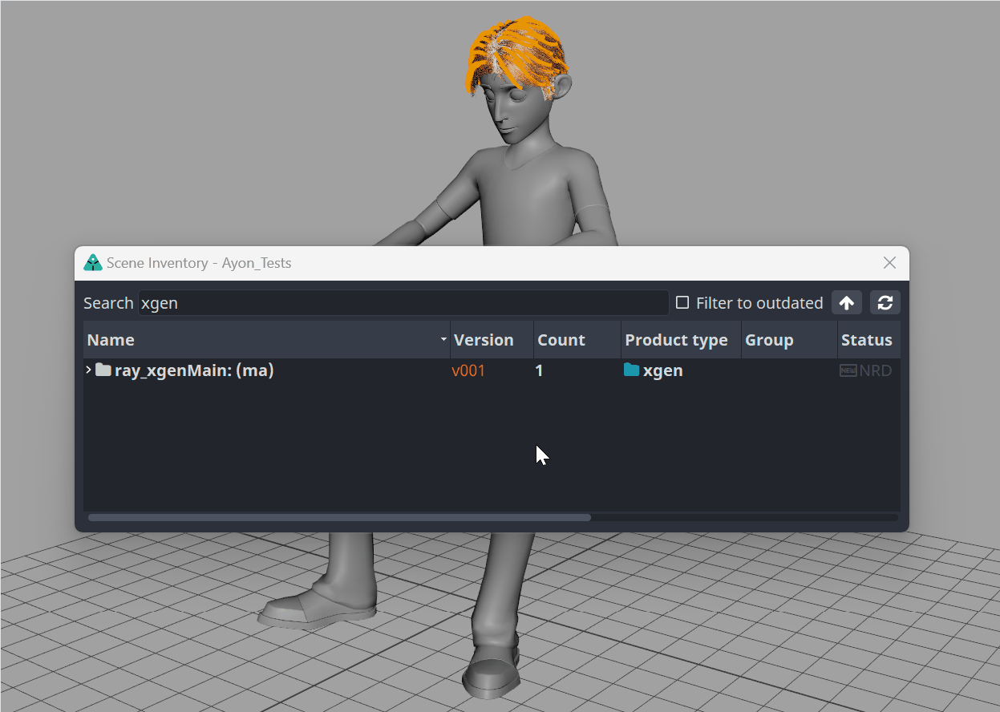
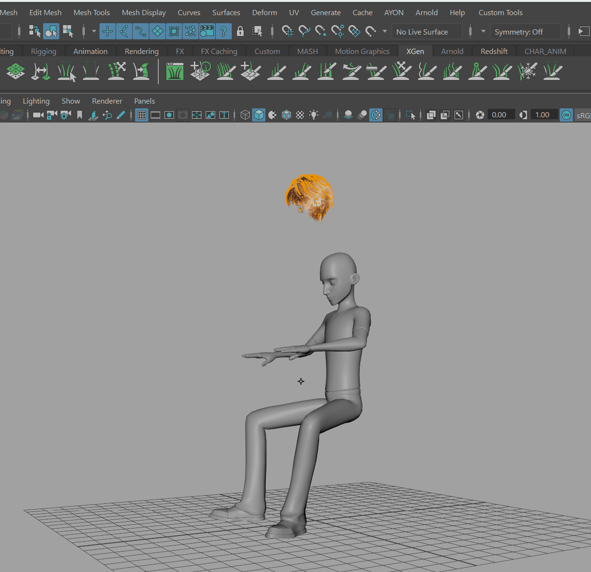
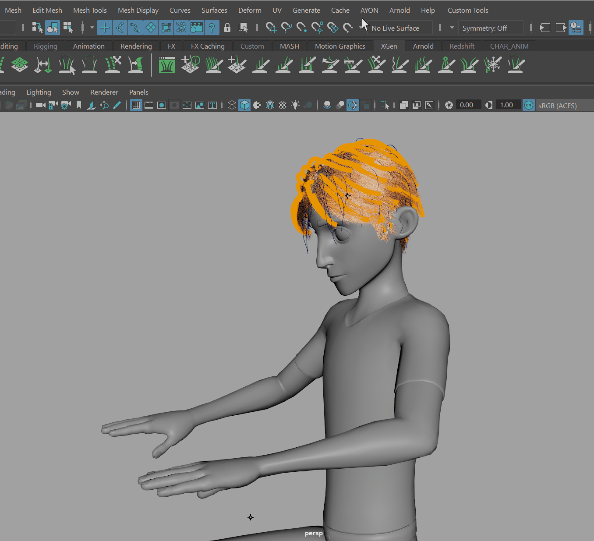
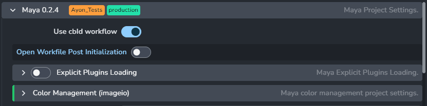
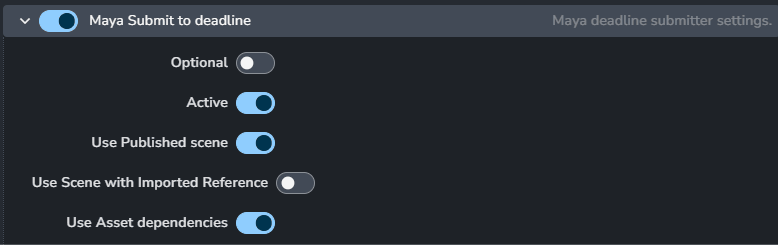

import ReactMarkdown from "react-markdown";
import versions from '@site/docs/assets/json/Ayon_addons_version.json'

<ReactMarkdown>
{versions.Maya_Badge}
</ReactMarkdown>

AYON supports **Xgen** classic (using **Collections** and **Descriptions**) with the following workflow.

`AYON` integration of Xgen eases the otherwise cumbersome issues around Xgen's side car files and hidden behaviour inside Maya. The workflow supports publishing, loading and updating of Xgen collections, along with connecting animation from geometry and (guide) curves also allowing you to fully manage its versions and iterations.

:::warning
Interactive Grooms are not supported within **AYON**, use **Xgen** descriptions with **Placing and Shaping Guides** control type when creating your setup
:::

## Workflow

:::info
Please check **AYON Setup** section at the bottom of this page for details whats neccessary when using Xgen with AYON first!
:::

`Xgen` workflow consists of first creating an `Xgen` setup (aka rig), sharing it via publishing within the project, connecting such an `Xgen` product with existing animated data and optionally driving such a setup with simulation using guide curves, and finally outputting rendered images with hair strands.

### Creating Xgen publish

Begin with creating `Xgen` collection consisting of description(s) while selecting groom geometry ideally comming from loaded product using `AYON` >`Loader`.
You should be familiar with `Xgen` and its practices and following these when creating the setup on your loaded model.



:::info
Use your character **model or rig** product loaded via **AYON Loader** before starting to setup **Xgen**
::: 

Once your `Xgen` setup is ready, select it and create an `Xgen` publish instance type. This needs to contain only **one Xgen collection**.

`AYON > Create... > Xgen`



:::tip
You can create multiple `Xgen` publish instances within single workfile each representing single `Xgen` collection. You can pick different name `Variant` for such occasions resulting in `XgenHead` and `XgenBody` etc. But most of the times single collection will do as it can consist of multiple descriptions representing these anyway.
:::

### Publishing Xgen setup

Once you are ready with your `Xgen` setup you can trigger `Publish` action via `AYON`>`Publish`.



The publishing process will grab geometry used for grooming `Xgen` along with any external files used in the collection's descriptions. This creates an isolated Maya file with just the `Xgen` collection's dependencies, so you can use any nested geometry when creating the `Xgen` description. An `Xgen` version will consist of:

- Maya file (`.ma`) - this contains the geometry and the connections to the Xgen collection and descriptions.
- Xgen file (`.xgen`) - this contains the Xgen collection and description.
- Resource files (`.ptx`, `.xuv`) - this contains Xgen side car files used in the collection and descriptions.

You should end up with new `Xgen` product `v001` in your project and such a product can be later loaded to any maya workfile within a project...

### Loading Xgen

Open the `AYON > Loader...`, and navigate to the published `Xgen` version. On right-click action you'll get the option to `Reference Xgen (ma)` into your active workfile.



:::warning
Save your maya workfile if you didn't before attempting to load Xgen product into your scene as it needs to be saved first because of Xgen side car files writting! Otherwise warning message appears telling you to do so...
:::

When loading an `Xgen` product and version the following happens:

- References in the Maya file.
- Copies the Xgen file (`.xgen`) to the current workspace.
- Modifies the Xgen file copy to load the current workspace first then the published Xgen collection.
- Makes a custom attribute on the Xgen collection, `float_ignore`, which can be seen under the `Expressions` tab of the `Xgen` UI. This is done to initialize the Xgen delta file workflow.
- Setup an Xgen delta file (`.xgd`) to store any workspace changes of the published Xgen version.

:::info
Once loading completes, the `Xgen` collection enters the Xgen delta file workflow. This ensures that modifications in the Maya workfile are saved to the current workspace. The original Xgen collection remains unchanged, allowing for map assignments or attribute alterations without affecting the base setup. Thus, shot-specific tweaks can be made safely, preserving the integrity of the initial configuration.
:::

### Updating Xgen

When there are changes to the `Xgen` product and new version shows up, the user will be notified when opening the workfile or publishing. Since the `Xgen` is referenced in the active maya workfile, it follows the standard Maya referencing system and overrides.

Use `AYON` > `Manage` to set / change `Xgen` product `version` as with any other product types `AYON` offers.



:::note
For example publishing `xgenMain` version 1 with the attribute `renderer` set to `None`, then version 2 has `renderer` set to `Arnold Renderer`. When updating from version 1 to 2, the `renderer` attribute will be updated to `Arnold Renderer` unless there is a local override.
:::

### Connecting Xgen to animation

When loading in an Xgen version, it does not have any connections to anything in the workfile, so its static in the position it was published in. Use the [Connect Geometry](addon_maya_artist#connect-geometry) action to connect Xgen to any matching loaded animated geometry.

 

:::info
`Animation` or `Pointcache` product type need to be used for connecting `Xgen` also reffered as `connect patches` in Xgen user docs.
:::


### Connect Guide Curves

Along with patches (aka animated character model meshes) you can also connect the `Xgen` guides to an `Alembic` cache consisting of matching NURBS curves originating from simulation / other DCCs like `Houdini` etc.

#### Usage

Navigate to `AYON` > `Manage`
First selecting the `animation` product container, of `animation` or `pointcache` type, then the `Xgen` product container to connect to.

Right-click > `Actions` > `Connect Xgen`.



:::warning
Only alembic `.abc` representation is allowed and need to contain only nurbs curves matching Xgen guides present in the particular setup
:::

#### Details

Connecting the guide will make Xgen use the Alembic directly, setting the attributes under `Xgen` / `Guide Animation`, so the Alembic needs to contain the same amount of curves as guides in the Xgen.

The animation container gets connected with the Xgen container, so if the animation container is updated so will the Xgen container's attribute.

### Rendering

First check **AYON Setup** section below if all correctly setup within AYON settings.

To render with Xgen, follow the [Rendering With AYON](addon_maya_artist#rendering-with-ayon) guide. AYON will manage all necessary actions related to Xgen and its source files, including baking patches and other requirements for successful rendering of the animated sequence.

:::note Details
When submitting a workfile with Xgen for rendering, all Xgen-related files are collected and published as the workfile's resources. This means the published workfile is no longer referencing the workspace's Xgen files and carries all dependencies exclusive to the rendering workfile.
:::

## AYON Setup

In order to be able to use `Xgen` in the `AYON` pipeline, a few setup steps need to be done first...

### Maya Addon Settings
On the server, navigate to the following settings section:

Project settings > `Maya` > enable `Open Workfile Post Initialization`;

`project_settings/maya/open_workfile_post_initialization`



:::tip
You can set up these also on the Studio Settings level if preferable acting then as defaults for any present or future AYON projects not just for the active Project selected.
:::

This is due to two errors occurring when opening workfile containing referenced `Xgen` nodes on launch of Maya specifically:

- ``Critical``: Duplicate collection errors on launching workfile. This is because Maya first imports Xgen when referencing in external Maya files, then imports Xgen again when the reference edits are applied.
```
Importing XGen Collections...
# Error: XGen:  Failed to find description ball_xgenMain_01_:parent in collection ball_xgenMain_01_:collection. Abort applying delta: P:/PROJECTS/OP01_CG_demo/shots/sh040/work/Lighting/cg_sh040_Lighting_v001__ball_xgenMain_01___collection.xgen  #
# Error: XGen:  Tried to import a duplicate collection, ball_xgenMain_02_:collection, from file P:/PROJECTS/OP01_CG_demo/shots/sh040/work/Lighting/cg_sh040_Lighting_v001__ball_xgenMain_02___collection.xgen. Aborting import.  #
```
- ``Non-critical``: Errors on opening workfile and failed opening of published xgen. This is because Maya imports Xgen when referencing in external Maya files but the reference edits that ensure the location of the Xgen files are correct, has not been applied yet.
```
Importing XGen Collections...
# Error: XGen:  Failed to open file: P:/PROJECTS/OP01_CG_demo/shots/sh040/work/Lighting/cg_ball_xgenMain_v035__ball_rigMain_01___collection.xgen  #
# Error: XGen:  Failed to import collection from file P:/PROJECTS/OP01_CG_demo/shots/sh040/work/Lighting/cg_ball_xgenMain_v035__ball_rigMain_01___collection.xgen  #
```

### Deadline Addon Settings

In order to be able to render on AWS Deadline without Xgen errors...

On the `AYON` server, navigate to the following settings section:

Project settings > `Deadline` > `Publish plugins` > `Maya Submit to Deadline` > disable `Use Published scene`

`project_settings/deadline/publish/MayaSubmitDeadline/use_published`



:::info
By setting it **AYON** will use **workfile** scene **directly instead of published** one for rendering as a temporary workaround
due to current Xgen limitations. This should be fixed in the future thought allowing using standard published exclusive workfile when
rendering on the farm instead.
:::