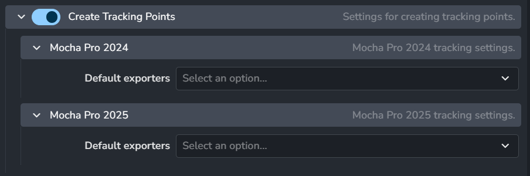
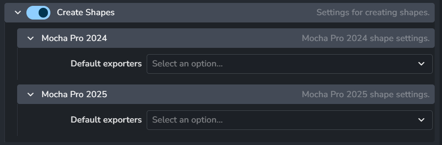

import ReactMarkdown from "react-markdown";
import versions from '@site/docs/assets/json/Ayon_addons_version.json'

<ReactMarkdown>
{versions.Mocha_Badge}
</ReactMarkdown>

## Overview

The Mocha Pro Addon for AYON provide features to manage you Mocha Pro workfiles, load clips and
publish tracking data and shape data.

:::note
This addon supports only Mocha Pro - the standalone application, not the plugin versions for DCCs.
:::

## Addon Settings

### Creator Plugins

#### Create Tracking Points
> Setting Location: `ayon+settings://mocha/create/CreateTrackingPoints`

- **Enable**: When enabled, users can create `tracking points` products using the publisher tool.
- **Default Exporters**: Choose the default exporter for `tracking points` for each Mocha version.

#### Create Shapes
> Setting Location: `ayon+settings://mocha/create/CreateShapeData`

- **Enable**: When enabled, users can create `Shapes Data` products using the publisher tool.
- **Default Exporters**: Choose the default exporter for `Shapes Data` for each Mocha version.