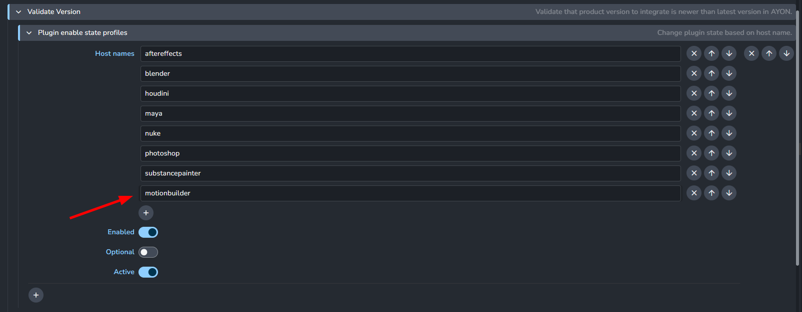
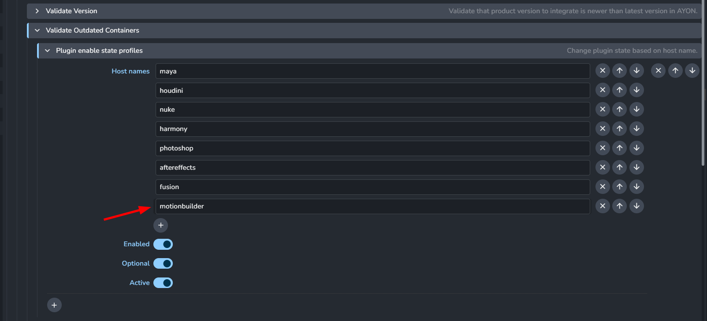

import ReactMarkdown from "react-markdown";
import versions from '@site/docs/assets/json/Ayon_addons_version.json'

<ReactMarkdown>
{versions.MotionBuilder_Badge}
</ReactMarkdown>

:::caution Unknown support for Motion Builder 2023 and below

The AYON Motion Builder addon was initially developed with Motion Builder 2024 and 2025.
Hence functionality was not tested in older versions than 2024 and may not work.
:::

## Supported Workflows

The MotionBuilder addon currently enables you to import models, rigs, animations, and cameras. It also supports exporting animations and managing workfiles through saving, opening, and publishing.

:::info Motion Builder Addon Settings
The Motion Builder addon does not include individual settings, so it won't be listed in your studio's addon settings. However, this does not affect the addon's ability to utilize the core settings.
:::

## Publish Plugins

The Motion Builder addon leverages the plugins from the core addon. Many of these plugins offer filters where you can specify motionbuilder as the host. For example:

- **Validate Version:** Ensures that the workfile version is up to date with the latest in AYON. Access this validator at `ayon+settings://core/publish/ValidateVersion` and include Motion Builder's host name, which by default is `motionbuilder`.

- **Validate Outdated Container:** Checks that any loaded content is the most recent version. This validator is accessible at `ayon+settings://core/publish/ValidateOutdatedContainers`. Add Motion Builder's host name, which by default is `motionbuilder`.

