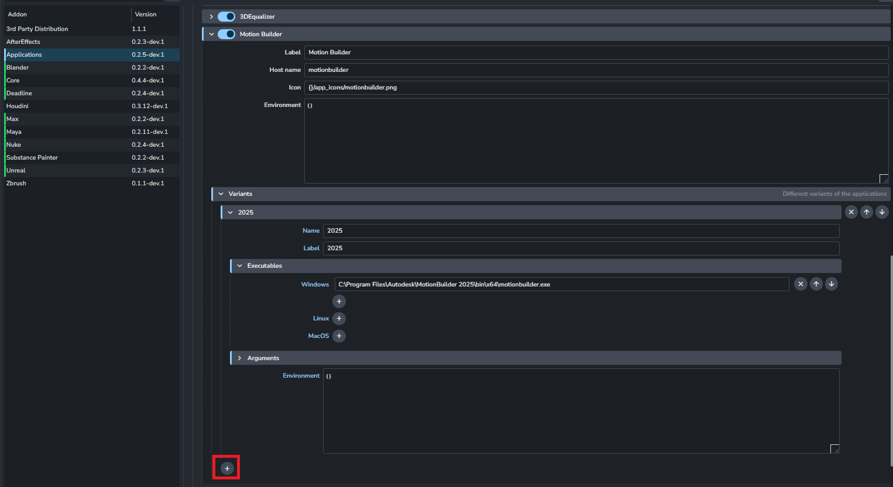

import ReactMarkdown from "react-markdown";
import versions from '@site/docs/assets/json/Ayon_addons_version.json'

<ReactMarkdown>
{versions.MotionBuilder_Badge}
</ReactMarkdown>

## Setting your Motion Builder launching version in Application

Users can set up your own Motion Builder version in Application Addon
You can click **+** button to add new different version.

:::warning Important
As the integration developed with Motion Builder 2024/2025, some functions may not be working in the version elder than 2024.
:::

## Publishing Plugins
There are some validators from Core Addon can be optionally added for Motion Builder.

# Validate Version
Users can access the validator via `ayon+settings://core/publish/ValidateVersion`
You can add `motionbuilder` as host names if you want to validate workfile version to make sure the workfile version is in the latest version in AYON.

# Validate Outdated Cotnainer
Users can access the validator via `ayon+settings://core/publish/ValidateOutdatedContainers`
You can add `motionbuilder` as host names if you want to validate outdated container to make sure the loaded content is always at the latest version.
