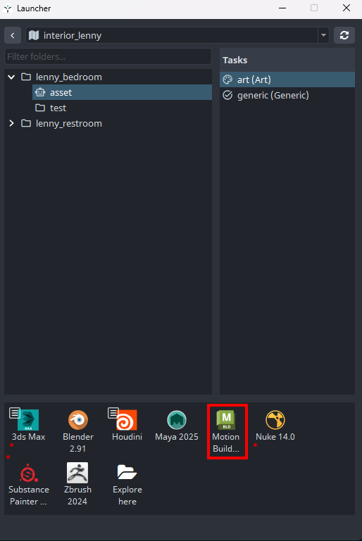
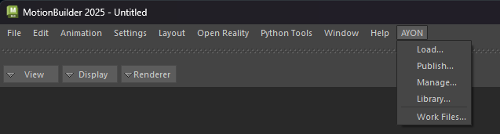

import ReactMarkdown from "react-markdown";
import versions from '@site/docs/assets/json/Ayon_addons_version.json'

<ReactMarkdown>
{versions.MotionBuilder_Badge}
</ReactMarkdown>

:::note Work in progress
This part of documentation is still work in progress.
:::
## First Steps With AYON

Locate **AYON Icon** in the OS tray (if hidden dive in the tray toolbar).

> If you cannot locate the AYON icon ...it is not probably running so check [Getting Started](artist_getting_started.md) first.

By clicking the icon  ```AYON Menu``` rolls out.


Choose ```AYON Menu > Launcher``` to open the ```Launcher``` window.

When opened you can **choose** the **project** to work in from the list. Then choose the particular **asset** you want to work on then choose **task**
and finally **run Motionbuilder by its icon** in the tools.



:::note Launcher Content
The list of available projects, assets, tasks and tools will differ according to your Studio and need to be set in advance by supervisor/admin.
:::

After the launch, you can find AYON menu next to Help menu.



## Creating and Publishing Instances

:::warning Important
Before proceeding further please check [Glossary](artist_concepts.md) and [What Is Publishing?](artist_publish.md) So you have clear idea about terminology.
:::


### Intro

Current MotionBuilder Integration supports ```Workfile```and ```Animation``` product types for publishing while ```Animation```, ```Camera```,
```Model```and ```Rig``` for loading.

Both **Animation** and **Workfile** product type are outputting the animation in FBX format. **Workfile** product type generally outputs all objects from the scene. **Animation** product type allow users to choose export by selection(currently only supports model selection) and their FBX export options before publishing.

## Publish Animation
//Need to explain it only supports model selection
:::warning Important
Current **Animation** only supports *Embed Media*, *Save Selected Models Only*, *Keep Transform Hierarchy*
as FBX export options.
:::

## Loading Point Cache
The loader only imports the asset in FBX format which is published from ```Animation```, ```Camera```, ```Model```and ```Rig```.

The loader will create the set which includes the loaded assets.
