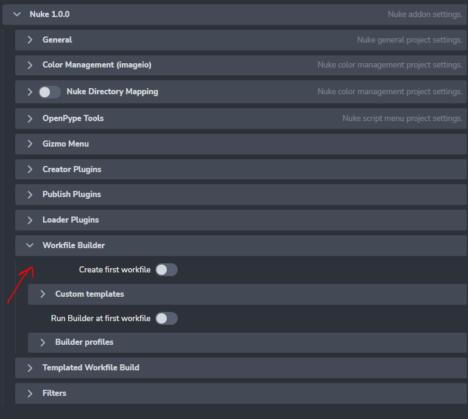
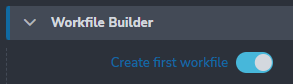
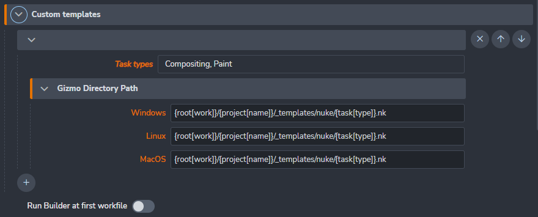
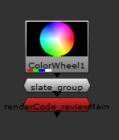

import ReactMarkdown from "react-markdown";
import versions from '@site/docs/assets/json/Ayon_addons_version.json'

<ReactMarkdown>
{versions.Nuke_Badge}
</ReactMarkdown>

import Tabs from '@theme/Tabs';
import TabItem from '@theme/TabItem';

## Workfile Builder

All Workfile Builder related settings can be found here. This is a list of available features:
- Create first workfile
- Custom Template path (task type filtered)
- Run Builder profiles at first run
- Define Builder Profiles With Filters





:::important Auto Load Last Version
In case you want to set the auto load of the latest available version of workfiles, you can do it from [here](project_settings_core#open-last-workfile-at-launch).
:::

### Create first workfile

By switchintg this feature on, AYON will generate initial workfile version. Following attributes are possible to configure:





#### Custom templates
Custom templates are added into nuke's node graph as nodes. List of task types can be defined for templates filtering.

- Task types are sourced from project related Anatomy/Task Types


 - multi platform path can be used in a variety of ways. Along the absolute path to a template file also an python formatting could be used. At the moment these keys are supported (image example below):
   - `root[key]`: definitions from anatomy roots
   - `project[name, code]`: project in context
   - `asset`: name of asset/shot in context
   - `task[type, name, short_name]`: as they are defined on asset/shot and in **Anatomy/Task Type** on project context



#### Run Builder profiles on first launch
Enabling this feature will look into available Builder's Prorfiles (look below for more information about this feature) and load available versions into node graph.

### Builder Profiles
Builder profiles are set of rules allowing artist Load any available versions for the context of the asset, which it is run from. Preset is having following attributes:

- **Filter**: Each profile could be defined with task filter. In case no filter is defined, a profile will be working for all.

- **Context section**: filtres for product name (regex accepted), families, representation names and available Loader plugin.

- **Linked Assets/Shots**: filters for asset builds to be added


## Slate Workflow

1. Add a "slate" node above the instance node. The workflow requires the slate node to have "slate" in the name to detect it.



Here is the slate group from the example above;

```
set cut_paste_input [stack 0]
version 15.0 v2
push $cut_paste_input
Group {
 name slate_group
 selected true
 xpos -172
 ypos -163
}
 ColorBars {
  inputs 0
  name ColorBars1
  xpos 410
  ypos -202
 }
 Text2 {
  font_size_toolbar 100
  font_width_toolbar 100
  font_height_toolbar 100
  message "THIS IS A SLATE"
  old_message {{84 72 73 83 32 73 83 32 65 32 83 76 65 84 69}
    }
  box {0 0 1920 1080}
  xjustify center
  yjustify center
  transforms {{0 2}
    }
  cursor_position 15
  center {960 540}
  cursor_initialised true
  autofit_bbox false
  initial_cursor_position {{0 1080}
    }
  group_animations {{0} imported: 0 selected: items: "root transform/"}
  animation_layers {{1 11 960 540 0 0 1 1 0 0 0 0}
    }
  name Text2
  xpos 410
  ypos -130
 }
 Input {
  inputs 0
  name footage
  selected true
  xpos 279
  ypos -170
 }
 Switch {
  inputs 2
  which {{"\[python (nuke.root()\\\[\\\"first_frame\\\"\\].value()\\ -\\ 1)\\ ==\\ nuke.frame()]"}}
  name Switch1
  xpos 279
  ypos -130
 }
 Output {
  name Output1
  xpos 279
  ypos -30
 }
end_group
```

Any node can be used as a slate node, so feel free to customize or insert your studios own slate node. Just ensure it has `slate` in the name.

2. Make sure the slate node is actually showing something by looking into `first-frame - 1`.

3. Add tag `slate-frame` into settings at `ayon+settings://core/publish/ExtractReview/profiles/0/outputs/1/tags`.

4. Make sure the render write node is marked as reviewable.

## Custom Menu
You can add your custom tools menu into Nuke by extending definitions in **Nuke -> Scripts Menu Definition**.


:::note Work in progress
This is still work in progress. Menu definition will be handled more friendly with widgets and not
raw json.
:::

## Gizmo Menu
You can add your custom toolbar menu into Nuke by setting your gizmo path and extending definitions in **Nuke -> Gizmo Menu**.


## Creator Plugins

### Exposed Knobs
`ayon+settings://nuke/create/CreateWriteRender/exposed_knobs`

This list links knobs from the write node inside, to the publish group. The name of the knobs can be found when hovering over the knob, in the tooltip in bold.


