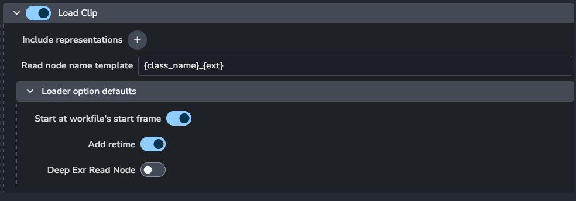

import ReactMarkdown from "react-markdown";
import versions from '@site/docs/assets/json/Ayon_addons_version.json'

<ReactMarkdown>
{versions.Nuke_Badge}
</ReactMarkdown>

import Tabs from '@theme/Tabs';
import TabItem from '@theme/TabItem';

:::caution Nuke License compatibility
The AYON Nuke addon integration is compatible exclusively with the `commercial` license of Nuke, which provides Full Python API Support and pipeline functionality. Please note that the `non-commercial` and `indie` licenses lack full Python API support and, as a result, are not supported by the addon.

For more details, check out the comparison between different Nuke licenses [here](https://learn.foundry.com/nuke/content/getting_started/meet_nuke/about_indie.html).
:::

## General
### Menu Shortcuts
> Setting Location: `ayon+settings://nuke/general/menu`

Set Shortcuts for AYON global [artist tools](artist_tools.md).

Available tools: 
- **Create...**
- **Publish...**
- **Load...**
- **Manage...**
- **Build Workfile...**

## Color Management (ImageIO)

Color configuration for Nuke scripts and nodes and also override the global color management settings, check [Host specific overrides](admin_colorspace.md#host-specific-overrides).

### Enable Color Management

> Setting Location: `ayon+settings://nuke/imageio/activate_host_color_management`

This toggle enables AYON's global color management.
This toggle is a master switch that enables and disables the whole section.

### File Rules
> Setting Location: `ayon+settings://nuke/imageio/file_rules`

- **Activate Host Rules**
- Rules
  - **+**: Add more rules
  - Each rule consists of
    
    - **Rule name**
    - **Regex pattern**
    - **Colorspace name**
    - **File extension**

### Viewer
> Setting Location: `ayon+settings://nuke/imageio/viewer`

- **Display**
- **View**

### Monitor OUT
> Setting Location: `ayon+settings://nuke/imageio/monitor`

- **Display**
- **View**

### Backing Target Colorspace
> Setting Location: `ayon+settings://nuke/imageio/baking_target`

#### Mode 1: Use Colorspace

- **Enable**
- **Target baking type**
- **Colorspace**

#### Mode 2: Use Display & View

- **Enable**
- **Target baking type**
- **Display**
- **View**

### Workfile
> Setting Location: `ayon+settings://nuke/imageio/workfile`

Nuke script project color settings map 1:1 

- **Color Management Workflow**
- **Native OpenColorIO Config**
- **Working Space**
- **Thumbnails**
- **Monitor Out**
- **8-bit Files**
- **16-bit Files**
- **Log Files**
- **Float Files**

### Nodes
> Setting Location: `ayon+settings://nuke/imageio/nodes`

#### Plugin required

- **Used in plugins**
- **Nuke Node Class**
- **Knobs**
  - **Name**
  - **Type**
  - **Controller**
  - **+**: Add more knobs
- **+**: Add more node per plugins

#### Plugin's node overrides

- **Used in plugins**
- **Nuke Node Class**
- **Knobs**
  - **Name**
  - **Type**
  - **Controller**
  - **+**: Add more knobs
- **+**: Add more node per plugins

### Assign colorspace to read nodes via rules
> Setting Location: `ayon+settings://nuke/imageio/regex_inputs`

When using loading different clips and images sequences via AYON loader,
you can set the default colorspace for the read node based on a regex expression.

- **Regex expression**
- **Colorspace**
- **+**: Add more rules.

## Nuke Directory Mapping
> Setting Location: `ayon+settings://nuke/dirmap`

- **Enable**
- **Source Paths**
- **Destination Paths**

## Custom Tools
> Setting Location: `ayon+settings://nuke/scriptsmenu`

Creates a custom from the provided action definitions 
- **Menu Name**
- **Definitions**
  - Each definition includes
    - **Type**
    - **Command**
    - **Source Type**
    - **Title**
    - **Tooltip**
  - **+**: Add more definitions

:::tip Expected result
For the setting value in the screen shot above, 
custom tools menu will appear in Nuke's toolbar. 

:::

## Gizmo Menu
> Setting Location: `ayon+settings://nuke/gizmo`

- Toolbar Menu Name
- Toolbar Icon Path
- Gizmo Menu Options
  Gizmo Menu supports two modes:

- Gizmo Directory Path

- **Gizmo Definitions**
  - Each Definition consists of:
    - **Gizmo Menu Parent**
    - **Gizmo List**
      - Each Gizmo item consists of:
        - **Label**
        - **Type of usage**
        - **Python command**
        - **Icon Path**
        - **Hotkey**
      - **+**: Add More Gizmos
  - **+**: Add More gizmo Definitions

## Creator Plugins

### Create Write Render

> Setting Location: `ayon+settings://nuke/create/CreateWriteRender`

- Temporary rendering path template
- Default variants
- Instance attributes
- Write Node Exposed Knobs
- Preceding nodes

### Create Write Prerender

> Setting Location: `ayon+settings://nuke/create/CreateWritePrerender`

- Temporary rendering path template
- Default variants
- Instance attributes
- Write Node Exposed Knobs
- Preceding nodes

### Create Write Image

> Setting Location: `ayon+settings://nuke/create/CreateWriteImage`

- Temporary rendering path template
- Default variants
- Instance attributes
- Write Node Exposed Knobs
- Preceding nodes

## Publish Plugins

### Collect Instance Version
> Setting Location: `ayon+settings://nuke/publish/CollectInstanceData`

- Product types

### Validate Correct Folder Name
> Setting Location: `ayon+settings://nuke/publish/ValidateCorrectAssetContext`

- Enable
- Optional
- Active

### Validate Knobs
> Setting Location: `ayon+settings://nuke/publish/ValidateKnobs`

- Knobs

### Validate Output Resolution
> Setting Location:`ayon+settings://nuke/publish/ValidateOutputResolution`

- Enable
- Optional
- Active

### Validate Gizmo
> Setting Location: `ayon+settings://nuke/publish/ValidateGizmo`

- Enable
- Optional
- Active

### Validate Backdrop
> Setting Location: `ayon+settings://nuke/publish/ValidateBackdrop`

- Enable
- Optional
- Active

### Validate workfile attributes
> Setting Location: `ayon+settings://nuke/publish/ValidateScriptAttributes`

- Enable
- Optional
- Active

### Extract Review Data
> Setting Location: `ayon+settings://nuke/publish/ExtractReviewData`

### Extract Review Data Lut
> Setting Location: `ayon+settings://nuke/publish/ExtractReviewDataLut`

### Extract Review Intermediates
> Setting Location: `ayon+settings://nuke/publish/ExtractReviewIntermediates`

- Viewer lut raw
- Baking streams
  - Each baking stream consists of
    - Output name
    - Publish
    - Filter
      
    - Input read node RAW switch
    - Bake viewer process
    - Target backing colorspace override
      
    - Bake viewer input process node (LUT)
    - Reformate Nodes
    - 
    - File extension
    - Custom tags
  - **+**: Add more baking streams

### Extract Camera Formate
> Setting Location: `ayon+settings://nuke/publish/ExtractCameraFormat`

- Camera export format

### Extract Slate Frame
> Setting Location: `ayon+settings://nuke/publish/ExtractSlateFrame`

- Viewer lut raw
- Key value mapping
  - f_submission_note
    - Template
  - f_submitting_for
    - Template
  - f_vfx_scope_of_work
    - Template

### Increment Workfile Version
> Setting Location: `ayon+settings://nuke/publish/IncrementScriptVersion`

- Enable
- Optional
- Active

## Load Plugins
### Load Image
> Setting Location: `ayon+settings://nuke/load/LoadImage`

- Include representations
- Read node name template

### Load Clip
> Setting Location: `ayon+settings://nuke/load/LoadClip`

- Include representations
- Read node name template
- Loader options defaults
  - Start at workfile's start frame
  - Add retime
  - Deep Exr Read Node

## Workfile Builder
> Setting Location: `ayon+settings://nuke/workfile_builder`

:::caution deprecation alert
This setting is deprecated, use [Templated Workfile Builder](#templated-workfile-builder) Setting instead.
:::

- Create first workfile
- Custom templates
- RunBuilder at first workfile
- Builder profiles

## Templated Workfile Builder
> Setting Location: `ayon+settings://nuke/templated_workfile_build`

First matched profile will be used as a workfile template

- Profiles
  - Each profile consists of:
    - Task Types
    - Task names
    - Path to template
    - Keep placeholders
    - Create first version
  - **+**: Add more profiles