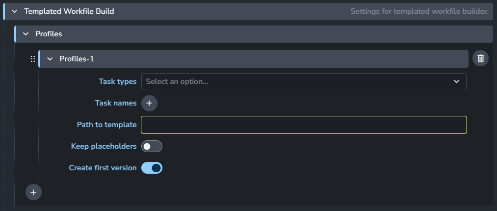

import ReactMarkdown from "react-markdown";
import versions from '@site/docs/assets/json/Ayon_addons_version.json'

<ReactMarkdown>
{versions.Nuke_Badge}
</ReactMarkdown>

## Table of contents

- [How to Use Templated Workfile Builder](#how-to-use-templated-workfile-builder)

## How to Use Templated Workfile Builder

The `Templated Workfile Builder` initializes Nuke with a Node Graph from a pre-made workfile template. This tool is useful if you want your artists to start working on a task using a template.

To make this work:

1. [Create a workfile template](#create-workfile-template).
2. [Add that template to your Nuke settings](#add-a-template-to-settings).

### Create Workfile Template

When building a workfile, you'll usually start from an empty scene. You can do this by launching Nuke with the `skip opening last file` option enabled in the launcher.

#### What is a Placeholder

A placeholder is a key component in workfile templates, used to define products to publish or to load published products. A placeholder node is replaced when the `Templated Workfile Builder` tool builds a workfile.

There are two main types of placeholders:
- **Create**: This is replaced by a publish instance. It works the same way as if a user opened the publisher tool and created a product.
- **Load**: This is used for loading products.

| Create | Load |
|--|--|
|  |  |

#### Create a Place Holder

Here's a step by step guide to create place Holders.

From AYON menu, select `Template Builder > Create Place Holder`.

The `Placeholder Manager` window will appear to configure the placeholder.

A red node called `PLACEHOLDER` will be created. It will be replaced when building the workfile template.

You can connect the placeholder node in a node graph, and the replacement will be done in place.

:::note
Any published instance that replaces the placeholder must have unique input and output nodes, unless it's imported as a single node.
:::

#### Update Place Holder

From the AYON menu, select `Template Builder > Update Place Holder`.

This opens the Placeholder Manager window, allowing you to modify the information in the extra attributes of the selected placeholder.

#### Build Current Workfile

From the AYON menu, select `Build Workfile`.

This action builds the current workfile, replacing all placeholders with the corresponding Nuke nodes.

#### Build Workfile from template

From the AYON menu, select `Template Builder > Build Workfile from Template`.

This tool imports the template and replaces existing placeholders with the corresponding published objects, which may also contain placeholders. If no published items match the given description, the placeholder will remain in the node graph.

:::tip Example Output

- Replace the `PLACEHOLDER` node in the template with the published instance that matches the information provided in the extra attributes of the placeholder.
:::

:::info

If the instance replacing Placeholder **A** contains another placeholder **B** that points to multiple published elements, all nodes imported with **A**, except **B**, will be duplicated for each element replacing **B**.
:::

#### Open Template

From the AYON menu, select `Template Builder > Open Template`.

Use this to open the workfile template that matches the current AYON context.

### Add a Template to Settings

Once you have a template workfile, you can add it to your settings.
This is typically done by adding a profile in the [Templated Workfile Builder](addon_nuke_admin_settings.md#templated-workfile-builder) setting.

