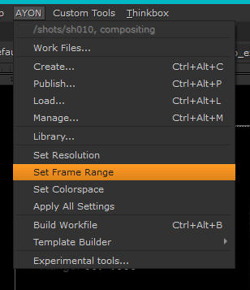
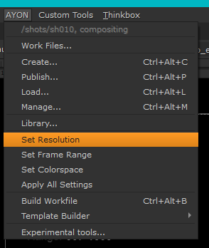
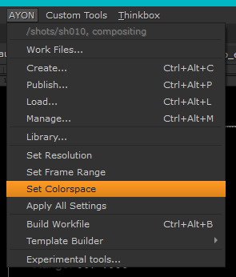
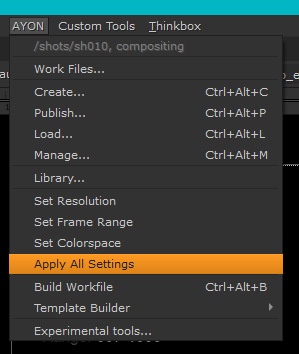
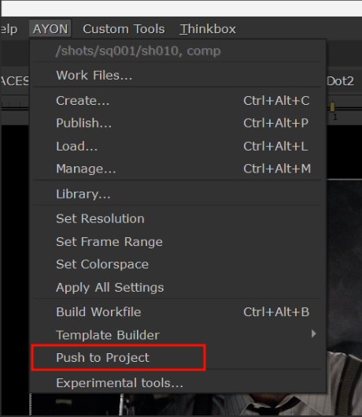

import ReactMarkdown from "react-markdown";
import versions from '@site/docs/assets/json/Ayon_addons_version.json'

<ReactMarkdown>
{versions.Nuke_Badge}
</ReactMarkdown>

## AYON global tools

-   [Work Files](artist_tools_workfiles)
-   [Create](artist_tools_creator)
-   [Publish](artist_tools_publisher)
-   [Load](artist_tools_loader)
-   [Manage (Inventory)](artist_tools_inventory)
-   [Library Loader](artist_tools_library_loader)

## Nuke specific tools

### Set Frame Ranges

Use this feature in case you are not sure the frame range is correct.

##### Result

-   setting Frame Range in script settings
-   setting Frame Range in viewers (timeline)

 <!-- picture needs to be changed -->

<figure>

<figcaption>

1.  limiting to Frame Range without handles
2.  **Input** handle on start
3.  **Output** handle on end

</figcaption>
</figure>

### Set Resolution

This menu item will set correct resolution format for you defined by your production.

##### Result

-   creates new item in formats with project name
-   sets the new format as used

 <!-- picture needs to be changed -->

### Set Colorspace

This menu item will set correct Colorspace definitions for you. All has to be configured by your production (Project coordinator).

##### Result

-   set Colorspace in your script settings
-   set preview LUT to your viewers
-   set correct colorspace to all discovered Read nodes (following expression set in settings)

See [Nuke Color Management](addon_nuke_artist.md#nuke-color-management)

 <!-- picture needs to be changed -->

### Apply All Settings

It is usually enough if you once per while use this option just to make yourself sure the workfile is having set correct properties.

##### Result

-   set Frame Ranges
-   set Colorspace
-   set Resolution

 <!-- picture needs to be changed -->

### Push to Project

This tool enables you to transfer your workfile to any accessible project. It simplifies packing and moving a workfile to a Library project. Additionally, It's handy when a shot spans multiple projects and requires the same workfile in each. The tool systematically processes all linked resources and relocates them to the new destination within the `/resources` folder.

 <!-- picture needs to be changed -->

1. Choose the desired project for the workfile.
2. Pick the specific folder within the project for the workfile.
3. Determine the task context.
4. Click 'OK' and await completion.

A confirmation message will display the workfile's destination path.

 <!-- picture needs to be changed -->

