import ReactMarkdown from "react-markdown";
import versions from '@site/docs/assets/json/Ayon_addons_version.json'

<ReactMarkdown>
{versions.Photoshop_Badge}
</ReactMarkdown>

## Available Tools

-   [Work Files](artist_tools_workfiles.md)
-   [Create](artist_tools_creator.md)
-   [Load](artist_tools_loader.md)
-   [Publish](artist_tools_publisher.md)
-   [Manage](artist_tools_inventory.md)

## Working With AYON in Photoshop

The Photoshop AYON integration allows you to:

- Manage your Photoshop work files using correct naming, version and save location with ease
- Produce / Automate Image Assets creation which can be easily shared across production environment
- Make Reviews acting as a thumbnail / preview for production management software like Ftrack, Kitsu etc. so everyone being aware of the newest  version available
- Loading / Managing asset versions in PS work files within the project

## Setup

There need to be done several setup steps first before running the AYON integration. First your active project need to have Photoshop (PS) defined in the project anatomy as an available tool including its filepath to the executable (being set by default). Secondly its neccessary to install PS extension manager which simplifies future extensions installation / management for PS. We skip the first step due to the fact it should be already preset by TD / Admin. And we jump to the second step instead right away.

To install the `extension manager` , open the following link and download it first [Anastasyi's Extension Manager](https://install.anastasiy.com/).
Open Anastasyi's Extension Manager and select Photoshop in the menu. Then go to `{path to PS addon}hosts/photoshop/api/extension.zxp`.
Current location will be most likely in `/User/AppData`, on `WINDOWS` it would be something like `c:\Users\YOUR_USER\AppData\Local\Ynput\AYON\addons\core_xx.xx.xx\ayon_core\hosts\photoshop\api`.
On Linux look in `~/.local/share/Ynput/AYON/addons`, on Mac `~/Library/Application Support/Ynput/AYON/addons`

:::info
The file path being temporary until final AYON release though. User also has to start `AYON Launcher`  tray app at least for once to populate aformentioned filepath with those files.
:::

## Usage

When you launch Photoshop you will be met with the floating `Workfiles` window. If you don't have any previous workfiles, you can just close this window right away.

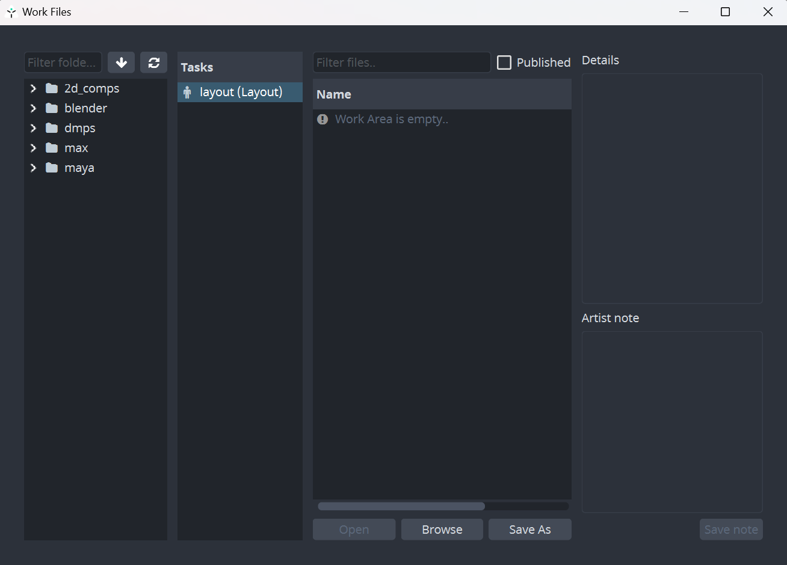

After that you will be introduced to `AYON` toolset on the right side of the Photoshop UI next to its icon.
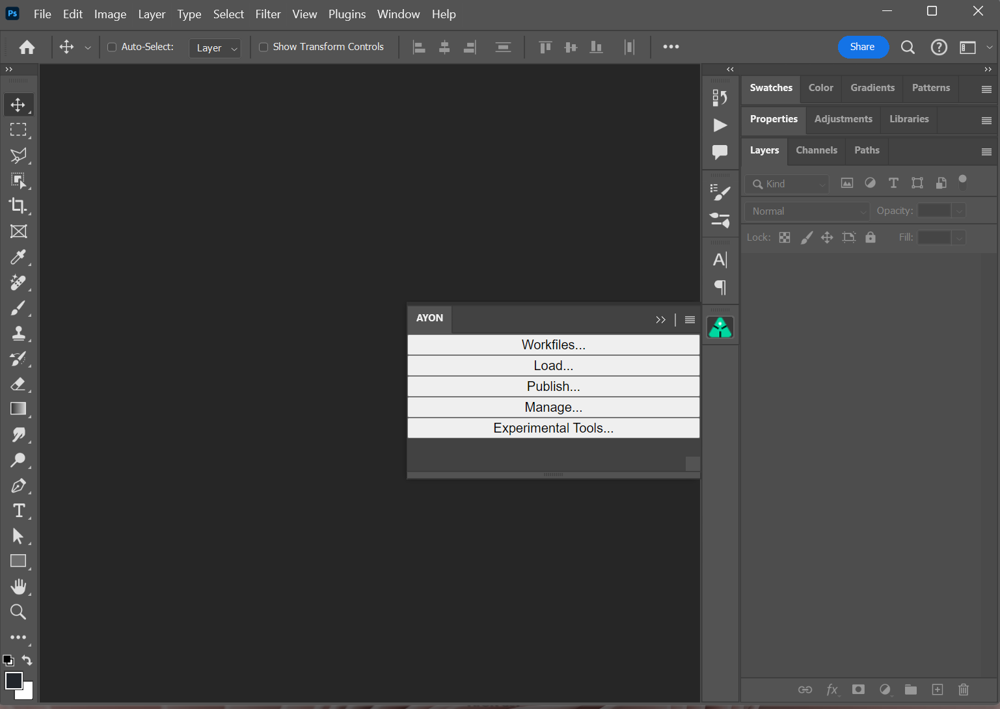

You can also locate the extension panel in Photoshop Menu by going to `Window` > `Extensions` > `AYON` if necessary or collapse the menu by hitting the `AYON` icon next to it.

 <!-- picture needs to be changed -->

You can show the extension panel by going to `Window` > `Extensions` > `AYON`.

:::note guide
On newer MacOS you need to:
- go to `Applications/Adobe Photoshop XXXX`
- right clicking on the `Adobe Photoshop XXXX.app`
- then `Get Info`, check `Open using Rosetta`
:::
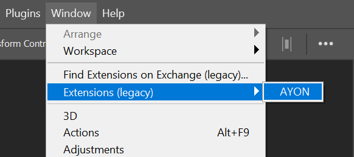

### Saving active Photoshop document as Workfile

Create or open any valid Photoshop file which will act as your `Workfile` from now on. Navigate to the `AYON` tools and trigger `Workfiles` and hit `Save As`. Your document will be properly named and versioned following rules set for the active project and saved to the correct folder location automatically.Think of this tool as a substitude for classic `File>Save` and `File>Open` as you will use it exclusively when in `AYON` Photoshop mode. 

:::note
Even though classic `File>Open` and `File>Save` being available to you, use `AYON`>`Workfiles` instead as you will get proper naming and file destination automatically without need to worry about any of these! However you can trigger classic `CTRL+S` anytime too for quick saving of your progress as you would normally do.
:::

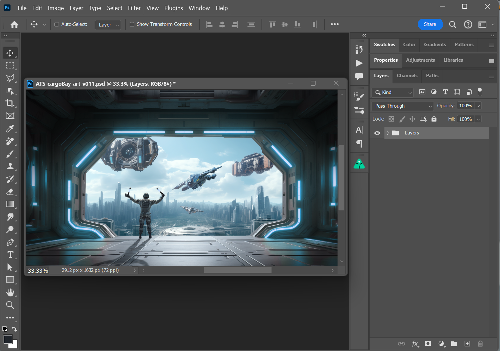

In the above picture you can see my `Workfile` being properly named and versioned and its a clear indication of correctly saved document.

### Publish

When you are ready to share your work with rest of the team, you will need to publish it first. `Publish` action does produce an asset, saved in separate publish folder and written into project database and being instantly available for loading as an `Image` asset into desired destination. This is done by opening the `Publisher` tool through the `Publish...` menu entry in the `AYON` toolset.

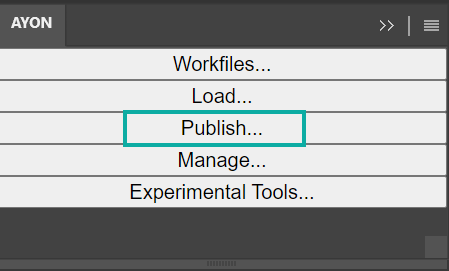

Publisher shows up allowing you to produce your very first `Image` asset for production. We will briefly inspect Publisher components first.

It consists of multiple tabs at the very top `Create` `Publish` `Report` `Details`, each for a different occasion during publishing process as the naming suggests. We skip `Create` and head to `Publish` tab as we should have already products ready for publishing and no need to create those manually.

If not already, switch to `Publish` tab now (you should see it as picture above).

 On the left side there is list of `Products to publish`. These widgets represents assets which will be produced when the publishing finnishes also having knobs for enabling/disabling publishing next to each, namely `image` , `review` and `workfile`. The `Context` type can be ignored for now as it is implicit widget and does not produce any asset to worry about.

- `Image` represents your artwork aka asset for publishing
- `Review` represents preview of your `Image` asset usually as a JPG with smaller size
- `Workfile` acting like backup file copied together with your `Image` asset to separate publish folder 

Disable any product type if needed and when ready, go and hit `Publish` button at the very bottom right.

Your assets just have been publicly available within the project and can be loaded via `Load` action from `AYON` menu.

To summarize it, you can enable or disable any publish product and repeat publishing over and over producing new version of the asset each time if desired.

:::note
The list of available `products for publishing` can differ in yours as it is depedent on `AYON` settings by studio TDs

:::

#### Create

When in the `Publisher` and `Create` tab, you are able to populate your workfile with new `publish` type besides the already present ones. You are free to add/remove any of those which gives you a lot of possibilities in terms of publishing full photoshop document or just particular layer(s).

There is just `Image` product type available to you in the Photoshop which produces 2d pixel image acting for example as a layer in AE composition or as a reference imagePlane in Maya or image in Nuke compostion.

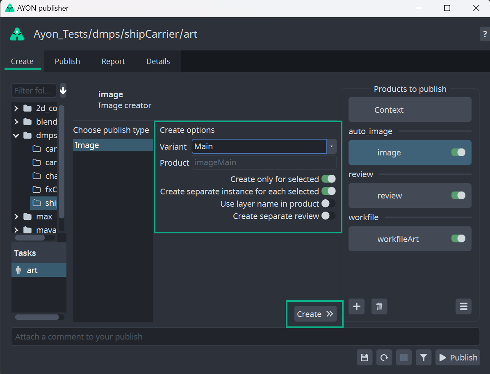

`Image` creator has multiple options for tweaking its output and way the data being produced.

- `Create only for selected` - creates `Image` just for selected layer(s)
- `Create separate instance for each selected` - creates `Image` for each layer in your selection of layers
- `Use layer name` - appends the layer name to the `Image` product
- `Create separate review` - creates `Review` product besides the implicit one as a separate product for each `Image`

In most cases you would like to keep `Create only for selected` toggled `ON` and select exact Photoshop layer(s) which you would like to publish. When this option being `OFF` than there is no need to select anything and `Image` being created for all the visible layers in the active workfile similar to Flatten Image.

When multiple layers selected and `Create separate instance for each selected` toggled `ON` you will get `Image` for each layer separately.

For example when selecting `Layer01` , `Layer02` and `Layer03` then it will produce these product types

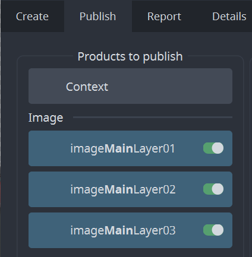

 and also marks actual Photoshop layers with ℗ icon standing for publishing

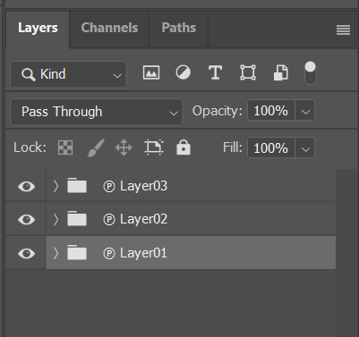

With `Create separate instance for each selected` toggled `OFF` it will create only single publishable instance which will wrap all selected layers into single Group again marked with ℗ icon.

:::note
Name of publishable instance (eg. product name) can be configured by studio admin TD with a template in `project_settings/global/tools/creator/product_name_profiles`.
:::

Trash icon under the list of instances allows to delete any selected `image` instance.

Workfile instance will be automatically recreated though. If you do not want to publish it, use pill toggle on the instance item.

If you would like to modify publishable instance, click on `Publish` tab at the top. This would allow you to change name of publishable
instances, disable them from publishing, change their task etc.

Publisher allows publishing into different context, just click on any instance, update `Variant`, `Asset` or `Task` in the form in the middle and don't forget to click on the 'Confirm' button.

#### Validate

If you would like to run validation rules set by your Studio, click on funnel icon at the bottom right. This will run through all
enabled instances, you could see more information after clicking on `Details` tab.

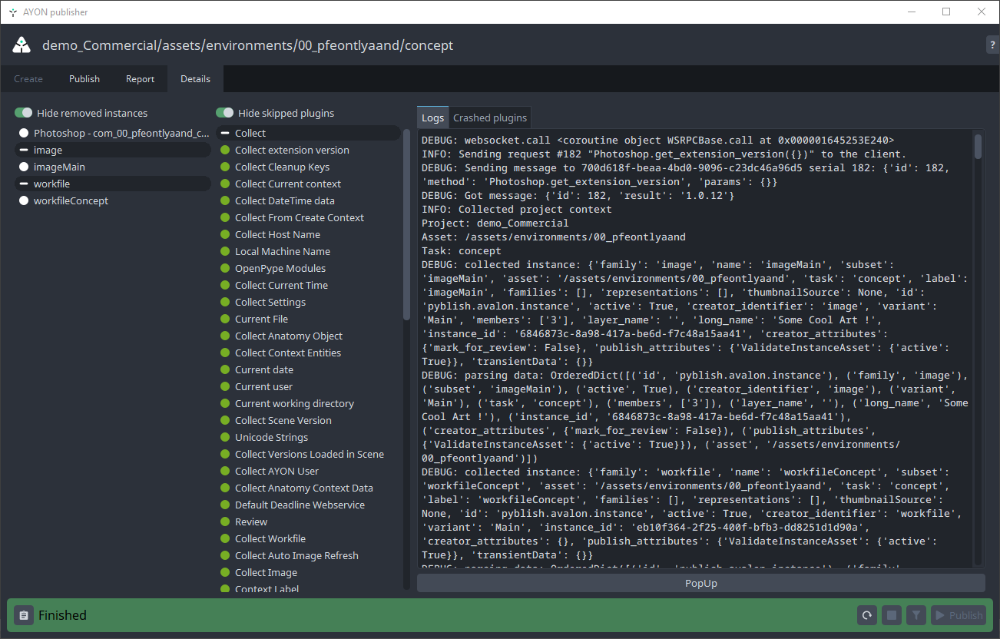

In this dialog you could see publishable instances in left column, triggered plugins in the middle and logs in the right column.

In left column you could see that `review` instance was created automatically. This instance flattens all publishable instances or
all visible layers if no publishable instances were created into single image which could serve as a single reviewable element (for example in Ftrack).

Creation of Review could be disabled in `project_settings/photoshop/publish/CollectReview`.

If you are satisfied with results of validation phase (and there are no errors there), you might hit `Publish` button at bottom right.
This will run through extraction phase (it physically creates images from `image` instances, creates `review` etc) and publishes them
(eg. stores files into their final destination and stores metadata about them into DB).
This part might take a while depending on amount of layers in the workfile, amount of available memory and performance of your machine.

You may encounter issues with publishing which will be indicated with red squares. If these issues are within the validation section, then you can fix the issue. If there are issues outside of validation section, please let the AYON team know.

You can always start new publish run with a circle arrow button at the bottom right. You might also want to move between phases (Create, Update etc)
by clicking on available tabs at the top of the dialog.

#### Simplified publish

There is a simplified workflow for simple use case where only single image should be created containing all visible layers.
No image instances must be present in a workfile and `project_settings/photoshop/publish/CollectInstances/flatten_product_template` must be filled in Settings.
Then artists just need to hit 'Publish' button in menu.

#### Repair Validation Issues

If there is some issue in validator phase, you will receive something like this:

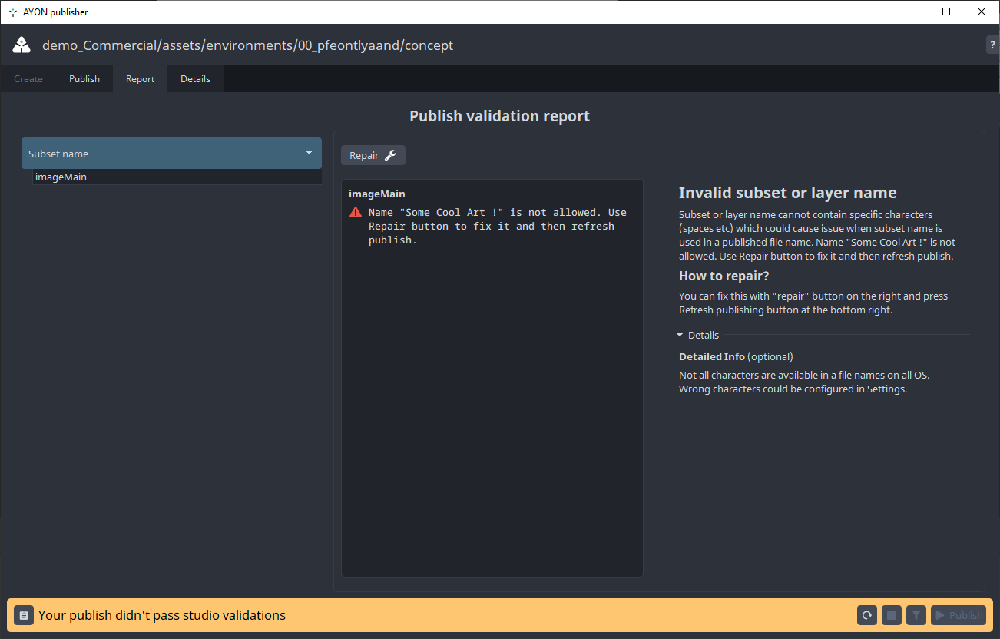

All validators will give some description about what the issue is. You can inspect this by clicking on items in the left column.

If there is an option of automatic repair, there will be `Repair` button on the right. In other case you need to fix the issue manually.
(By deleting and recreating instance etc.)

#### Buttons on the bottom right are for:
- `Refresh publishing` - set publishing process to starting position - useful if previous publish failed, or you changed configuration of a publish
- `Stop/pause publishing` - if you would like to pause publishing process at any time
- `Validate` - if you would like to run only collecting and validating phases (nothing will be published yet)
- `Publish` - standard way how to kick off full publishing process

### Load

When you want to load existing published work, you can load in smart layers through the `Loader`. You can reach the `Loader` through the extension's `Load` button.

The supported product type for Photoshop being

- `image`

To load an image, right-click on the product you want and choose a representation:

### Manage

Now that we have some images loaded, we can manage which version is loaded. This is done through the `Scene Inventory`. You can reach it through the extension's `Manage` button.

:::warning
Loaded images has to stay as smart layers in order to be updated. If you rasterize the layer, you cannot update it to a different version.
:::

You can switch to a previous version of the image or update to the latest.

#### Support & Issues
If you would like to ask for help admin or support, you could use any of the three options on the `Note` button on bottom left:
- `Go to details` - switches into a more detailed list of published instances and plugins.
- `Copy report` - stash full publishing log to a clipboard
- `Export report` - save log into a file for sending it via mail or any communication tool

If you are able to fix the workfile yourself, use the first button on the right to set the UI to initial state before publish. (Click the `Publish` button to start again.)

#### Legacy Publish Instances Support

All screenshots from Publish are from updated dialog, before publishing was being done by regular `Pyblish` tool.
New publishing process should be backward compatible, eg. if you have a workfile with instances created in the previous publishing approach, they will be translated automatically and
could be used right away.

#### Removing AYON metadata from the document

If you hit on unexpected behaviour with old instances, contact support first, then you could try to delete and recreate instances from scratch.
Nuclear option is to purge workfile metadata in `File > File Info > Origin > Headline`. This is only for most determined daredevils though!

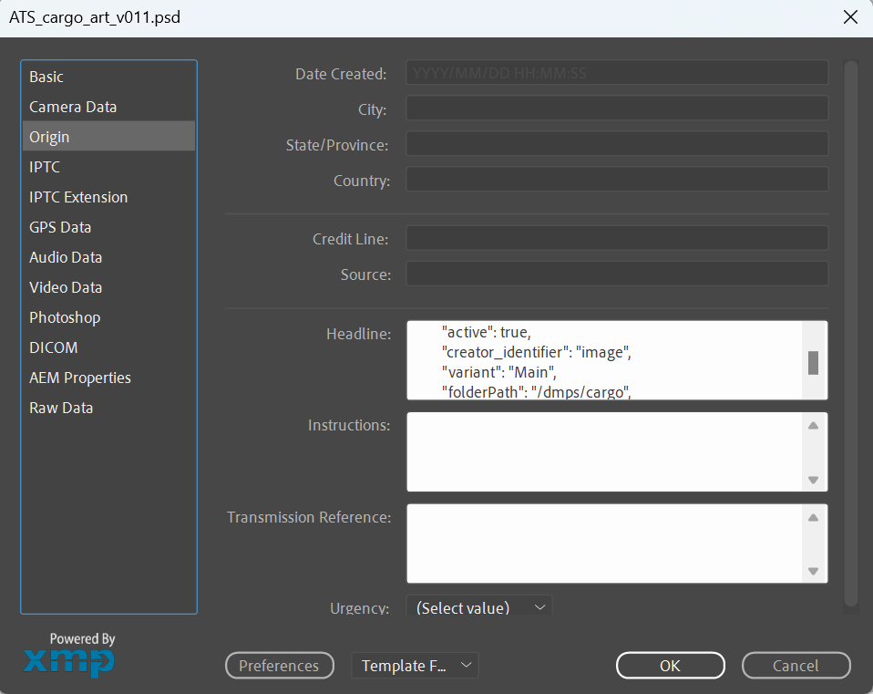
