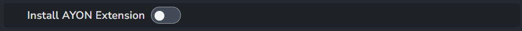

import ReactMarkdown from "react-markdown";
import versions from '@site/docs/assets/json/Ayon_addons_version.json'

<ReactMarkdown>
{versions.Premiere_Badge}
</ReactMarkdown>

## Premiere Extension Installation

The Adobe extension needs to be installed on each artist's machine to use this integration. It can be installed automatically; see [Auto Install Extension](#auto-install-extension) for more information.Alternatively, artists can install it manually. For more details, refer to the [Premiere Extension installation](addon_premiere_artist.md#premiere-extension-installation).

## Premiere settings

### Auto Install Extension
> Setting Location: `ayon+settings://premiere/auto_install_extension`

When enabled, On Windows OS It will try to install AYON Premiere extension to user `appdata` if it's not installed already.

Example: `C:\Users\YOUR_USER_NAME\AppData\Roaming\Adobe\CEP\extensions\io.ynput.PPRO.panel`

