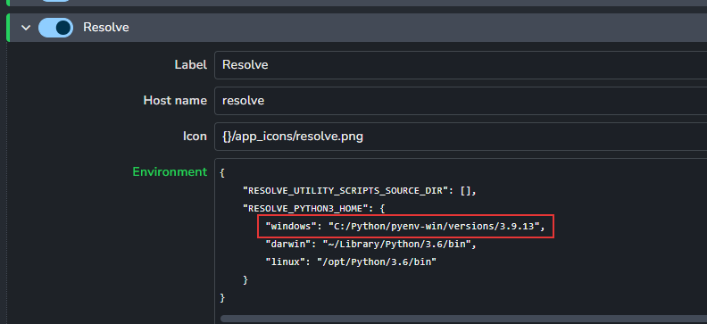

import ReactMarkdown from "react-markdown";
import versions from '@site/docs/assets/json/Ayon_addons_version.json'

<ReactMarkdown>
{versions.Resolve_Badge}
</ReactMarkdown>

import Tabs from '@theme/Tabs';
import TabItem from '@theme/TabItem';

:::caution Free Resolve limitation

Free Resolve won't work properly with our resolve addon.
This limitation exists due to the constraints set by BMD Resolve and not our own. It's important to note here that the free version of resolve does not grant access to Python API.
:::

## Resolve requirements
Resolve uses a separate Python interpreter (it does not come with Python itself). The interpreter needs to have installed PySide2 (or PySide6 if on MacOS) and OpenTimelineIO dependencies for Ayon to work correctly. Bellow you can find instructions on how to install them into an installed Python of your choice.

- Resolve Studio 17 - our recommended version `Python 3.6.2`
- Resolve Studio 18 - our recommended version range `Python 3.10.x` (in complience with Ayon)


### Configuring settings for Python home directory
To be able to run python in Resolve you need to set `RESOLVE_PYTHON3_HOME` environment variable to the directory path of your Python interpreter version.

Open your server Studio settings and go to **Application** addon `ayon+settings://applications/applications/resolve`. Here you can add the path to the **Environment** section.




### Installing Python dependencies

#### PySide2 or PySide6

AYON is using its own window widget inside Resolve, for that reason PySide2 (or PySide6 if on MacOS) has to be installed into the python.

<Tabs
  groupId="platforms"
  defaultValue="win"
  values={[
    {label: 'Windows', value: 'win'},
    {label: 'Linux', value: 'linux'},
    {label: 'Mac', value: 'mac'},
  ]}>

<TabItem value="win">


```bash
cd <a path you had set to RESOLVE_PYTHON3_HOME>
python.exe -m pip install PySide2
```

</TabItem>
<TabItem value="linux">


```bash
cd <a path you had set to RESOLVE_PYTHON3_HOME>
python3 -m pip install PySide2
```

</TabItem>
<TabItem value="mac">


```bash
cd <a path you had set to RESOLVE_PYTHON3_HOME>
python3 -m pip install PySide6
```

</TabItem>
</Tabs>

### OpenTimelineIO

:::warning Permissions
Installation guide for OpenTimelineIO in Python 3.6 can be found [here](https://github.com/ynput/OpenPype/blob/develop/openpype/hosts/resolve/README.markdown#basic-setup).
:::

AYON is using OpenTimelineIO for editorial publishing. OpenTimelineIO has to be installed into the python.

<Tabs
  groupId="platforms"
  defaultValue="win"
  values={[
    {label: 'Windows', value: 'win'},
    {label: 'Linux', value: 'linux'},
    {label: 'Mac', value: 'mac'},
  ]}>

<TabItem value="win">


```bash
cd <path to RESOLVE_PYTHON3_HOME>
python.exe -m pip install OpenTimelineIO
```

</TabItem>
<TabItem value="linux">


```bash
cd <a path you had set to RESOLVE_PYTHON3_HOME>
python3 -m pip install OpenTimelineIO
```

</TabItem>
<TabItem value="mac">


```bash
cd <a path you had set to RESOLVE_PYTHON3_HOME>
python3 -m pip install OpenTimelineIO
```

</TabItem>
</Tabs>


### Debugging if Python is not working in Resolve


#### Set Resolve's Fusion settings for Python 3 interpreter

In case Resolve is not showing Ayon menu, please have a look into Resolve's console and click to _Py3_ tab. If it is not working then Python is not correctly connected to Resolve. One of the reasons might be that Fusion is not set to use Python 3.6 interpreter.

As it is shown in below picture you have to go to Fusion Tab and then in Fusion menu find Fusion Settings. Go to Fusion/Script and find Default Python Version and switch to Python 3.6


### Custom DaVinci Resolve Python 3.x interpreter

In the **Studio Settings** / **Applications** / **Resolve** section, you can change the environment variables to configure a custom python interpreter.

e.g. An example of a possible configuration, or use hard-coded and write it in the environment configuration.

```bash
{
    "RESOLVE_UTILITY_SCRIPTS_SOURCE_DIR": [],
    "RESOLVE_PYTHON3_HOME": {
        "windows": "{CUSTOM_RESOLVE_PYTHON_HOME}",
        "darwin": "{CUSTOM_RESOLVE_PYTHON_HOME}",
        "linux": "{CUSTOM_RESOLVE_PYTHON_HOME}"
    }
}
```

Set your python 3.x interpreter directory to the environment variable `CUSTOM_RESOLVE_PYTHON_HOME`.

Next, you'll need to use your custom python interpreter to install some of the necessary packages

1. `python -m pip install PySide2`
2. `python -m pip install OpenTimelineIO`

### Enable Scripting
In Resolve go to `DaVinci Resolve > Preferences > System > General`. Set `External scripting using` to `Local`.