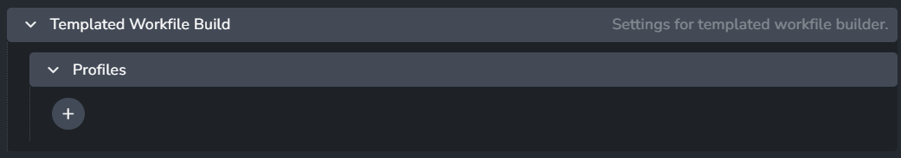
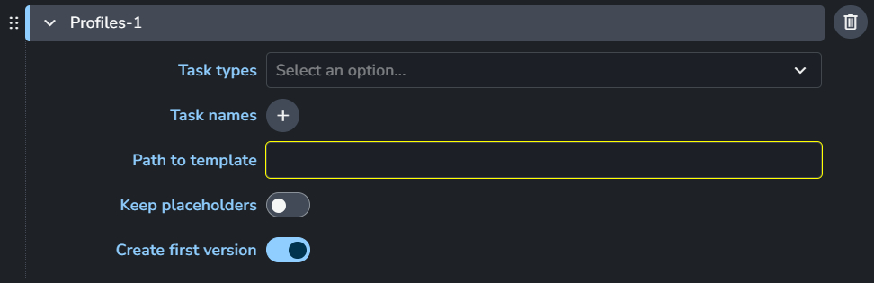

import ReactMarkdown from "react-markdown";
import versions from '@site/docs/assets/json/Ayon_addons_version.json'

<ReactMarkdown>
{versions.Silhouette_Badge}
</ReactMarkdown>

## Addon Settings

### Color Management (ImageIO)

> Setting Location: `ayon+settings://silhouette/imageio`

This section allows you to configure and override the global color management settings. For more details, check [Host specific overrides](admin_colorspace.md#host-specific-overrides).

- **Enable Color Management**: Turns on color management for Tray Publisher.
- **File Rules**
  - **Activate Host Rules**: Enable this to override global color rules.
  - **Rules**
    - **+** : Add more rules
    - Each rule consists of:
      
      - **Rule name**
      - **Regex pattern**
      - **Colorspace name**
      - **File extension**

### Templated Workfile Builder
> Setting Location: `ayon+settings://silhouette/templated_workfile_build`

First matched profile will be used as a workfile template

- Profiles
  - Each profile consists of:
    
    - Task Types
    - Task names
    - Path to template
    - Keep placeholders
    - Create first version
  - **+**: Add more profiles

For example:

_In this case it would build the workfile template only for the Roto task type
using the `.sfx` template project provided in the settings._