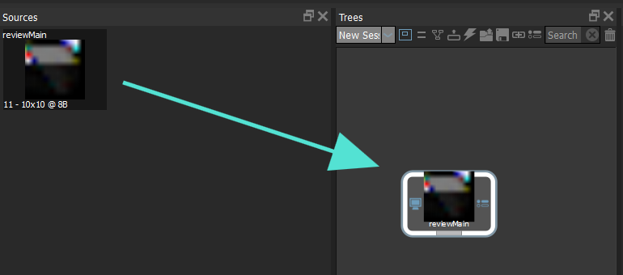
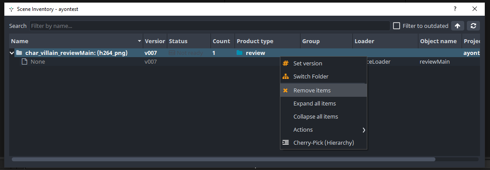
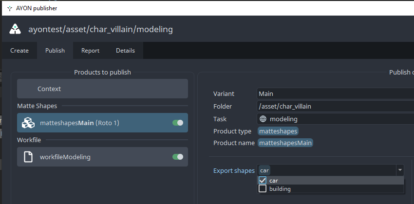
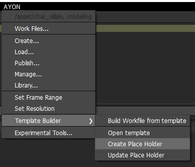

import ReactMarkdown from "react-markdown";
import versions from '@site/docs/assets/json/Ayon_addons_version.json'

<ReactMarkdown>
{versions.Silhouette_Badge}
</ReactMarkdown>

:::note Silhouette 2023.5+ supported only
Only BorisFX Silhouette 2023.5+ is supported due to required support for the `SFX_SCRIPT_IMPORTS` environment variable on startup.:::
:::

:::note Silhouette 2024.5.0-2024.5.3 crash due to Qt font load bug
Silhouette 2024.5.0-2024.5.3 will crash due to a bug in Silhouette's Qt binding
which causes the application to crash when loading custom fonts. When using 
2024.5 please make sure to use 2024.5.4 or higher.
:::

## AYON global tools

For a general overview on  how AYON tools work inside a host integration see:

-   [Work Files](artist_tools_workfiles.md)
-   [Create](artist_tools_creator.md)
-   [Load](artist_tools_loader.md)
-   [Manage (Inventory)](artist_tools_inventory.md)
-   [Publish](artist_tools_publisher.md)

## Loading

In Silhouette, we can load:

- **sources**: products with video/image extensions
- **matte shapes**: `matteshapes` product type
- **tracker points**: `trackpoints` product type

### Loading sources

When loading sources, it's good to know that upon load the loaded source is
not directly added to your node graph. Instead, it's added to the project 
sources where you can then choose add it to your node graph like any source
in Silhouette.

:::note Removing a loaded source will remove the node from the node graph

Removing a loaded source from the project sources will also delete the nodes
from your graph. Cleaning it up for you.

:::

### Loading matte shapes and tracker points

Loading roto matte shapes or trackers can be used without any active selection
to load as a new node in the node graph. If you have a selection, it'll add the
imported data to the selected node. That way, you can e.g. 'import' to an
existing roto node.

:::note Updating removes all children
Currently updating loaded content like this will completely recreate and 
re-import the children objects to the roto node. As such, any changes made to 
the object list will be lost and the new updated import will replace it 
completely.
:::

## Publishing

### Multiple publish instances per node

Unlike in many other AYON integrations in Silhouette it's possible for a single
node to contain multiple publishable instances, e.g. you could publish both 
Trackers and Matte Shapes from a single Roto node. When the `Use Selection` is
enabled on creating a Matte Shapes or Tracker instance, and you have a 
'supported' node like a Roto node then it will add the publish instance to that 
selected node instead of creating a new node in the graph.

### Publishing matte shapes

1. Select the Roto node you'd like to export from.
2. In the Publisher Create tab, choose "Matte Shapes"

You can optionally choose to export only some of the matte shapes in the
Roto node's object list:

### Publishing trackers

1. Select the Roto node you'd like to export from.
2. In the Publisher Create tab, choose "Track Points"

You can optionally choose to export only some of the tracker points in the
Roto node's object list in the publisher UI's attributes for the instance.

### Publishing renders

1. In Publisher Create tab, choose "Render".
2. Connect the newly added output node to your graph.
3. Publish to render and integrate the new output from the graph. 

## Workfile Template Builder

The Silhouette integration supports the AYON's Workfile Template Builder.

Using the workfile template builder you can create a new workfile template 
that can be configured as a startup workfile for new tasks in Silhouette.
This includes loading relevant sources and trackers/matte shapes directly
that are relevant to the current context you're starting in.

:::note Loading multiple products

The "Load Placeholder" can load multiple products using one placeholder, like 
loading all existing published source plates for a particular context. Each
of those will be loaded to your node graph, but only the _last loaded_ product
will remain connected to the other nodes in your template, since each new load
would replace previously existing connections.

:::

### Building your first template

To start building a new workfile template use the menu entries in the 
`AYON > Template Builder` submenu.

:::info Create Placeholders do not work yet
Due to the more complex nature of Silhouette Creator's allowing multiple 
publish instances to currently exist on a single node, the template builder
'Create Placeholder' currently is not functional yet.

As a workaround you can create a real publish instance in your graph and use 
that as a placeholder, it does mean you'll need to update the publish context
on the publish instances after scene setup, this can be done through the
publisher UI by changing the folder path and task for the instances. You can 
multiselect and edit them all, make sure to "confirm" and save the changes.

The 'Load Placeholder' is fully functional and can be used to load single
and or multiple products and start building your template graphs accordingly.

See the [Implement Workfile Templates issue](https://github.com/ynput/ayon-silhouette/issues/3) for the latest status.

:::

### Configuring templates

The studio admin with access to the studio and project settings can configure
the Silhouette Templated Workfile Build settings by setting up profiles for
which they should apply. See the [AYON Silhouette Admin documentation](addon_silhouette_admin.md#templated-workfile-builder).
