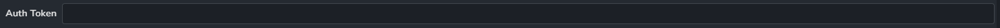
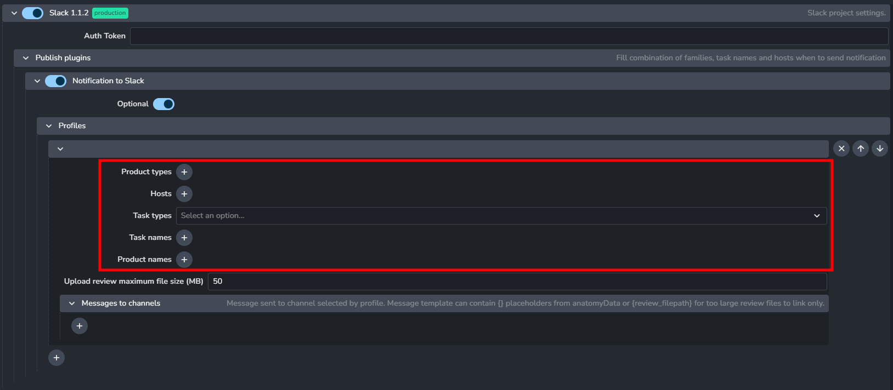
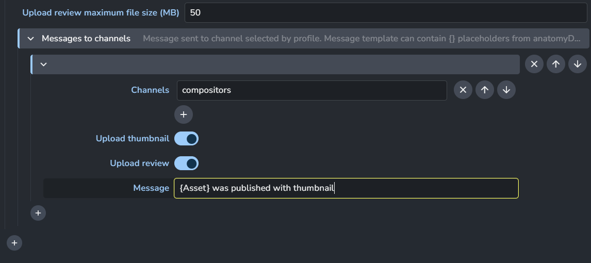

import ReactMarkdown from "react-markdown";
import versions from '@site/docs/assets/json/Ayon_addons_version.json'

<ReactMarkdown>
{versions.Slack_Badge}
</ReactMarkdown>

import Tabs from '@theme/Tabs';
import TabItem from '@theme/TabItem';


This addon enables you to set up profiles that specify when to trigger notifications, and for which combination of task, host, and product types.
It also supports customizable message templates that use placeholders (denoted by curly brackets `{}`) that are automatically populated at the time of publishing.


## App installation

Please ensure that the AYON Slack application is installed on the company's Slack using the `manifest.yml` before proceeding to AYON settings.

<Tabs
groupId="platforms"
defaultValue="win"
values={[
{label: 'Windows', value: 'win'},
{label: 'Linux', value: 'linux'},
{label: 'Mac', value: 'mac'},
]}>

<TabItem value="win">

1. Locate the `manifest.yml` file. You can find it in the `AppData` folder, typically at `c:\Users\YOUR_USER\AppData\Local\Ynput\AYON\addons\slack_X.X.X\ayon_slack\`.
2. To create your app, please follow the steps outlined in the "Creating apps with manifests" section at [Slack API Documentation](https://api.slack.com/reference/manifests#using).

:::tip
You can quickly navigate to the local app data using the environment variable shortcut: `%LOCALAPPDATA%`. For example, using `%LOCALAPPDATA%\Ynput\AYON\addons` as path to see your installed addons.
:::

</TabItem>

<TabItem value="linux">

1. Locate the `manifest.yml` file. You can find it in the user data folder, typically at `~/.local/share/Ynput/AYON/addons/slack_X.X.X/ayon_slack/`.
2. To create your app, please follow the steps outlined in the "Creating apps with manifests" section at [Slack API Documentation](https://api.slack.com/reference/manifests#using).

</TabItem>

<TabItem value="mac">

1. Locate the `manifest.yml` file. You can find it in the `Application Support` folder, typically at `~/Library/Application Support/Ynput/AYON/addons/slack_X.X.X/ayon_slack/`.
2. To create your app, please follow the steps outlined in the "Creating apps with manifests" section at [Slack API Documentation](https://api.slack.com/reference/manifests#using).

</TabItem>

</Tabs>

### Custom app icon

Customize your Slack bot by adding a custom icon.
After the app is installed, the Slack admin can easily upload an image to serve as the app's icon.

:::info
Please note that this setting is found within the Slack app settings, not in AYON settings.
:::

Here's how to do it:

1. Navigate to your Slack app settings at a URL similar to `https://api.slack.com/apps/XXXXXXXX/general`.
2. Click on 'Basic Information' and then find 'Display Information'.
3. Here, you can upload any image of your choice. For ease, you can use the [pre-made AYON icon](https://github.com/ynput/ayon-launcher/blob/develop/common/ayon_common/resources/AYON.png).

## Settings


Once the Slack addon is enabled on the server, an AYON admin can turn on push `Notifications to Slack`:

- For all projects: 
  - `ayon+settings://slack/publish/CollectSlackFamilies/enabled`
- For a specific project, replace {PROJECT_NAME} with your project's name:
  - `ayon+settings://slack/publish/CollectSlackFamilies/enabled?project={PROJECT_NAME}`

### Token



For the Slack addon to function properly, it's essential to enter the authentication token:

- For all projects:
  - `ayon+settings://slack/token`
- For a specific project, replace {PROJECT_NAME} with your project's name:
  - `ayon+settings://slack/token?project={PROJECT_NAME}`

<details><summary>Get Slack Token</summary>
You'll find this token in the Slack dashboard once the app is installed. Remember, you can create separate tokens for use with different projects.


</details>

### Profiles



Profiles determine when notifications are triggered. You can configure one or several profiles based on `Product types`, `Hosts`, `Task types`, and `Task names` or `Product names` (with regex support).

For example, to receive notifications when a render is published from Maya, the settings would be:

- Product type: 'render'
- Host: 'Maya'

### Upload review maximum file size

This setting controls the maximum file size for the `Upload Review` feature within the `Message to Channels` section. It sets a cap on the size of review files you can upload. If a file exceeds this limit, a link to the file's location in the studio will be shared instead.
Additionally, if `Extract Burnin` plugin is enabled, AYON will default to using the burnin version of the review.

:::info Slack storage limit
Uploading large files to Slack can slow down the publishing process since publish plugins run one after another, causing a pause until the upload completes.
Also, keep in mind that you can easily hit Slack's storage ceiling—5GB for the free version, and a max of 1GB for any single file.
:::

### Messages to channels



- **Channels:**
Specify one or more channels where you'd like the plugin to send messages.
:::info
Please note that the Slack bot can access public channels by default, so there's no need for it to join them first.
However, your Slack bot must be manually invited to each target channel by a Slack admin if they are private channels.
To add your bot to a target channel, simply mention it in the message field with the command: `/invite @ayonNotifier`.
:::
- **Upload thumbnail** & **Upload review:**
The plugin is capable of uploading a 'thumbnail' or 'review' from an instance (if they are present in an instance).
:::info
We have one additional implemented key `{review_filepath}`.
to message content instead of using `Upload review`. This link might help users to find review easier on their machines.
(It won't show a playable preview though!).
:::
- **Message:**
Message content can use template keys (see [Available template keys](admin_settings_project_anatomy.md#available-template-keys)).
Few keys also have Capitalized and UPPERCASE format. Values will be modified accordingly. e.g. `{Folder[name]}` ➜ "Gun", `{PRODUCT}` ➜ "RENDER".
:::tip Message Example
  ```
  {Product} was published for {FOLDER[NAME]} in {task[name]} task.
  Here you can find review {review_filepath}.
  ```
:::

<!-- TODO: Enhance the following section. You may convert it to an FAQ or add them to the message example above.  -->

#### Further info about messages
- **Dynamic message for artists:**
If artists uses host with implemented Publisher (new UI for publishing, implemented in Tray Publisher, Adobe products etc), it is possible for
them to add additional message (notification for specific users for example, artists must provide proper user id with '@').
Additional message will be sent only if at least one profile, eg. one target channel is configured.
All available template keys (see higher) could be used here as a placeholder too.

- **User or group notifications:**
Message template or dynamic data could contain user or group notification, it must be in format @artist.name, '@John Doe' or "@admin group" for display name containing space.
If value prefixed with @ is not resolved and Slack user is not found, message will contain same value (not translated by Slack into link and proper mention.)

- **Message retention:**
Currently no purging of old messages is implemented in AYON. Admins of Slack should set their own retention of messages and files per channel.
(see https://slack.com/help/articles/203457187-Customize-message-and-file-retention-policies)