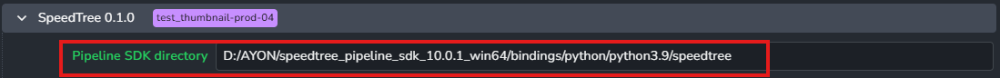
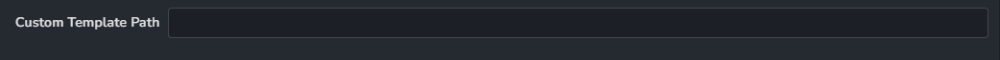

import ReactMarkdown from "react-markdown";
import versions from '@site/docs/assets/json/Ayon_addons_version.json'

<ReactMarkdown>
{versions.SpeedTree_Badge}
</ReactMarkdown>

## SpeedTree Pipeline SDK
### Setting up the SpeedTree Pipeline SDK path
> Setting Location: `ayon+settings://speedtree/sdk_directory`

Users need to fill your Pipeline SDK directory to install the AYON plugin.
If your SDK folder located in `D:/AYON/speedtree_pipeline_sdk_10.0.1_win64`,
you need to fill in `D:/AYON/speedtree_pipeline_sdk_10.0.1_win64/bindings/python/python3.9/speedtree`

## Project Creation
### Project Templates
> Setting Location: `ayon+settings://speedtree/template_path`

Users can optionally fill in the Custom Template Path to be used for project creation in SpeedTree.
The custom template path is left empty by default, and it would use `Blank.spm` file from the
Game templates folder in SpeedTree installed location.

