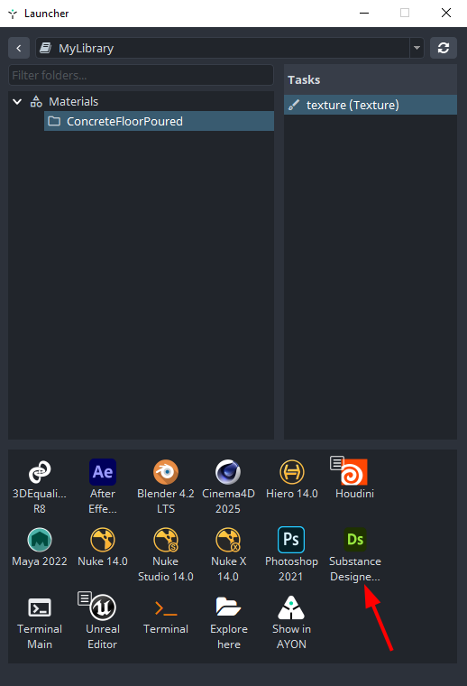

import ReactMarkdown from "react-markdown";
import versions from '@site/docs/assets/json/Ayon_addons_version.json'

<ReactMarkdown>
{versions.SpeedTree_Badge}
</ReactMarkdown>

## About SpeedTree Addon

The SpeedTree AYON integration lets you:
- Export your vegetation files as versioned publishes for others to load and update in the third-party software.

## Working with AYON in SpeedTree

### Launch SpeedTree via AYON Launcher

Once your admin configures AYON to work with SpeedTree, you'll find the SpeedTree icon in the launcher.

### Initialize Workfile

Admins can configure the SpeedTree addon to automatically initialize a workfile when launching SpeedTree from the launcher. If your admin has set it up, you won't need to choose the spm to start your project.

For more info, see [Custom Template Path](addon_speedtree_admin.md#Setting-up-the-SpeedTree-Pipeline-SDK-path).

:::note
Once SpeedTree launched and spm project is automatically created, a `Blank.spm` file or any predefined template spm is saved as a local temp file by default. Make sure to use the [Work Files](artist_tools_workfiles.md) tool to save your files; otherwise, your work inside `Blank.spm` will be lost if you close the SpeedTree application.
:::

## AYON Global Tools
You can access AYON global tools in Designer through the `AYON` menu.
:::note
Due to the limitations of the SpeedTree API, the AYON menu must function as a standalone floating UI element. Since it cannot be integrated or accessed directly from the host application, users are unable to close the window using the standard close icon.
:::

-   [Work Files](artist_tools_workfiles.md)
-   [Create](artist_tools_creator.md)
-   [Publish](artist_tools_publisher.md)

## Create and Publish Products

### Publishing Model

Navigate to **AYON -> Publish -> Create** to create publish instance for the foliage which need to be published.

Switching to **AYON -> Publish** and hitting `Publish` button will produce a 3d model (FBX) along with `.xml` file storing the data of the foliage.
