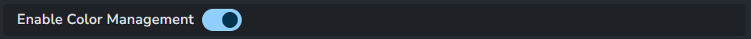
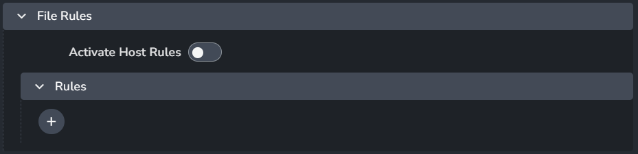
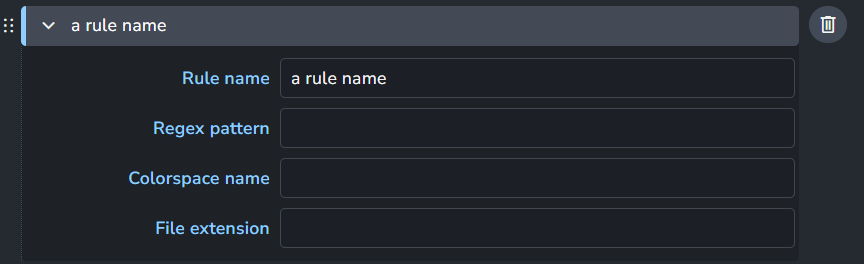
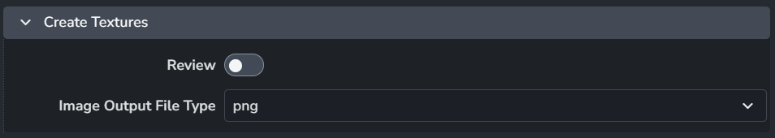

import ReactMarkdown from "react-markdown";
import versions from '@site/docs/assets/json/Ayon_addons_version.json'

<ReactMarkdown>
{versions.SubstanceDesigner_Badge}
</ReactMarkdown>

## Color Management (ImageIO)

Color configuration for Substance Designer and also override the global color management settings, check [Host specific overrides](admin_colorspace.md#host-specific-overrides).

### Enable Color Management

> Setting Location: `ayon+settings://substancedesigner/imageio/activate_host_color_management`

This toggle enables AYON's global color management.
This toggle is a master switch that enables and disables the whole section.

### File Rules
> Setting Location: `ayon+settings://substancedesigner/imageio/file_rules`

- **Activate Host Rules**
- Rules
  - **+**: Add more rules
  - Each rule consists of
    
    - **Rule name**
    - **Regex pattern**
    - **Colorspace name**
    - **File extension**

## Project Creation
### Project Templates
> Setting Location: `ayon+settings://substancedesigner/project_creation/project_templates`

This setting initializes the substance designer workfile by creating a substance graph.

- Each template consists of
  
  1. **Graph Name**: This name will be used for the created graph.
  2. **Document Resolution**: Choose from a list the texture resolution when creating new project.
  3. **Template Type**: Choose from a list either default substance templates or custom template for project creation. Each selection shows different settings. Find below the available options.
- **+**: Add more rules

import templateDefault from './assets/substance_designer/admin/template_default.png';
import templateCustom from './assets/substance_designer/admin/template_custom.png';
import templateTaskType from './assets/substance_designer/admin/template_by_task_type.png';

<table>
  <thead>
    <tr>
    <th>Template Type</th><th>Available Settings</th>
    </tr>
  </thead>
  <tbody>
    <tr>
     <td>Default Substance Template</td>
     <td>
      
      <li><strong>Template</strong>: Choose template to create your Substance Graph.</li>
     </td>
    </tr>
    <tr>
     <td>Custom Template</td>
     <td>
      
      <li><strong>Custom Template Graph Name</strong>: Name of the graph from the custom template you want to create your project from. Leaving it blank, it won't do anything.</li>
      <li><strong>Path to Custom Template</strong>: Path of which custom template located. It supports template keys.</li>
     </td>
    </tr>
    <tr>
     <td>Template By Task Types</td>
     <td>
      
      <li><strong>Task Types</strong>: Choose from a list of task types to determine which ones the filter profile will affect. Leaving it blank, it won't do anything.</li>
      <li><strong>Path to template</strong>: A path of which a template located. It supports template keys.</li>
     </td>
    </tr>
  </tbody>
</table>

## Creator Plugins
### Create Textures
> Setting Location: `ayon+settings://substancedesigner/create/CreateTextures`

- **Review**: Enable to generate review.
- **Image Output File Type**: Choose from a list the texture output format.