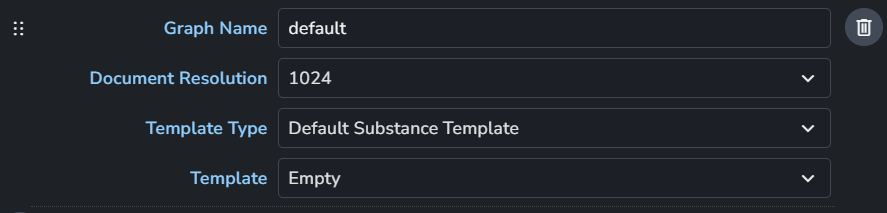
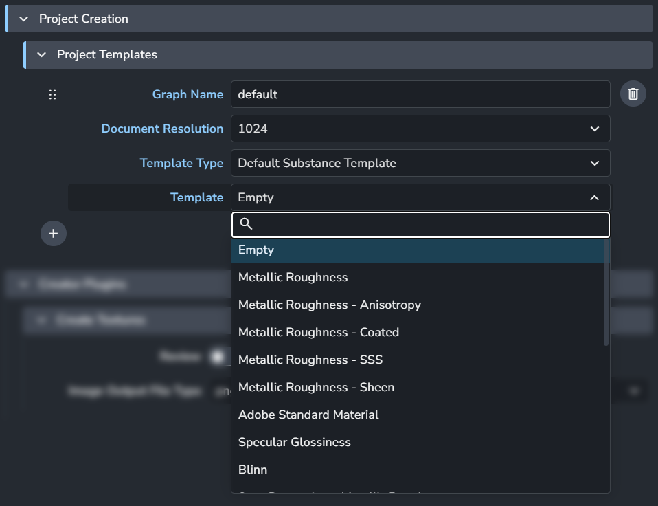
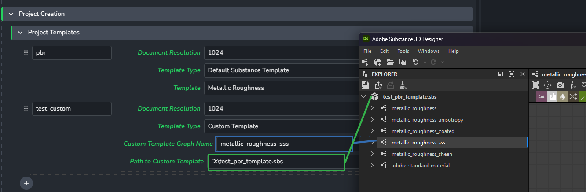
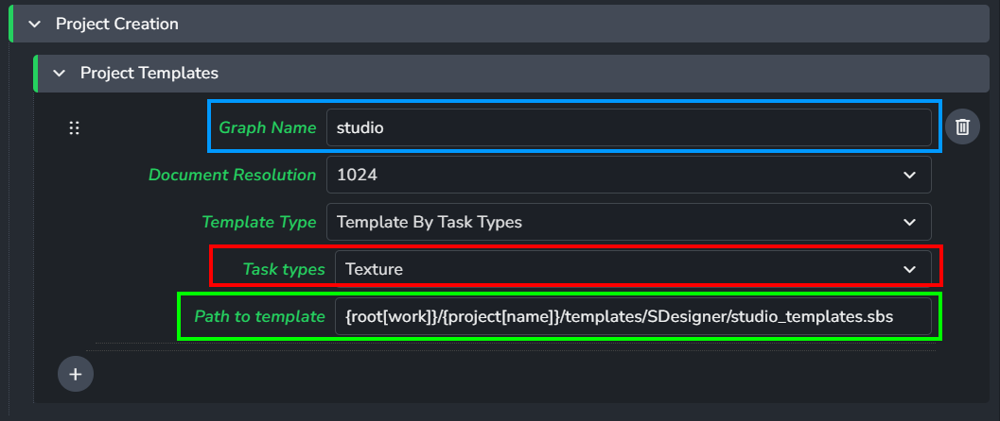

import ReactMarkdown from "react-markdown";
import versions from '@site/docs/assets/json/Ayon_addons_version.json'

<ReactMarkdown>
{versions.SubstanceDesigner_Badge}
</ReactMarkdown>

## Substance Designer Project Templates

The [Project Templates](addon_substancedesigner_admin_settings.md#project-creation) feature lets you start workfiles with templates. It offers several options to choose a preset template when users launch Designer.

### How Project Templates Work

Based on the selected **Template Type** (3), the specified template is added to the workfile and named according to the **Graph Name** (1) with the specified **Document Resolution** (2) in the template.

### Template Types

#### Default Template

It is similar to the options in `File` -> `New` -> `Substance Graph...`. This feature allows you to select a default graph for artists to start with.

#### Custom Template

When choosing **Custom Template**, you need to provide the filepath of the substance file and the name of the graph in the `.sbs` file you want to use as a template.

For example, to add the graph `metallic_roughness_sss` from the substance file `D:\test_pbr_template.sbs` as a template for your project, fill in the Path to Custom Template as `D:\test_pbr_template.sbs` and Custom Template Graph Name as `metallic_roughness_sss`. Refer to the screenshot below for guidance.

*Example shows the contents of the template file and specifying a graph in settings*

#### Template By Task Types

When choosing **Template By Task Types**, you need to provide the filepath of the substance file and specify the desired **task types** for it to work.

For example, notice the colors in the following example.

Launching Substance Designer in the specified task setting will trigger project creation.

The graph is named according to the **Graph Name**, and the template file contents are added to the graph.

