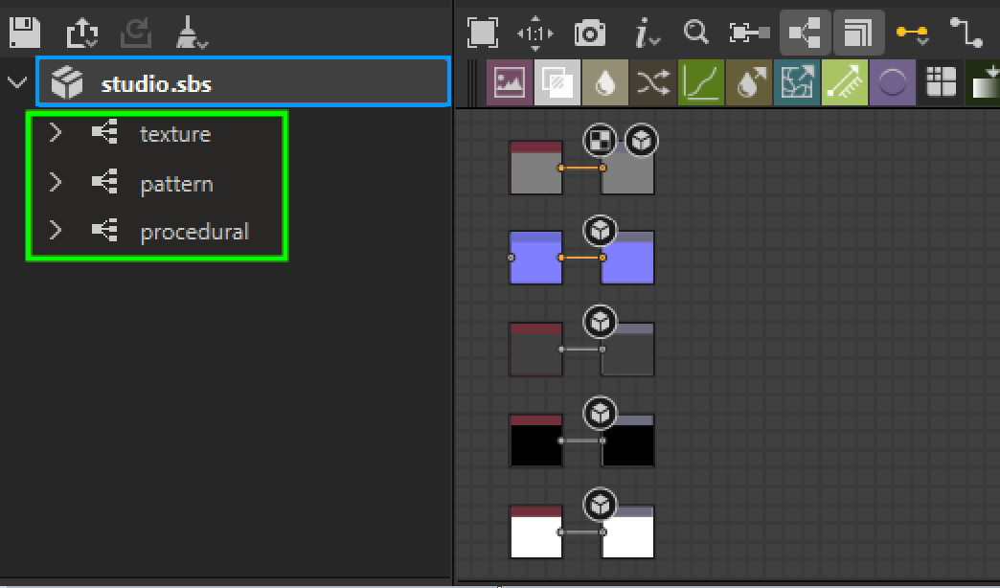
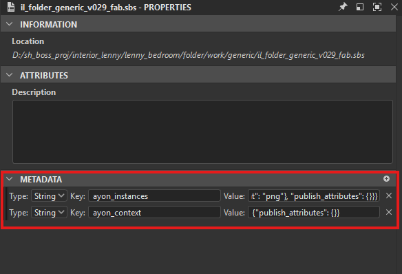
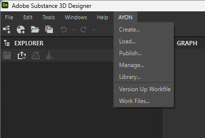
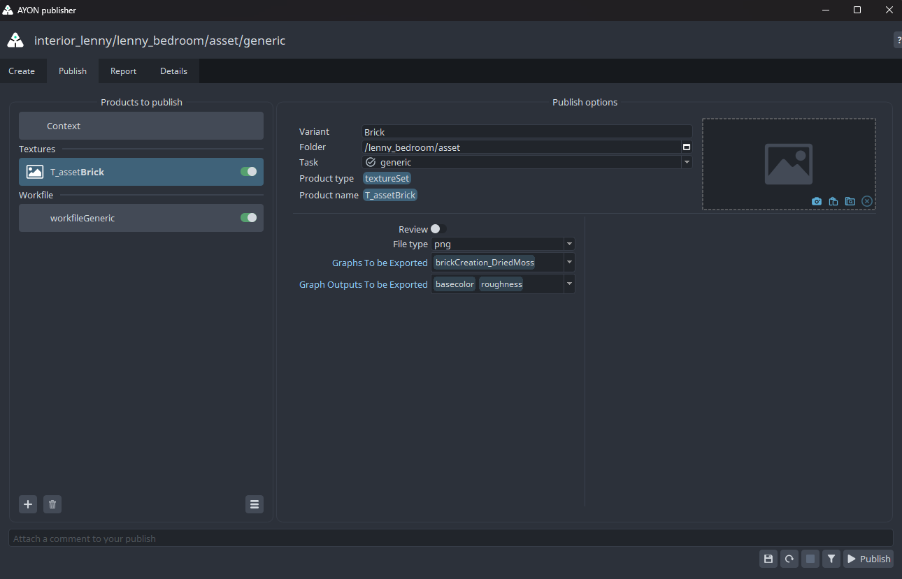
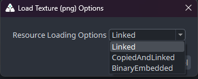

import ReactMarkdown from "react-markdown";
import versions from '@site/docs/assets/json/Ayon_addons_version.json'

<ReactMarkdown>
{versions.SubstanceDesigner_Badge}
</ReactMarkdown>

## About Substance Designer Addon

The Substance Designer AYON integration lets you:
- Easily export your textures/SBSAR files as versioned publishes for others to load and update.
- Load your textures into resource folders in your package project and use them in your Substance Graphs.

## Working with AYON in Substance Designer

### Launch Designer via AYON Launcher

Once your admin configures AYON to work with Substance Designer, you'll find the Substance Designer icon in the launcher.

### Initialize Workfile

Admins can configure the Substance Designer addon to automatically initialize a workfile when launching Designer from the launcher. If your admin has set it up, you won't need to create the Substance Graph yourself through `File` -> `New` -> `Substance Graph...`

For more info, see [Substance Designer Project Templates](addon_substancedesigner_admin_tutorials.md#substance-designer-project-templates).

*A workfile with example template.*

### AYON Metadata

When opening an existing Substance Graph used to publish textures to AYON, you'll find the related data embedded in the package from which the graph inherits.

:::caution
Make sure you don't remove AYON-related data in the metadata, or you could lose all information needed for loading or publishing through AYON.

:::

## AYON Global Tools
You can access AYON global tools in Designer through the `AYON` menu.

-   [Work Files](artist_tools_workfiles.md)
-   [Create](artist_tools_creator.md)
-   [Load](artist_tools_loader.md)
-   [Manage (Inventory)](artist_tools_inventory.md)
-   [Publish](artist_tools_publisher.md)
-   [Library Loader](artist_tools_library_loader.md)

## Create and Publish Products

### Publishing Textures

To publish textures, open the graph(s) inherited from the package you want to publish. Then, navigate to **AYON -> Create** to create a texture instance. You can choose which graphs and outputs you want to export.

The Texture Set instance generates a publish for each output map per graph, as defined in the Substance Designer's template during project creation. When publishing the default Substance Designer's PBR template with the variant **Main**, six instances will be published with the following variants:
- Main.**basecolor**
- Main.**normal**
- Main.**roughness**
- Main.**metallic**
- Main.**height**
- Main.**ambientocclusion**

The bold output map name for the publish is based on the string pulled from the default pattern set in export presets. So `$(graph)_$(identifier)` becomes `basecolor`.

### Publishing SBSAR

To publish SBSAR files, open the graph(s) inherited from the package you want to publish. Then, go to **AYON -> Create** to create an SBSAR instance. Once you hit **Publish**, the SBSAR is published to AYON.

## Loading Products

You can go to **AYON -> Load** to load products. Any loaded product will be added to the resources folder (named `{project_name}_resources`) in the package.

### Loading Textures

You can load textures via the `Load Texture` loader. You can choose to link or import resources by clicking the small memo (see the red frame in the screenshot below) before importing the texture.

| Texture Loader | Texture Loader Options |
|--|--|
|  |  |

## Manage Loaded Products

You can go to **AYON -> Manage** to manage the version of loaded products. For example, in the manage window, right-click your loaded texture and select `update to latest` to update it to the latest version.

## Troubleshooting

### Can't See the AYON Menu?

If you're unable to see the AYON top-level menu in Substance Designer, make sure you have launched Substance Designer through AYON and that the AYON Integration plug-in is loaded inside Substance Designer: **Tools > Plugins_Manager > ayon_plugin**

### Substance Designer + Steam

Running the Steam version of Substance Designer within AYON requires you to close the Steam executable before launching Substance Designer through AYON. Otherwise, the Substance Designer process is launched using Steam's existing environment and will not be able to pick up the pipeline integration. This appears to be a limitation of how Steam works.