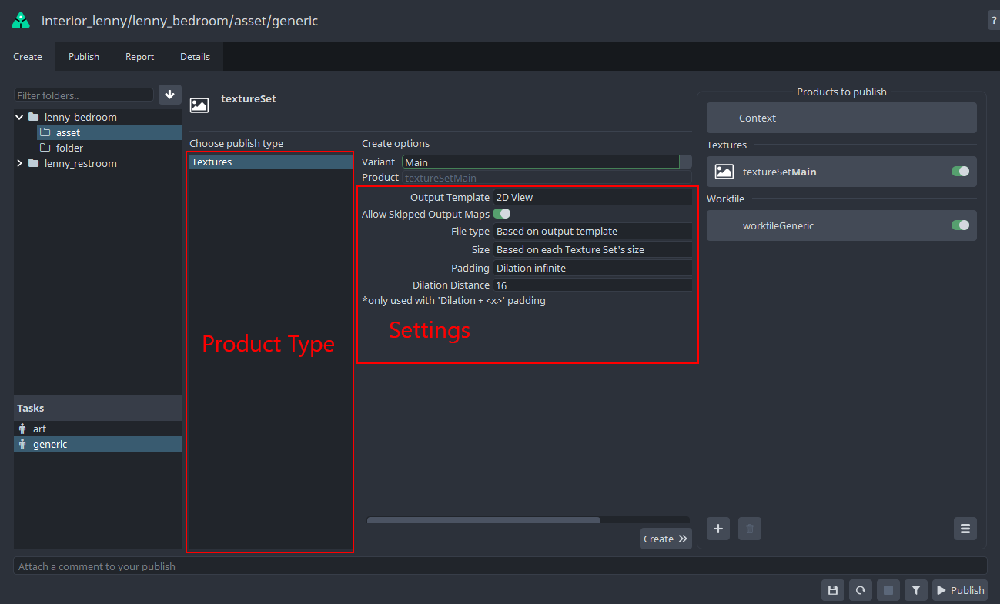
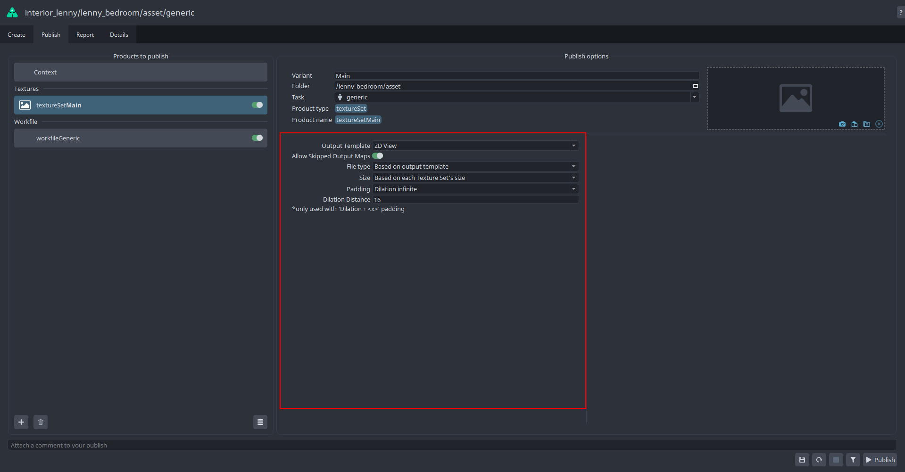

import ReactMarkdown from "react-markdown";
import versions from '@site/docs/assets/json/Ayon_addons_version.json'

<ReactMarkdown>
{versions.SubstancePainter_Badge}
</ReactMarkdown>

## AYON global tools

-   [Work Files](artist_tools_workfiles)
-   [Create](artist_tools_creator)
-   [Load](artist_tools_loader)
-   [Manage (Inventory)](artist_tools_inventory)
-   [Publish](artist_tools_publisher)
-   [Library Loader](artist_tools_library_loader)

## Working with AYON in Substance Painter

The Substance Painter AYON integration allows you to:

- Set the project mesh and easily keep it in sync with updates of the model
- Easily export your textures as versioned publishes for others to load and update.

## Setting the project mesh

Substance Painter requires a project file to have a mesh path configured.
As such, you can't start a workfile without choosing a mesh path.

To start a new project using a published model you can _without an open project_
use AYON > Load.. > Load Mesh on a supported publish. This will prompt you
with a New Project prompt preset to that particular mesh file.

If you already have a project open, you can also replace (reload) your mesh 
using the same Load Mesh functionality. 

After having the project mesh loaded or reloaded through the loader
tool the mesh will be _managed_ by AYON. For example, you'll be notified 
on workfile open whether the mesh in your workfile is outdated. You can also
set it to specific version using AYON > Manage.. where you can right click 
on the project mesh to perform _Set Version_

:::info
A Substance Painter project will always have only one mesh set. Whenever you 
trigger _Load Mesh_ from the loader this will **replace** your currently loaded 
mesh for your open project.
:::

## Publishing textures

To publish your textures we must first create a `textureSet` 
publish instance. 

To create a **TextureSet instance** we will use AYON's publisher tool. Go 
to **AYON → Publish... → Textures**

The texture set instance will define what Substance Painter export template (`.spexp`) to
use and thus defines what texture maps will be exported from your workfile. This
can be set with the **Output Template** attribute on the instance.

You can always edit your setting in Publish tab before publishing the instance.

:::info
The TextureSet instance gets saved with your Substance Painter project. As such, 
you will only need to configure this once for your workfile. Next time you can
just click **AYON → Publish...** and start publishing directly with the
same settings.
:::

#### Publish per output map of the Substance Painter preset

The Texture Set instance generates a publish per output map that is defined in
the Substance Painter's export preset. For example a publish from a default
PBR Metallic Roughness texture set results in six separate published products 
(if all the channels exist in your file).

When publishing for example a texture set with variant **Main** six instances will
be published with the variants: 
- Main.**BaseColor**
- Main.**Emissive**
- Main.**Height**
- Main.**Metallic**
- Main.**Normal**
- Main.**Roughness**

The bold output map name for the publish is based on the string that is pulled
from the what is considered to be the static part of the filename templates in 
the export preset. The tokens like `$mesh` and `(_$colorSpace)` are ignored.
So `$mesh_$textureSet_BaseColor(_$colorSpace)(.$udim)` becomes `BaseColor`.

An example output for PBR Metallic Roughness would be:

## Known issues

#### Can't see the AYON menu?

If you're unable to see the AYON top level menu in Substance Painter make
sure you have launched Substance Painter through AYON and that the AYON
Integration plug-in is loaded inside Substance Painter: **Python > ayon_plugin**

:::note
It's possible the menu entry and plug-in are still named OpenPype instead of AYON.
:::

#### Substance Painter + Steam

Running the steam version of Substance Painter within AYON will require you 
to close the Steam executable before launching Substance Painter through AYON. 
Otherwise the Substance Painter process is launched using Steam's existing 
environment and thus will not be able to pick up the pipeline integration.

This appears to be a limitation of how Steam works.